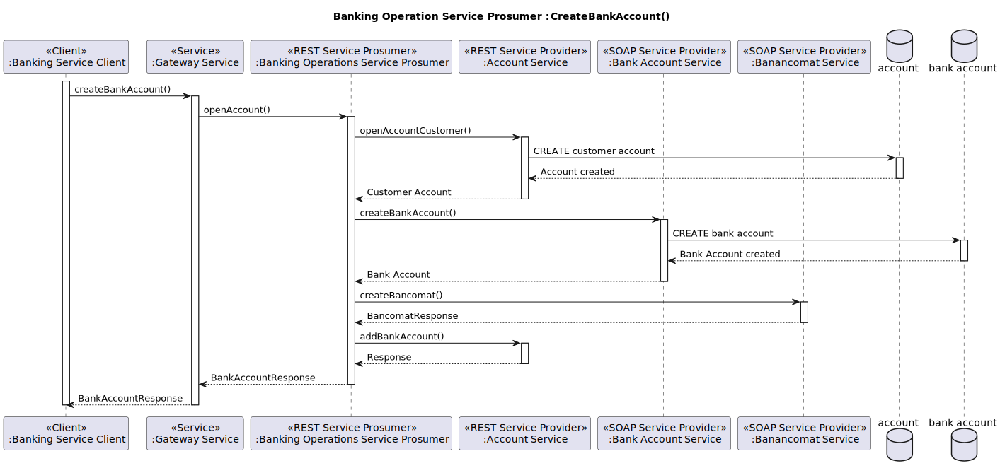
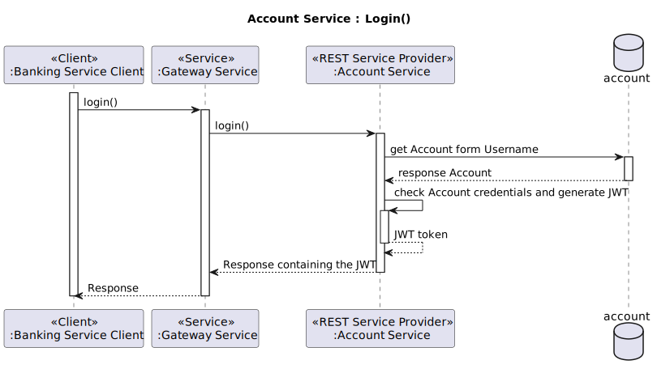
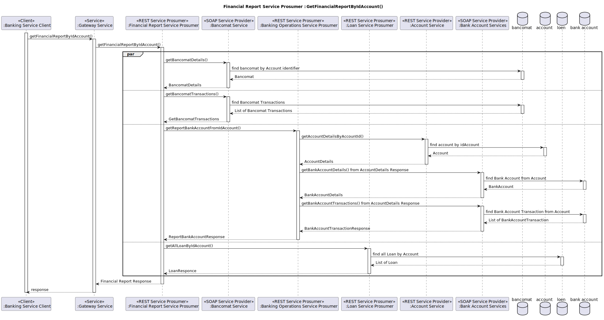
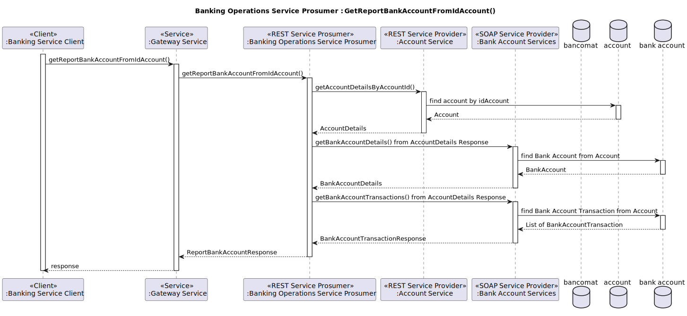
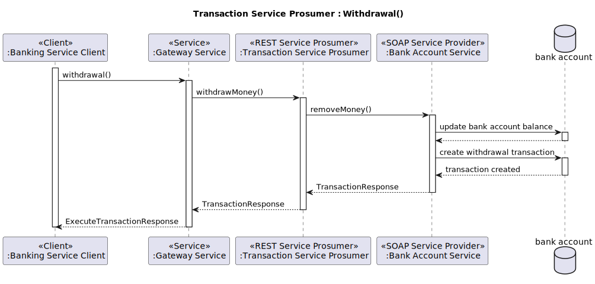
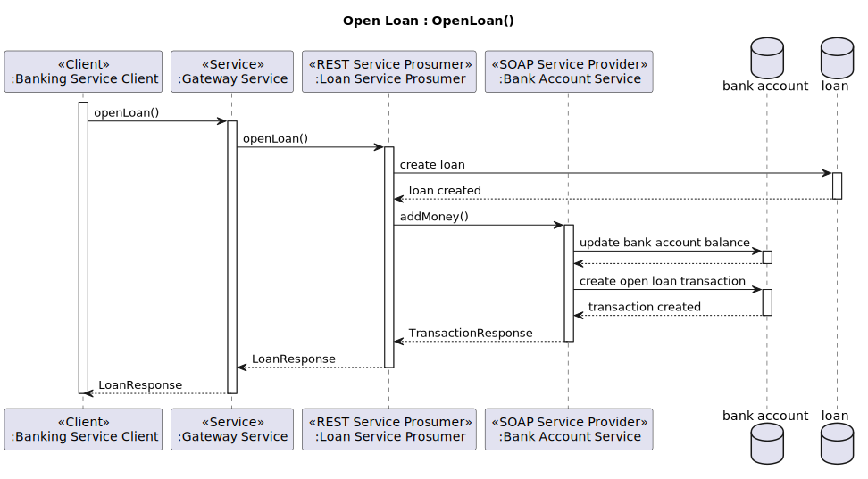
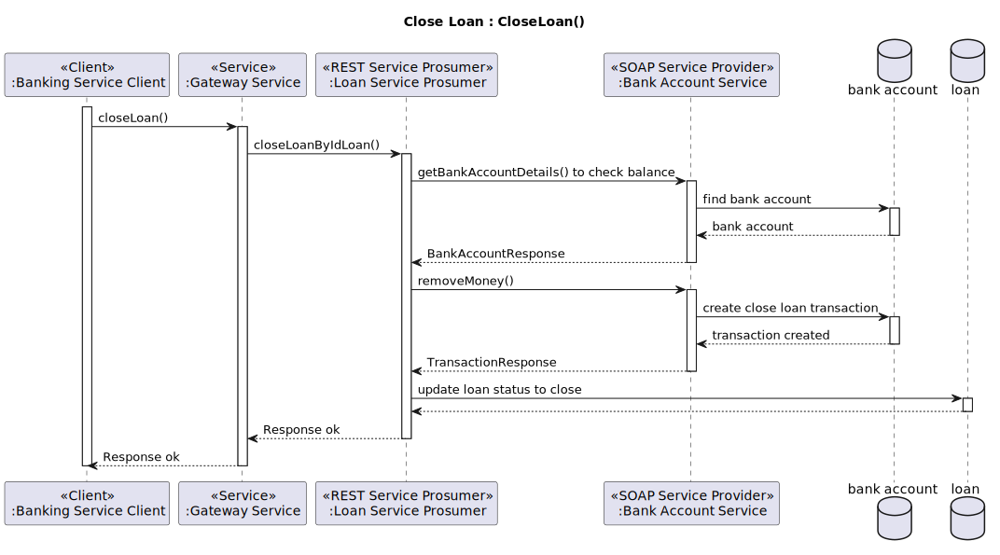

<!-- PROJECT SHIELDS -->
[![Contributors][contributors-shield]][contributors-url]
[![Commit Activity][commit-shield]][commit-url]
[![Last Commit][last-commit-shield]][last-commit-url]
[![License][license-shield]][license-url]


<!-- PROJECT LOGO -->
<br />
<div align="center">
  <a href="https://github.com/Alemato/Banking-Micro-SOA-System">
    
  </a>

<h3 align="center">Banking-Micro-SOA-System</h3>

  <p align="center">
    Modern banking system that implements a service-oriented architecture (SOA)!
    <br />
    <a href="https://github.com/Alemato/Banking-Micro-SOA-System"><strong>Explore all docs »</strong></a>
  </p>
</div>

<!-- TABLE OF CONTENTS -->
<details>
  <summary>Table of Contents</summary>
  <ol>
    <li>
      <a href="#banking-micro-soa-system">Project Overview</a>
    </li>
    <li><a href="#exam-Requirements">Exam Requirements</a></li> 
    <li><a href="#system-objectives">System Objectives</a></li>
    <li><a href="#system-functionality">System Functionality</a></li>
    <li><a href="#motivations-for-the-soa-and-microservices-approach">Motivations for the SOA and Microservices Approach</a></li>
    <li><a href="#use-case-diagram">Use Case Diagram</a></li>
    <li>
            <a href="#component-diagram">Component Diagram</a>
        <ul>
            <li><a href="#components">Components</a></li>
            <li><a href="#note-aggiuntive">Additional Notes</a></li>
        </ul>
    </li>
    <li>
      <a href="#sequence-diagrams">Sequence Diagrams</a>
      <ul>
        <li><a href="#open-bank-account">Open Bank Account</a></li>
        <li><a href="#login">Login</a></li>
        <li><a href="#financial-report">Financial Report</a></li>
        <li><a href="#bank-account-report">Bank Account Report</a></li>
        <li><a href="#withdraw-money">Withdraw Money</a></li>
        <li><a href="#open-loan">Open Loan</a></li>
        <li><a href="#close-loan">Close Loan</a></li>
      </ul>
    </li>
    <li>
      <a href="#implementation">Implementation</a>
      <ul>
        <li><a href="#integrating-spring-boot-and-apache-cxf">Integrating Spring Boot and Apache CXF</a></li>
        <li><a href="#configuring-apache-cxf-for-proper-execution">Configuring Apache CXF for Proper Execution</a></li>
        <li><a href="#integration-of-apache-cxf-service-description-openapi-in-spring-boot">Integration of Apache CXF Service Description OpenApi in Spring Boot</a></li>
        <li><a href="#optimizations-made-in-the-services">Optimizations Made in the Services</a></li>
        <li><a href="#integration-of-apache-cxf-logging-in-spring-boot">Integration of Apache CXF Logging in Spring Boot</a></li>
        <li><a href="#modifications-to-jackson-json-provider-for-apache-cxf-in-spring-boot">Modifications to Jackson JSON Provider for Apache CXF in Spring Boot</a></li>
        <li><a href="#integration-of-apache-cxf-metrics-with-spring-boot-actuator">Integration of Apache CXF Metrics with Spring Boot Actuator</a></li>
        <li><a href="#metrics-configuration-for-a-soap-application">Metrics Configuration for a SOAP Application</a></li>
        <li><a href="#metrics-configuration-for-a-rest-application">Metrics Configuration for a REST Application</a></li>
        <li><a href="#spring-cloud-discovery-eureka">Spring Cloud Discovery Eureka</a></li>
        <li><a href="#implementation-of-load-balancing-in-apache-cxf-clients">Implementation of Load-Balancing in Apache CXF Clients</a></li>
        <li><a href="#implementing-a-jax-ws-service-with-apache-cxf-and-spring-boot">Implementing a JAX-WS Service with Apache CXF and Spring Boot</a></li>
        <li><a href="#implementation-of-a-jax-rs-service-with-apache-cxf-and-spring-boot">Implementation of a JAX-RS Service with Apache CXF and Spring Boot</a></li>
        <li><a href="#asynchronous-client-implementation-with-apache-cxf">Asynchronous Client Implementation with Apache CXF</a></li>
        <li><a href="#implementation-of-a-simple-client-for-the-banking-micro-soa-system">Implementation of a Simple Client for the Banking Micro-SOA System</a></li>
        <li><a href="#using-the-maven-plugin-openapi-generator-maven-plugin">Using the Maven Plugin openapi-generator-maven-plugin</a></li>
        <li><a href="#using-the-maven-plug-in-cxf-codegen-plugin">Using the Maven Plug-in cxf-codegen-plugin</a></li>
        <li><a href="#using-the-maven-build-helper-maven-plugin">Using the Maven build-helper-maven-plugin</a></li>
        <li><a href="#dockerfile-implementation">Dockerfile Implementation</a></li>
        <li><a href="#implementation-of-docker-compose">Implementation of docker-compose</a></li>
      </ul>
    </li>
    <li><a href="#configuration-guide">Configuration Guide</a></li>
    <li><a href="#demo-video">Demo video</a></li>
    <li><a href="https://github.com/Alemato/Banking-Micro-SOA-System/blob/main/LICENSE">License</a></li>
  </ol>
</details>

<!-- MARKDOWN LINKS & IMAGES -->
<!-- https://www.markdownguide.org/basic-syntax/#reference-style-links -->

[contributors-shield]: https://img.shields.io/github/contributors/Alemato/Banking-Micro-SOA-System?style=for-the-badge

[contributors-url]: https://github.com/Alemato/Banking-Micro-SOA-System/graphs/contributors

[commit-shield]: https://img.shields.io/github/commit-activity/t/Alemato/Banking-Micro-SOA-System?style=for-the-badge

[commit-url]: https://github.com/Alemato/Banking-Micro-SOA-System/graphs/commit-activity

[last-commit-shield]: https://img.shields.io/github/last-commit/Alemato/Banking-Micro-SOA-System?style=for-the-badge

[last-commit-url]: https://github.com/Alemato/Banking-Micro-SOA-System/graphs/commit-activity

[license-shield]: https://img.shields.io/github/license/Alemato/Banking-Micro-SOA-System?style=for-the-badge

[license-url]: https://github.com/Alemato/Banking-Micro-SOA-System/blob/master/LICENSE.txt

# Banking Micro-SOA System

The "Banking Micro-SOA System" is a modern banking system that implements a service-oriented architecture (SOA) using
microservices with REST and SOAP technologies.

This project demonstrates how to build a scalable and modular application capable of handling common banking operations,
leveraging best software engineering practices and advanced tools.

It utilizes Apache CXF, Spring Boot, Docker, and Maven.

## Exam Requirements

The project meets all the requirements described in the following file:
[FINAL_TEST_23-24.pdf](/docs/FINAL_TEST_23-24.pdf)

## System Objectives

The main objectives of the **Banking Micro SOA System** are:

- **Efficient User Management**: Ensure a secure and simple process for account management and user authentication.
- **Account Operations Management**: Enable account and ATM opening, along with the generation of detailed account
  status reports.
- **Comprehensive Current Account Management**: Allow the addition and removal of money, and the recording of all
  transactions.
- **Advanced ATM Management**: Facilitate ATM creation and the recording of transactions performed through these
  devices.
- **Loan Management**: Support the opening and closing of loans with precise tracking of related transactions.
- **Transaction Execution**: Support various operations such as transfers, withdrawals, deposits, and ATM payments.
- **Report Generation**: Provide a comprehensive financial report of all operations, offering a clear and integrated
  view of financial activities.

## System Functionality

**The system is structured modularly**, dividing the main functionalities into specific services, each responsible for a
particular aspect of banking management:

- User Management:

    - Account Management: Creation, update, and deletion of user accounts.
  - Authentication: Implementation of robust authentication systems to ensure secure access.

- Current Account Management:

    - Account Operations: Addition and removal of funds, detailed recording of all transactions.

- ATM Management:

    - ATM Creation: Configuration and management of ATM devices.
  - ATM Transactions: Recording and tracking of operations performed through ATMs.

- Loan Management:

    - Loan Opening/Closing: Procedures for the entire loan lifecycle, from request to closure.

- Transaction Execution:

    - Transfers, Withdrawals, Deposits, and ATM Payments: Execution and recording of all financial operations.

- Account Operations:

    - Account/ATM Opening: Process of opening new accounts and ATM devices.
    - Account Report: Generation of detailed reports on account status.

- Report Management:

    - Comprehensive Financial Report: Creation of integrated reports providing an overall view of financial activities.

## Motivations for the SOA and Microservices Approach

Adopting an SOA and microservices architecture for the Banking Micro SOA System is driven by several key advantages:

- **Maintainability**: Dividing the system into independent microservices simplifies management, updates, and error
  correction. Each service can be developed, deployed, and maintained separately, reducing the risk of negative impacts
  on the overall system.

- **Scalability**: The ability to instantiate multiple system nodes allows for easy scaling of resources based on
  demand. In a banking environment with a high volume of transactions, this flexibility is crucial for ensuring optimal
  performance and service continuity.

- **Reliability**: A microservices-based architecture isolates failures, preventing a problem in a single component from
  compromising the entire system. This approach significantly enhances the system's reliability and resilience.

- **Flexibility**: Using SOA and microservices facilitates integration with other systems and the implementation of new
  features without having to rewrite the entire codebase, speeding up development and deployment times.

The **Banking Micro SOA System** thus represents a cutting-edge solution for banking management, capable of addressing
modern challenges with efficiency and robustness.

## Use Case Diagram


[Uses_cases_it.svg](/docs/Uses_cases_it.svg)

In this scenario, we can see all the system users who can perform the actions described earlier:

1. **Login:** Authenticate and release the JWT.
2. **Account Management:** Create an account of the correct user type, view account details.
3. **Current Account Management:** Create current accounts, add and remove funds, manage banking transactions, and
   generate current account reports.
4. **ATM Management:** Configure an ATM, record transactions performed with the ATM, generate ATM reports.
5. **Loan Management:** Open and close a loan, generate loan reports.
6. **Account Registration with Current Account and ATM:** Includes creating a customer account, opening a current
   account, and configuring an ATM.
7. **Banking Operations Management:**
    1. **Partial Report Generation** that includes:
        1. Account Details
       2. Current Account Transactions Report
       3. ATM Transactions Report
    2. **Total Report Generation** that includes:
        1. Account Details
       2. Current Account Transactions Report
       3. ATM Transactions Report
        4. Loan Report

## Component Diagram


### Components

1. **Banking Mini SOA System**
    - Represents the main system that includes all subsystems and services.

2. **Account Service**
    - Type: REST Service Provider
   - Responsibilities: Manage account-related operations such as authentication, account creation, and management. It
     handles data persistence using a database to save account information.
    - Operations:
        - `OpenAccount (Customer/Banker/Admin)`
        - `Login`
        - `AddBankAccount`
        - `GetAccount`
        - `CheckTokenResponse`

3. **Bank Account Service**
    - Type: SOAP Service Provider
   - Responsibilities: Manage current accounts, add and remove money, and save transactions. It keeps track of all bank
     account information and related transactions in a database.
    - Operations:
        - `CreateBankAccount`
        - `AddMoney`
        - `RemoveMoney`
        - `BancomatPay`
        - `ExecuteTransfer`
        - `CheckBankAccountTransfer`
        - `GetBankAccountTransaction`
        - `GetBankAccountDetails`

4. **Bancomat Service**
    - Type: SOAP Service Provider
   - Responsibilities: Manage ATM-related operations and transactions. It handles data persistence using a database to
     save ATM information and related transactions.
    - Operations:
        - `CreateBancomat`
        - `GetBancomatDetails`
        - `GetBancomatDetailsByNumber`
        - `ExecuteTransaction`
        - `GetBancomatTransaction`

5. **Banking Operations Service Prosumer**
    - Type: REST Service Prosumer
   - Responsibilities: Manage bank account opening operations
    - Operations:
        - `OpenAccount`
        - `GetReportBankAccountFromIdAccount`
        - `RequestAtmCard`
        - `GetAtmCard`

6. **Loan Service Prosumer**
    - Type: REST Service Prosumer
    - Responsibilities: Manage loan-related operations such as creation and closing, and track user loan history.
    - Operations:
        - `OpenLoan`
        - `CloseLoanByIdLoan`
        - `GetLoanByIdLoan`
        - `GetAllLoanByIdAccount`
        - `GetAllLoanByIdBankAccount`

7. **Transaction Service Prosumer**
    - Type: REST Service Prosumer
   - Responsibilities

     : Manage financial transactions such as deposits, withdrawals, transfers, and ATM payments.
     - Operations:
     - `DepositMoney`
     - `WithdrawMoney`
     - `ExecuteTransfer`
     - `ExecuteAtmPayment`

8. **Financial Report Service Prosumer**
    - Type: REST Service Prosumer
    - Responsibilities: Generate and provide complete financial reports of the account's banking position.
    - Operations:
        - `GetFinancialReportByIdAccount`

9. **Gateway Service**
    - Type: Gateway
   - Responsibilities: Provide a unified entry point for the banking system services.
    - Operations:
        - `HandleRequests`

10. **Discovery Service**
    - Type: Discovery
    - Responsibilities: Manage service discovery and integration within the system.

11. **Banking Service Client**
    - Type: Client Spring Shell
    - Responsibilities: Interface with the various services of the banking system through the gateway to perform
      user-requested operations.

### Additional Notes

- The **Banking Service Client** communicates with the **Gateway Service** for all operations.
- The **Gateway Service** routes requests to the respective provider/prosumer services.
- Services follow SOA/Microservices paradigms with REST or SOAP interfaces, ensuring interoperability and scalability.
- Load balancing is defined according to a *"Non-Repetitive Random Iteration"* logic.
- Services are designed to be modular and can be updated or replaced independently without affecting the entire system.

## Sequence Diagrams

### Open Bank Account



In this operation, the customer user opens their current account by registering in the banking system. The first request
is made to the Banking Operation Service Prosumer, which in turn first makes the account creation request to the Account
Service Provider, then the account creation on the BankAccount Service Provider, then the account is updated on the
Account Service Provider by inserting the ID of the newly created account, and finally, the ATM is created on the
respective service (Bancomat Service Provider). At the end of the operations, the creation response is returned to the
client.

### Login



During this operation, the registered user authenticates with the system. The user sends their credentials to the
system, which forwards them to the account management service (Account Service). This service verifies the credentials
and generates a JWT token. At the end of the process, a response containing the generated token is sent back.

### Financial Report



During this operation, the user requests a complete financial report from the system. The user sends the request to the
system, which forwards it to the financial report management service (Financial Report Service Prosumer). This service
will send four parallel requests:

1. GetBancomatDetails to the Bancomat Service (SOAP type)
2. GetBancomatTransactions to the Bancomat Service (SOAP type)
3. GetReportBankAccountFromIdAccount to the Banking Operations Service Prosumer (REST type)
4. GetAllLoanByIdAccount to the Loan Service Prosumer (REST type)

(The GetReportBankAccountFromIdAccount operation will be described later.)

At the end of the process, the four responses will be combined to generate the complete financial report.

### Bank Account Report



During this operation, the user requests the current account report from the system. The user sends the request to the
system, which forwards it to the banking operations management service (Banking Operation Service Prosumer), which in
turn makes two calls, first to the account management service to get the account information and then to the bank
account management service to get the bank account information.

At the end of the process, the information will be combined to generate the bank account report.

### Withdraw Money



The money withdrawal operation from the current account is performed by the customer user. Through the Transaction
Service Prosumer, a request is forwarded to the Bank Account Service to verify if there is sufficient money in the
current account and the amount is deducted from the balance. Immediately after, a withdrawal transaction is created and
returned to the client.

### Open Loan



Opening a loan by the customer user involves the Loan Service Prosumer and the BankAccount Service Provider. First, a
loan is created, then the corresponding money is added to the user's current account on the BankAccount Service
Provider. Finally, before returning the response, the loan opening transaction is also saved in the user's account.

### Close Loan



The loan closure operation, performed by a consumer user, involves paying off the loan by deducting the corresponding
amount of money from the user's current account on the BankAccount Service Provider. The account balance is checked, and
the amount is deducted. Finally, the loan status is updated before returning the response.

---

# Implementation

For each project module, Spring Boot 3.3.1 and Apache CXF 4.0.4 were chosen.

In compliance with the exam requirements, no technologies other than those explained and adopted in class were used.

The project is divided into the following Maven modules:

1. **account-service**: Provider. Responsible for authentication and user management operations. This service was
   implemented in REST using Apache CXF (JAX-RS) and Spring Boot, registered with Netflix Eureka.

2. **bank-account-services**: Provider. Responsible for current account operations. This service was implemented in SOAP
   using Apache CXF (JAX-WS) and Spring Boot, registered with Netflix Eureka.

3. **bancomat-service**: Provider. Responsible for ATM operations. This service was implemented in SOAP using Apache
   CXF (JAX-WS) and Spring Boot, registered with Netflix Eureka.

4. **banking-operations-service-prosumer**: Prosumer. Responsible for bank account opening operations. This service was
   implemented in REST using Apache CXF (JAX-RS) and Spring Boot, registered with Netflix Eureka. All operations are
   provided asynchronously. REST and SOAP clients were developed, implementing load balancing towards the provider
   service.

5. **loan-service-prosumer**: Prosumer. Responsible for loan-related operations. This service was implemented in REST
   using Apache CXF (JAX-RS) and Spring Boot, registered with Netflix Eureka. All operations are provided
   asynchronously. A REST client was developed, implementing load balancing towards the provider service.

6. **transaction-service-prosumer**: Prosumer. Responsible for managing financial transactions such as deposits,
   withdrawals, transfers, and ATM payments. This service was implemented in REST using Apache CXF (JAX-RS) and Spring
   Boot, registered with Netflix Eureka. All operations are provided asynchronously. REST and SOAP clients were
   developed, implementing load balancing towards the provider service.

7. **financial-report-service-prosumer**: Prosumer. Responsible for generating and providing complete financial reports
   of the account's banking position. This service was implemented in REST using Apache CXF (JAX-RS) and Spring Boot,
   registered with Netflix Eureka. All operations are provided asynchronously. REST and SOAP clients were developed,
   implementing load balancing towards the provider service.

8. **gateway-service**: Gateway. Responsible for providing a unified entry point for our system's services. This service
   was implemented with Spring Cloud Reactive Gateway and uses Netflix Eureka.

9. **discovery-service**: Discovery. Responsible for managing service discovery and integration within the system. This
   service was implemented with Spring Cloud Discovery Eureka.

10. **banking-service-client**: Client. It is the sample client that interfaces with the Gateway to perform banking
    operations. This client was developed with Spring Shell and Apache CXF (REST client).

The implementations of all Prosumer services are asynchronous, as they need to interact with one or more Provider
services, resulting in delays in their responses.

Regarding Providers, they have been optimized to support a high number of operations per second, allowing the
implementation of most of their operations synchronously.

## Integrating Spring Boot and Apache CXF

To integrate Apache CXF into a Spring Boot application, you need to add one of the following dependencies in
the `pom.xml`:

```xml

<dependencies>
    <!-- ...  -->
    <dependency>
        <groupId>org.apache.cxf</groupId>
        <artifactId>cxf-spring-boot-starter-jaxws</artifactId>
        <version>4.0.4</version>
    </dependency>

    <dependency>
        <groupId>org.apache.cxf</groupId>
        <artifactId>cxf-spring-boot-starter-jaxrs</artifactId>
        <version>4.0.4</version>
    </dependency>
    <!-- ...  -->
</dependencies>
```

- **cxf-spring-boot-starter-jaxws**: Configures and runs Apache CXF in a Spring application, integrating the necessary
  dependencies for running Apache CXF in SOAP mode (JAX-WS).

- **cxf-spring-boot-starter-jaxrs**: Configures and runs Apache CXF in a Spring application, integrating the necessary
  dependencies for running Apache CXF in REST mode (JAX-RS).

**Note**: If you want to implement a Spring Boot application that uses Apache CXF in both SOAP and REST modes, you only
need to include one of the dependencies, along with the client dependency for Apache CXF in the other mode. For example,
if you include only the `cxf-spring-boot-starter-jaxws` dependency (for SOAP), you just need to add the missing library
dependency `cxf-rt-rs-client` for the REST client in the `pom.xml`.

### Configuring Apache CXF for Proper Execution

To create a SOAP application, you need to manually configure Apache CXF. Here is the necessary Java code:

```java

@Configuration
public class ApacheCXFConfig {

    private final Bus bus;
    private final BankAccountService bankAccountService;
    private final MetricsProvider metricsProvider;

    public ApacheCXFConfig(Bus bus, BankAccountService bankAccountService, MetricsProvider metricsProvider) {
        this.bus = bus;
        this.bankAccountService = bankAccountService;
        this.metricsProvider = metricsProvider;
    }

    @Bean
    public Endpoint endpoint() {
        EndpointImpl endpoint = new EndpointImpl(bus, bankAccountService, null, null, new MetricsFeature[]{
                new MetricsFeature(metricsProvider)
        });
        endpoint.publish("/BankAccountService");
        return endpoint;
    }

}
```

As seen in the code, you need to manually create a Java Bean that provides the proper initialization of an **Apache CXF
Endpoint**. Through dependency injection, Spring will inject: the `Bus` from Apache CXF, `BankAccountService` which is
the interface defining the SOAP services, and `MetricsProvider` which is the metrics provider (we will discuss this
further later).

To create a REST application, you can use Spring's component-scan to find all the classes needed by Apache CXF and
Spring to properly configure the service. The configuration of Apache CXF can be done using the following YAML commands:

```yaml
cxf:
  path: /services
  servlet.init:
    service-list-path: /info
  jaxrs:
    component-scan: true
    classes-scan-packages: it.univaq.sose.accountservice.configuration, it.univaq.sose.accountservice.service
```

As seen, under the `cxf.jaxrs` key, there are settings for the component-scan. You need to add to this key every package
that contains Apache CXF code (endpoints and various configurations). This way, Apache CXF will check the package for
configurations or endpoints.

In the YAML file, there are also the `cxf.path` and `cxf.servlet.init.service-list-path` keys, if set:

- **cxf.path**: Identifies the path of the servlet used by Apache CXF within the application.
- **cxf.servlet.init.service-list-path**: Identifies the path where Apache CXF will publish the list of managed
  services.

## Integration of Apache CXF Service Description OpenApi in Spring Boot

To integrate Apache CXF's Service Description OpenApi into Spring Boot, add the following dependencies to
your `pom.xml`:

```xml

<dependencies>
    <!-- ... -->
    <dependency>
        <groupId>org.webjars</groupId>
        <artifactId>swagger-ui</artifactId>
        <version>5.17.14</version>
    </dependency>
    <dependency>
        <groupId>org.apache.cxf</groupId>
        <artifactId>cxf-rt-rs-service-description</artifactId>
        <version>4.0.4</version>
    </dependency>
    <dependency>
        <groupId>org.apache.cxf</groupId>
        <artifactId>cxf-rt-rs-service-description-openapi-v3</artifactId>
        <version>4.0.4</version>
    </dependency>
    <!-- ... -->
</dependencies>
```

After adding the dependencies, create a Java Bean to provide a properly configured instance of `OpenApiFeature`:

```java

@Configuration
public class ApacheCXFConfig {
    @Value("${cxf.path}")
    private String cxfPath;

    @Bean
    public OpenApiFeature createOpenApiFeature() {
        final OpenApiFeature openApiFeature = new OpenApiFeature();
        openApiFeature.setPrettyPrint(true);
        openApiFeature.setTitle("Account Service for Banking Micro-SOA System");
        openApiFeature.setContactName("The Banking Micro-SOA System team");
        openApiFeature.setDescription("This is Account Service for Banking Micro-SOA System. Uses Apache CXF and Spring Boot on JAX-RS.");
        openApiFeature.setVersion("0.0.1-SNAPSHOT");
        openApiFeature.setSwaggerUiConfig(
                new SwaggerUiConfig()
                        .url(cxfPath + "/openapi.json").queryConfigEnabled(false));
        return openApiFeature;
    }

    // ...
}
```

Now you can use OpenApi annotations within your REST service interfaces.

## Optimizations Made in the Services

Given that this is a banking system, optimizations have been made to increase the volume of requests that can be handled
within the request Time-to-Live interval (60 seconds).

Within the services, we use Spring Data JPA with PostgreSQL. Therefore, we have optimized the behavior of Hibernate and
Hikari to maximize operations executed on the database.

```yaml
spring:
  datasource:
    driver-class-name: org.postgresql.Driver
    url: jdbc:postgresql://host.docker.internal:5432/account?reWriteBatchedInserts=true
    username: postgres
    password: 123456
    name: Account_DS
    hikari:
      auto-commit: false
      minimum-idle: 0
      maximum-pool-size: 10
      max-lifetime: 600000
      transaction-isolation: TRANSACTION_READ_COMMITTED
      data-source-properties:
        prepStmtCacheSqlLimit: 1024
        useServerPrepStmts: false
        prepStmtCacheSize: 500
        cachePrepStmts: true
  batch:
    jdbc:
      initialize-schema: always
  jpa:
    open-in-view: false
    hibernate:
      ddl-auto: update
    properties:
      hibernate:
        jdbc:
          time_zone: UTC
          batch_size: 10
        order_inserts: true
        order_updates: true
        query:
          fail_on_pagination_over_collection_fetch: true
          plan_cache_max_size: 4096
          in_clause_parameter_padding: true
        format_sql: false
        connection:
          provider_disables_autocommit: true
    show-sql: false
```

##### Hibernate and Hikari Configuration Details

1. `spring.datasource`: Configures the datasource for database connection.
    - `driver-class-name`: Specifies the JDBC driver to use, in this case, the PostgreSQL driver.
    - `url`: The connection URL for the PostgreSQL database. The option `reWriteBatchedInserts=true` optimizes batch
      operations by rewriting them into a single operation.
    - `username`: The username for the database connection.
    - `password`: The password for the database connection.
    - `name`: An identifying name for the datasource.
    - `hikari`: Specific configuration for HikariCP, the connection pool used.
        - `auto-commit`: Set to false to disable automatic transaction commits.
        - `minimum-idle`: Minimum number of idle connections maintained in the pool.
        - `maximum-pool-size`: Maximum number of connections in the pool.
        - `max-lifetime`: Maximum lifetime of a connection in milliseconds.
        - `transaction-isolation`: Transaction isolation level, in this case, TRANSACTION_READ_COMMITTED.
        - `data-source-properties`: Additional properties for the datasource.
            - `prepStmtCacheSqlLimit`: Size limit for the prepared statement cache.
            - `useServerPrepStmts`: Specifies whether to use server-side prepared statements.
            - `prepStmtCacheSize`: Size of the prepared statement cache.
            - `cachePrepStmts`: Enables the prepared statement cache.
2. `spring.batch.jdbc`: Specifications for Batch operations.
    - `initialize-schema`: Set to `always`, initializes the database schema for Spring Batch at each startup.
3. `spring.jpa`: Specifications for JPA (Java Persistence API).
    - `open-in-view`: Set to false, automatically closes the Hibernate session after the view.
    - `hibernate.ddl-auto`: Set to update, Hibernate updates the database schema at application startup.
    - `properties`: Additional configurations.
        - `hibernate`: Specifications for Hibernate.
            - `jdbc`: Specifications for jdbc.
                - `time_zone`: Sets the time zone to UTC.
                - `batch_size`: Batch size for insert/update operations.
        - `order_inserts`: Enables insert ordering to optimize batch operations.
        - `order_updates`: Enables update ordering to optimize batch operations.
        - `query`: Specifications for queries executed on the database.
            - `fail_on_pagination_over_collection_fetch`: Sets whether to fail on pagination over collection fetch.
            - `plan_cache_max_size`: Maximum size of the query plan cache.
            - `in_clause_parameter_padding`: Enables parameter padding in IN clauses.
        - `format_sql`: Set to false, does not format the SQL generated by Hibernate.
        - `connection.provider_disables_autocommit`: Set to true, disables autocommit for the connection provider.
    - `show-sql`: Set to false, does not display the SQL generated by Hibernate in the console.

Thanks to these modifications, we can achieve over 5,000 write operations per second and more than 80,000 read
operations per second on the database.

An additional optimization involves using **SEQUENCE** as table indexes. This way, Hibernate requests IDs at startup for
saving new entities, reducing the number of queries to the database.

```java

@Getter
@Setter
@MappedSuperclass
@EntityListeners(AuditingEntityListener.class)
public class BaseEntity implements Serializable {
    @Serial
    private static final long serialVersionUID = -6204225224072578741L;

    @Id
    @GeneratedValue(strategy = GenerationType.SEQUENCE)
    @Column(name = "id", nullable = false)
    private Long id;

    @CreatedDate
    private LocalDateTime createDate;

    @LastModifiedDate
    private LocalDateTime updateDate;
}

@Getter
@Setter
@Entity
@Table(name = "account")
@SequenceGenerator(name = "account_seq", sequenceName = "account_sequence", allocationSize = 10) //Pre-Alloca solo 10 id
public class Account extends BaseEntity {
    @Serial
    private static final long serialVersionUID = 2741904033865180248L;

    @Column(name = "name", nullable = false)
    private String name;

    @Column(name = "surname", nullable = false)
    private String surname;

    @Column(name = "username", nullable = false)
    private String username;

    @Column(name = "password", nullable = false, length = 500)
    private String password;

    @Column(name = "email", nullable = false)
    private String email;

    @Column(name = "phone", nullable = false)
    private String phone;

    @Enumerated
    @Column(name = "role", nullable = false)
    private Role role;

    @Column(name = "id_bank_account")
    private Long idBankAccount;

    @Override
    public final boolean equals(Object object) {
        if (this == object) return true;
        if (object == null) return false;
        Class<?> oEffectiveClass = object instanceof HibernateProxy hibernateProxy ? hibernateProxy.getHibernateLazyInitializer().getPersistentClass() : object.getClass();
        Class<?> thisEffectiveClass = this instanceof HibernateProxy hibernateProxy ? hibernateProxy.getHibernateLazyInitializer().getPersistentClass() : this.getClass();
        if (thisEffectiveClass != oEffectiveClass) return false;
        Account account = (Account) object;
        return getId() != null && Objects.equals(getId(), account.getId());
    }

    @Override
    public final int hashCode() {
        return this instanceof HibernateProxy hibernateProxy ? hibernateProxy.getHibernateLazyInitializer().getPersistentClass().hashCode() : getClass().hashCode();
    }
}
```

## Integration of Apache CXF Logging in Spring Boot

To integrate Apache CXF Logging functionality in Spring Boot, add the following dependency to your `pom.xml`:

```xml

<dependency>
    <groupId>org.apache.cxf</groupId>
    <artifactId>cxf-rt-features-logging</artifactId>
    <version>4.0.4</version>
</dependency>
```

After adding the dependency, create a Java Bean to provide a properly configured instance of `LoggingFeature`:

```java

@Configuration
public class ApacheCXFConfig {
    // ...

    @Bean
    public LoggingFeature loggingFeature() {
        LoggingFeature loggingFeature = new LoggingFeature();
        loggingFeature.setPrettyLogging(true);
        return loggingFeature;
    }
}
```

## Modifications to Jackson JSON Provider for Apache CXF in Spring Boot

To properly handle dates during serialization and deserialization with the Jackson provider, add the following
dependencies:

```xml

<dependencies>
    <!-- ...  -->
    <dependency>
        <groupId>com.fasterxml.jackson.jakarta.rs</groupId>
        <artifactId>jackson-jakarta-rs-json-provider</artifactId>
    </dependency>
    <dependency>
        <groupId>com.fasterxml.jackson.core</groupId>
        <artifactId>jackson-annotations</artifactId>
    </dependency>
    <dependency>
        <groupId>com.fasterxml.jackson.datatype</groupId>
        <artifactId>jackson-datatype-jsr310</artifactId>
    </dependency>
    <!-- ...  -->
</dependencies>
```

To properly configure the Jackson Provider, including support for the new Java 8 date and time classes and setting date
serialization to a readable format instead of timestamps, create a Java Bean configured as follows:

```java

@Configuration
public class ApacheCXFConfig {
    // ...
    @Bean
    public JacksonJsonProvider jsonProvider() {
        ObjectMapper objectMapper = new ObjectMapper();
        objectMapper.registerModule(new JavaTimeModule());
        objectMapper.disable(SerializationFeature.WRITE_DATES_AS_TIMESTAMPS);
        return new JacksonJsonProvider(objectMapper);
    }
}
```

This will enable support for the ISO-8601 standard.

An adapter is also provided to manually handle dates:

```java
public class LocalDateTimeAdapter extends XmlAdapter<String, LocalDateTime> {
    private static final DateTimeFormatter DATE_FORMATTER = DateTimeFormatter.ISO_LOCAL_DATE_TIME;

    @Override
    public LocalDateTime unmarshal(String v) {
        return LocalDateTime.parse(v, DATE_FORMATTER);
    }

    @Override
    public String marshal(LocalDateTime v) {
        return v != null ? DATE_FORMATTER.format(v) : null;
    }
}
```

Example usage of the adapter:

```java

@Data
@XmlRootElement(name = "AccountResponse")
@XmlAccessorType(XmlAccessType.FIELD)
public class AccountResponse implements Serializable {
    @Serial
    private static final long serialVersionUID = 4592896323731902686L;

    // ...

    @XmlElement(required = true)
    @XmlJavaTypeAdapter(LocalDateTimeAdapter.class)
    private LocalDateTime updateDate;

    @XmlElement(required = true)
    @XmlJavaTypeAdapter(LocalDateTimeAdapter.class)
    private LocalDateTime createDate;

    // ...
}
```

This code ensures that dates are properly handled during serialization and deserialization, adhering to the ISO-8601
standard.

## Integration of Apache CXF Metrics with Spring Boot Actuator

In this project, we use Spring Boot Actuator to generate application metrics.

To manage and create Apache CXF metrics, you need to add the `cxf-rt-features-metrics` dependency.

Insert the following dependencies into the `pom.xml` file:

```xml

<dependencies>
    <!-- ...  -->
    <dependency>
        <groupId>org.springframework.boot</groupId>
        <artifactId>spring-boot-starter-actuator</artifactId>
    </dependency>
    <dependency>
        <groupId>org.apache.cxf</groupId>
        <artifactId>cxf-rt-features-metrics</artifactId>
        <version>4.0.4</version>
    </dependency>
    <dependency>
        <groupId>io.micrometer</groupId>
        <artifactId>micrometer-core</artifactId>
    </dependency>
    <!-- ...  -->
</dependencies>
```

#### Metrics Configuration for a SOAP Application

To enable metrics in a SOAP application, insert an instance of `MetricsFeature` in the constructor of the `Endpoint`:

```java

@Configuration
public class ApacheCXFConfig {

    private final Bus bus;
    private final BancomatService bancomatService;
    private final MetricsProvider metricsProvider;

    public ApacheCXFConfig(Bus bus, BancomatService bancomatService, MetricsProvider metricsProvider) {
        this.bus = bus;
        this.bancomatService = bancomatService;
        this.metricsProvider = metricsProvider;
    }

    @Bean
    public LoggingFeature loggingFeature() {
        LoggingFeature loggingFeature = new LoggingFeature();
        loggingFeature.setPrettyLogging(true);
        return loggingFeature;
    }

    @Bean
    public Endpoint endpoint() {
        EndpointImpl endpoint = new EndpointImpl(bus, bancomatService, null, null, new MetricsFeature[]{
                new MetricsFeature(metricsProvider)
        });
        endpoint.publish("/BancomatService");
        return endpoint;
    }
}
```

#### Metrics Configuration for a REST Application

For a REST application, you need to add the metrics provider package to the component-scan package list:

```yaml
cxf:
  path: /services
  servlet.init:
    service-list-path: /info
  jaxrs:
    component-scan: true
    classes-scan-packages: org.apache.cxf.metrics, it.univaq.sose.accountservice.configuration, it.univaq.sose.accountservice.service
```

#### Spring Boot Actuator Configuration

Configure Spring Boot Actuator with the following parameters:

```yaml
management:
  endpoints.web.exposure.include: health,info
  info.env.enabled: true

info.application:
  name: account-service
  description: Account Service for Banking Micro-SOA System
  version: 0.0.1-SNAPSHOT
```

These configurations allow the integration of Apache CXF metrics with Spring Boot Actuator, providing full visibility
into the application's performance.

## Spring Cloud Discovery Eureka

In this project, we use **Spring Cloud Discovery Eureka** as a discovery service for the entire system.

#### Creating the Eureka Server

To integrate Spring Cloud Discovery Eureka, you need to create a server as a separate Spring Boot application.

##### Configuration of the Server `pom.xml`

Below is the `pom.xml` file for the Eureka server:

```xml
<?xml version="1.0" encoding="UTF-8"?>
<project xmlns="http://maven.apache.org/POM/4.0.0" xmlns:xsi="http://www.w3.org/2001/XMLSchema-instance"
         xsi:schemaLocation="http://maven.apache.org/POM/4.0.0 https://maven.apache.org/xsd/maven-4.0.0.xsd">
    <modelVersion>4.0.0</modelVersion>
    <parent>
        <groupId>org.springframework.boot</groupId>
        <artifactId>spring-boot-starter-parent</artifactId>
        <version>3.3.1</version>
        <relativePath/> <!-- lookup parent from repository -->
    </parent>
    <groupId>it.univaq.sose</groupId>
    <artifactId>discovery-service</artifactId>
    <version>0.0.1-SNAPSHOT</version>
    <name>discovery-service</name>
    <description>Discovery Service</description>

    <properties>
        <java.version>17</java.version>
        <spring-cloud.version>2023.0.2</spring-cloud.version>
    </properties>

    <dependencies>
        <dependency>
            <groupId>org.springframework.boot</groupId>
            <artifactId>spring-boot-starter-actuator</artifactId>
        </dependency>
        <dependency>
            <groupId>org.springframework.cloud</groupId>
            <artifactId>spring-cloud-starter-netflix-eureka-server</artifactId>
        </dependency>
        <dependency>
            <groupId>org.springframework.boot</groupId>
            <artifactId>spring-boot-starter-test</artifactId>
            <scope>test</scope>
        </dependency>
    </dependencies>

    <dependencyManagement>
        <dependencies>
            <dependency>
                <groupId>org.springframework.cloud</groupId>
                <artifactId>spring-cloud-dependencies</artifactId>
                <version>${spring-cloud.version}</version>
                <type>pom</type>
                <scope>import</scope>
            </dependency>
        </dependencies>
    </dependencyManagement>

    <build>
        <plugins>
            <plugin>
                <groupId>org.springframework.boot</groupId>
                <artifactId>spring-boot-maven-plugin</artifactId>
            </plugin>
        </plugins>
    </build>
</project>
```

#### Eureka Server Configuration

The standard configuration of Eureka involves multiple redundant nodes to ensure the reliability of the discovery
service. However, to adapt Eureka to the specific needs of our system, we will modify some settings:

```yaml
eureka:
  instance:
    hostname: ${EUREKA_HOSTNAME:localhost}
  server:
    # Switch off self-preservation. Will turn lease expiration on and evict all instances which no longer sent a heartbeat and whose lease has expired.
    # Self-preservation is desirable for Eureka clusters and where network outages (e.g. between data centers) could be possible.
    # Note: the lease validity / expiration is configured in the Eureka _client_ instances (see eureka.instance.lease-expiration-duration-in-seconds).
    # See: https://github.com/Netflix/eureka/wiki/Server-Self-Preservation-Mode
    # See: https://www.baeldung.com/eureka-self-preservation-renewal
    enable-self-preservation: false
    # Make sure this is set to the same value as the lease renewal interval in Eureka _client_ instances (or slightly higher)
    # This value is relevant for Eureka's calculation of the 'current renewal threshold'.
    # Specifically, the following equation is used: current renewal threshold = (60s / expected-client-renewal-interval-seconds) * renewal-percent-threshold * current number of client instances.
    # In this case:
    # - for one registered client: 60 / 3 * 0.5 * 1 = 10.
    # - for two registered clients: 60 / 3 * 0,5 * 2 = 20.
    expected-client-renewal-interval-seconds: 15 # Default: 30
    # The interval in which the instance eviction task scans for instances with expired leases.
    # Given in milliseconds.
    eviction-interval-timer-in-ms: 2000 # Default 60000
    # The cadence of calculating / adapting a new renewal threshold, i.e. how frequently a new threshold is calculated.
    # The renewal threshold is used to distinguish, when Eureka should go into self-preservation mode
    # (if eureka.server.enable-self-preservation: true). If less heartbeats than the threshold are received, Eureka assumes
    # a network outage and protects itsel from evicting all service instances - assuming that the outage is over soon, and
    # services are still there to continue sending heartbeats.
    renewal-threshold-update-interval-ms: 2000 # Default: 15 * 60 * 1000
    # The minimum renewal threshold, in percent. If less heartbeats than the given percentage are received per minute
    # Eureka will go into self-preservation mode (if eureka.server.enable-self-preservation: true) and stop evicting
    # service instances with expired leases that no longer send heartbeats - assuming there is only a temporal network
    # outage.
    renewal-percent-threshold: 0.5  # Default: 0.85
  client:
    registerWithEureka: false
    fetchRegistry: false
    serviceUrl:
      defaultZone: http://${eureka.instance.hostname}:${server.port}/eureka/
```

#### Integrating the Eureka Client in Modules

To use the created discovery service, we need to add the following dependency in the `pom.xml` of our modules:

```xml

<dependencies>
    <dependency>
        <groupId>org.springframework.cloud</groupId>
        <artifactId>spring-cloud-starter-netflix-eureka-client</artifactId>
    </dependency>
</dependencies>

<dependencyManagement>
<dependencies>
    <dependency>
        <groupId>org.springframework.cloud</groupId>
        <artifactId>spring-cloud-dependencies</artifactId>
        <version>2023.0.2</version>
        <type>pom</type>
        <scope>import</scope>
    </dependency>
</dependencies>
</dependencyManagement>
```

#### Eureka Client Configuration

To increase the responsiveness of Eureka, we configure the client as follows:

```yaml
eureka:
  client:
    registerWithEureka: true
    serviceUrl:
      defaultZone: http://${EUREKA_HOST:host.docker.internal}:${EUREKA_SERVER_PORT:8761}/eureka/
  instance:
    lease-expiration-duration-in-seconds: 11
    lease-renewal-interval-in-seconds: 5
    prefer-ip-address: true
    statusPageUrlPath: /services/info
    healthCheckUrlPath: /actuator/health
    metadataMap:
      servletPath: ${cxf.path}
```

##### Client Configuration Details

1. **registerWithEureka: true**
    - Indicates that the client should register with the Eureka server, allowing the server to route requests to it.
2. **serviceUrl.defaultZone**
    - Specifies the URL of the Eureka server with which the client should register. Uses environment variables to
      determine the Eureka server host and port.
3. **lease-expiration-duration-in-seconds: 11**
    - Specifies the duration of the lease. After 11 seconds without renewal, the lease expires, and the Eureka server
      can remove the instance.
4. **lease-renewal-interval-in-seconds: 5**
    - Indicates the frequency with which the client sends a heartbeat signal to the Eureka server to renew the lease,
      useful for development or debugging.
5. **prefer-ip-address: true**
    - Configures the instance to prefer the IP address during registration and communication with the Eureka server,
      resolving container name resolution issues.
6. **statusPageUrlPath: /services/info**
    - Specifies the URL path for the instance's status page, which contains the list of services implemented by Apache
      CXF.
7. **healthCheckUrlPath: /actuator/health**
    - Indicates the URL path for the instance's health check.
8. **metadataMap.servletPath: ${cxf.path}**
    - Defines a metadata map that includes the servletPath, whose value is the root of Apache CXF.

## Implementation of Load-Balancing in Apache CXF Clients

In compliance with exam requirements, no technologies other than those explained and adopted in class were used. During
the course, the Spring Cloud OpenFeign project was introduced, enabling communication between services without passing
through the gateway. We started studying if its use was feasible in our project. In the initial study phase, we noted
that Spring Cloud OpenFeign does not inherently implement a load-balancing logic but requires another Spring project:
Spring Cloud LoadBalancer.

[Declarative REST Client: Feign](https://docs.spring.io/spring-cloud-openfeign/docs/current/reference/html/#spring-cloud-feign)

> Feign is a declarative web service client. It makes writing web service clients easier. To use Feign, create an
> interface and annotate it. It has pluggable annotation support, including Feign annotations and JAX-RS annotations.
> Feign also supports pluggable encoders and decoders. Spring Cloud adds support for Spring MVC annotations and for
> using
> the same HttpMessageConverters used by default in Spring Web. Spring Cloud integrates Eureka, Spring Cloud
> CircuitBreaker, as well as **Spring Cloud LoadBalancer to provide a load-balanced HTTP client when using Feign**.

[Overriding Feign Defaults](https://docs.spring.io/spring-cloud-openfeign/docs/current/reference/html/#spring-cloud-feign-overriding-defaults)

> Note:  
> `spring-cloud-starter-openfeign` supports `spring-cloud-starter-loadbalancer`. However, as it is an optional
> dependency, you need to ensure it is added to your project if you want to use it.

Complying with the exam requirements and not having covered Spring Cloud LoadBalancer during lessons, we could not
introduce it into our project.

After noting that it was necessary to introduce Spring Cloud LoadBalancer, we focused on the actual use of OpenFeign
compared to the Apache CXF client and concluded the study by deciding to implement a small load-balancer based on the
concept of *"Non-repetitive Random Iteration"* in the Apache CXF client.

Below is the load-balancer implementation for the Apache CXF client for SOAP operations:

```java

@Slf4j
@Service
public class BancomatServiceClient {
    private final EurekaClient eurekaClient;
    private volatile BancomatService_Service bancomatService;
    private final AtomicReference<URL> lastUrl = new AtomicReference<>();
    private final List<InstanceInfo> lastInstancesCache = Collections.synchronizedList(new ArrayList<>());

    public BancomatServiceClient(EurekaClient eurekaClient) {
        this.eurekaClient = eurekaClient;
        this.bancomatService = null;
    }

    public BancomatService getBancomatService() throws ServiceUnavailableException {
        try {
            List<InstanceInfo> instances = Optional.ofNullable(eurekaClient.getInstancesByVipAddress("BANCOMAT-SERVICE", false))
                    .filter(list -> !list.isEmpty())
                    .orElseGet(() -> {
                        log.warn("Using cached instances for BANCOMAT-SERVICE");
                        log.warn("lastInstancesCache {}", lastInstancesCache);
                        synchronized (lastInstancesCache) {
                            return new ArrayList<>(lastInstancesCache);  // Return a copy of the cached instances
                        }
                    });

            if (instances == null || instances.isEmpty()) {
                log.error("No instances available for BANCOMAT-SERVICE");
                throw new ServiceUnavailableException("No instances available for BANCOMAT-SERVICE");
            }

            // Update the instance cache synchronously
            synchronized (lastInstancesCache) {
                lastInstancesCache.clear();
                lastInstancesCache.addAll(deepCopyInstanceInfoList(instances));
            }

            // Remove the last used instance from the list
            URL lastUrlValue = lastUrl.get();
            if (lastUrlValue != null) {
                instances.removeIf(instance -> {
                    try {
                        return Objects.equals(new URL(instance.getHomePageUrl() + "services/BancomatService?wsdl"), lastUrlValue);
                    } catch (MalformedURLException e) {
                        log.error("Malformed URL while filtering instances: {}", e.getMessage(), e);
                        return false;
                    }
                });
            }

            // If no alternative instances are available, use the last used instance
            if (instances.isEmpty()) {
                log.warn("No alternative instances available for BANCOMAT-SERVICE, using the last used instance");
                if (bancomatService != null) {
                    return bancomatService.getBancomatPort();
                } else {
                    throw new ServiceUnavailableException("BANCOMAT-SERVICE: No alternative instances available and no previously used instance available");
                }
            }

            // Shuffle the list to select a random instance
            Collections.shuffle(instances);
            InstanceInfo instance = instances.get(0);
            String eurekaUrl = instance.getHomePageUrl() + "services/BancomatService?wsdl";
            URL url = new URL(eurekaUrl);
            bancomatService = new BancomatService_Service(url);
            log.info("New Retrieved BancomatService URL: {}", url);
            lastUrl.set(url);

            return bancomatService.getBancomatPort();
        } catch (MalformedURLException e) {
            log.error("Malformed URL: {}", e.getMessage(), e);
            throw new ServiceUnavailableException("Malformed URL: " + e.getMessage());
        } catch (Exception e) {
            log.error("Failed to retrieve BancomatService URL: {}", e.getMessage(), e);
            throw new ServiceUnavailableException("Failed to retrieve BancomatService URL: " + e.getMessage());
        }
    }

    private List<InstanceInfo> deepCopyInstanceInfoList(List<InstanceInfo> instances) {
        return instances.stream()
                .map(InstanceInfo::new) // Use the copy constructor
                .collect(Collectors.toList());
    }
}
```

Below is the load-balancer implementation for the Apache CXF client for REST operations:

```java

@Slf4j
@Service
public class AccountServiceClient {
    private final EurekaClient eurekaClient;
    private final JacksonJsonProvider jacksonProvider;
    private final AtomicReference<String> lastUrlService = new AtomicReference<>();
    private final List<InstanceInfo> lastInstancesCache = Collections.synchronizedList(new ArrayList<>());

    public AccountServiceClient(EurekaClient eurekaClient, JacksonJsonProvider jacksonProvider) {
        this.eurekaClient = eurekaClient;
        this.jacksonProvider = jacksonProvider;
    }

    private String getUrlServiceFromEureka() throws ServiceUnavailableException {
        try {
            List<InstanceInfo> instances = Optional.ofNullable(eurekaClient.getInstancesByVipAddress("ACCOUNT-SERVICE", false))
                    .filter(list -> !list.isEmpty())
                    .orElseGet(() -> {
                        log.warn("Using cached instances for ACCOUNT-SERVICE");
                        log.warn("lastInstancesCache {}", lastInstancesCache);
                        synchronized (lastInstancesCache) {
                            return new ArrayList<>(lastInstancesCache);  // Return a copy of the cached instances
                        }
                    });

            if (instances == null || instances.isEmpty()) {
                log.error("No instances available for ACCOUNT-SERVICE");
                throw new ServiceUnavailableException("No instances available for ACCOUNT-SERVICE");
            }

            // Update the instance cache synchronously
            synchronized (lastInstancesCache) {
                lastInstancesCache.clear();
                lastInstancesCache.addAll(deepCopyInstanceInfoList(instances));
            }

            // Remove the last used instance from the list
            String lastUrl = lastUrlService.get();
            if (lastUrl != null) {
                instances.removeIf(instance -> {
                    try {
                        return Objects.equals(new URL(instance.getHomePageUrl() + "services"), new URL(lastUrl));
                    } catch (MalformedURLException e) {
                        log.error("Malformed URL while filtering instances: {}", e.getMessage(), e);
                        return false;
                    }
                });
            }

            // If no alternative instances are available, use the last used instance
            if (instances.isEmpty()) {
                log.warn("No alternative instances available for ACCOUNT-SERVICE, using the last used instance");
                if (lastUrl != null) {
                    return lastUrl;
                } else {
                    throw new ServiceUnavailableException("ACCOUNT-SERVICE: No alternative instances available and no previously used instance available");
                }
            }

            // Shuffle the list to select a random instance
            Collections.shuffle(instances);
            InstanceInfo instance = instances.get(0);
            String eurekaUrl = instance.getHomePageUrl() + "services";
            log.info("New Retrieved Banking Operations Service URL: {}", eurekaUrl);
            lastUrlService.set(eurekaUrl);

            return eurekaUrl;
        } catch (Exception e) {
            log.error("Failed to retrieve Banking Operations Service URL: {}", e.getMessage(), e);
            throw new ServiceUnavailableException("Failed to retrieve Banking Operations Service URL: " + e.getMessage());
        }
    }

    private List<InstanceInfo> deepCopyInstanceInfoList(List<InstanceInfo> instances) {
        return instances.stream()
                .map(InstanceInfo::new) // Use the copy constructor
                .collect(Collectors.toList());
    }

    public AccountServiceDefaultClient getAccountService() throws ServiceUnavailableException {
        return JAXRSClientFactory.create(getUrlServiceFromEureka(), AccountServiceDefaultClient.class, List.of(jacksonProvider));
    }

    public Client getClientAccountService() throws ServiceUnavailableException {
        AccountServiceDefaultClient api = JAXRSClientFactory.create(getUrlServiceFromEureka(), AccountServiceDefaultClient.class, List.of(jacksonProvider));
        return WebClient.client(api);
    }

    public WebClient getWebClientAccountService() throws ServiceUnavailableException {
        AccountServiceDefaultClient api = JAXRSClientFactory.create(getUrlServiceFromEureka(), AccountServiceDefaultClient.class, List.of(jacksonProvider));
        Client client = WebClient.client(api);
        WebClient webClient = WebClient.fromClient(client);
        webClient.type(MediaType.APPLICATION_JSON);
        return webClient;
    }

    public ClientConfiguration getClientConfigurationAccountService() throws ServiceUnavailableException {
        AccountServiceDefaultClient api = JAXRSClientFactory.create(getUrlServiceFromEureka(), AccountServiceDefaultClient.class, List.of(jacksonProvider));
        Client client = WebClient.client(api);
        return WebClient.getConfig(client);
    }

    public String getEndpoint() throws ServiceUnavailableException {
        return getUrlServiceFromEureka();
    }
}
```

As seen in the above code, a caching strategy for instances returned by Eureka was adopted. This is necessary because
making numerous requests to the Eureka client can cause Eureka to enter protection mode and return an empty list as a
response.

In fact, all libraries using the Eureka client implement caching operations to avoid continuous calls to the Eureka
server.

These caching strategies can be quite complex.

To simplify the code as much as possible and make it more readable, we implemented a more basic strategy:

- Make a request to the Eureka server to obtain all instances of a given service.
- If Eureka returns a non-empty response, update our cache with the provided list of instances.
- If Eureka does not provide a list of instances, use the previously saved one.
- If the list resulting from the previous operations is empty or null, raise an exception.
- If the list is present, check if it contains the URL previously used to make a request to that service. If present,
  remove it from the list.
- If the list resulting after the removal is empty, reuse the URL previously used to make a request to that service.

## Implementing a JAX-WS Service with Apache CXF and Spring Boot

After adding the necessary dependencies and configurations described earlier, let's see how a JAX-WS service is
implemented.

To implement a service, it is sufficient to declare an interface using JAX-WS annotations and a class that implements
the actual logic.

Interface:

```java

@WebService(name = "BancomatService")
public interface BancomatService {

    @WebResult(name = "GetBancomatDetailsResponse",
            targetNamespace = "http://webservice.bancomatservice.sose.univaq.it/")
    @WebMethod(action = "urn:GetBancomatDetails")
    @ResponseWrapper(localName = "getBancomatDetailsResponse",
            className = "it.univaq.sose.bancomatservice.domain.dto.GetBancomatDetailsResponse")
    public BancomatResponse getBancomatDetails(@XmlElement(required = true) @WebParam(name = "accountId",
            targetNamespace = "http://webservice.bancomatservice.sose.univaq.it/") Long accountId) throws NotFoundException, BancomatException;

    @WebResult(name = "GetBancomatDetailsAsync",
            targetNamespace = "http://webservice.bancomatservice.sose.univaq.it/")
    @WebMethod(action = "urn:GetBancomatDetailsAsync")
    @ResponseWrapper(localName = "getBancomatDetailsResponse",
            className = "it.univaq.sose.bancomatservice.domain.dto.GetBancomatDetailsResponse")
    public Future<?> getBancomatDetailsAsync(@XmlElement(required = true) @WebParam(name = "accountId",
            targetNamespace = "http://webservice.bancomatservice.sose.univaq.it/") Long accountId, AsyncHandler<GetBancomatDetailsResponse> asyncHandler) throws NotFoundException, BancomatException;
    // ...
}
```

Interface implementation:

```java

@Service
@Features(features = "org.apache.cxf.ext.logging.LoggingFeature")
@WebService(serviceName = "BancomatService", portName = "BancomatPort",
        targetNamespace = "http://webservice.bancomatservice.sose.univaq.it/",
        endpointInterface = "it.univaq.sose.bancomatservice.webservice.BancomatService")
public class BancomatServiceImpl implements BancomatService {

    private final BancomatManager bancomatManager;

    public BancomatServiceImpl(BancomatManager bancomatManager) {
        this.bancomatManager = bancomatManager;
    }

    @Override
    @UseAsyncMethod
    public BancomatResponse getBancomatDetails(Long accountId) throws NotFoundException, BancomatException {
        return bancomatManager.getBancomatDetails(accountId);
    }

    @Override
    public Future<?> getBancomatDetailsAsync(Long accountId, AsyncHandler<GetBancomatDetailsResponse> asyncHandler) throws NotFoundException, BancomatException {
        final ServerAsyncResponse<GetBancomatDetailsResponse> r = new ServerAsyncResponse<>();
        new Thread(() -> {
            try {
                Thread.sleep(1000);
                BancomatResponse bancomatResponse = bancomatManager.getBancomatDetails(accountId);
                GetBancomatDetailsResponse response = new GetBancomatDetailsResponse();
                response.setGetBancomatDetailsResponse(bancomatResponse);
                r.set(response);
                asyncHandler.handleResponse(r);
            } catch (InterruptedException e) {
                r.exception(new BancomatException(e.getMessage()));
                asyncHandler.handleResponse(r);
                /* Clean up whatever needs to be handled before interrupting */
                Thread.currentThread().interrupt();
            } catch (NotFoundException e) {
                r.exception(e);
                asyncHandler.handleResponse(r);
                /* Clean up whatever needs to be handled before interrupting */
                Thread.currentThread().interrupt();
            }
        }).start();
        return r;
    }
    // ...
}
```

Note the following points:

- The use of an asynchronous method.
- The presence of `Thread.sleep(1000);` in the asynchronous implementation of the `getBancomatDetailsAsync` web method,
  which simulates a 1-second delay in the actual response.
- `r.exception(e);` and `r.exception(new BancomatException(e.getMessage()));` are used when an exception occurs,
  creating a FAULT-type response.
- The presence of the `@Features(features = "org.apache.cxf.ext.logging.LoggingFeature")` annotation, which enables
  Apache logging on this endpoint.

An example of a response object `BancomatResponse` and ResponseWrapper `GetBancomatDetailsResponse`:

```java

@Getter
@Setter
@ToString
@XmlAccessorType(XmlAccessType.FIELD)
@XmlType(name = "BancomatResponse", propOrder = {"id", "number", "cvv", "expiryDate", "accountId"})
public class BancomatResponse {

    @XmlElement(required = true)
    private Long id;

    @XmlElement(required = true)
    private String number;

    @XmlElement(required = true)
    private String cvv;

    @XmlElement(required = true)
    private String expiryDate;

    @XmlElement(required = true)
    private Long accountId;

    public BancomatResponse() {
    }

    public BancomatResponse(Long id, String number, String cvv, String expiryDate, Long accountId) {
        this.id = id;
        this.number = number;
        this.cvv = cvv;
        this.expiryDate = expiryDate;
        this.accountId = accountId;
    }
}

@XmlAccessorType(XmlAccessType.FIELD)
@XmlType(name = "getBancomatDetailsResponse", propOrder = {
        "getBancomatDetailsResponse"
})
public class GetBancomatDetailsResponse {

    @XmlElement(name = "GetBancomatDetailsResponse", namespace = "http://webservice.bancomatservice.sose.univaq.it/")
    protected BancomatResponse getBancomatDetailsResponse;

    public BancomatResponse getGetBancomatDetailsResponse() {
        return getBancomatDetailsResponse;
    }

    public void setGetBancomatDetailsResponse(BancomatResponse value) {
        this.getBancomatDetailsResponse = value;
    }

}
```

## Implementation of a JAX-RS Service with Apache CXF and Spring Boot

After adding the necessary dependencies and configurations described earlier, let's see how a JAX-RS service is
implemented.

To implement a service, it is sufficient to declare an interface using JAX-RS annotations and OpenApi annotations and a
class that implements the actual logic.

Interfaces:

```java

@Path("/api/account")
public interface AccountService {

    @Operation(operationId = "login", description = "Authenticate user and return JWT", responses = {
            @ApiResponse(responseCode = "200", description = "Authentication successful", content = {
                    @Content(mediaType = MediaType.APPLICATION_JSON, schema = @Schema(implementation = TokenResponse.class)),
                    @Content(mediaType = MediaType.APPLICATION_XML, schema = @Schema(implementation = TokenResponse.class))}),
            @ApiResponse(responseCode = "401", description = "Authentication failed", content = {
                    @Content(mediaType = MediaType.APPLICATION_JSON, schema = @Schema(implementation = ErrorResponse.class)),
                    @Content(mediaType = MediaType.APPLICATION_XML, schema = @Schema(implementation = ErrorResponse.class))})
    })
    @POST
    @Path("/login")
    @Consumes({MediaType.APPLICATION_JSON, MediaType.APPLICATION_XML})
    @Produces({MediaType.APPLICATION_JSON, MediaType.APPLICATION_XML})
    Response login(@RequestBody(description = "Login",
            required = true,
            content = {@Content(mediaType = MediaType.APPLICATION_JSON, schema = @Schema(implementation = UserCredentials.class)),
                    @Content(mediaType = MediaType.APPLICATION_XML, schema = @Schema(implementation = UserCredentials.class)),
            }
    ) UserCredentials credentials);
}

@Path("/api/bank")
public interface BankingOperationsService {
    @Operation(
            operationId = "OpenAccount",
            description = "This endpoint allows users to create their personal profile and open a new bank account in a single operation.",
            responses = {
                    @ApiResponse(
                            responseCode = "201",
                            description = "Open Account Successful",
                            content = {
                                    @Content(mediaType = MediaType.APPLICATION_JSON, schema = @Schema(implementation = OpenAccountResponse.class)),
                                    @Content(mediaType = MediaType.APPLICATION_XML, schema = @Schema(implementation = OpenAccountResponse.class))
                            }),
                    @ApiResponse(
                            responseCode = "400",
                            description = "Bad Request",
                            content = {
                                    @Content(mediaType = MediaType.APPLICATION_JSON, schema = @Schema(implementation = ErrorResponse.class)),
                                    @Content(mediaType = MediaType.APPLICATION_XML, schema = @Schema(implementation = ErrorResponse.class))
                            }
                    ),
                    @ApiResponse(
                            responseCode = "503",
                            description = "Service Unavailable",
                            content = {
                                    @Content(mediaType = MediaType.APPLICATION_JSON, schema = @Schema(implementation = ErrorResponse.class)),
                                    @Content(mediaType = MediaType.APPLICATION_JSON, schema = @Schema(implementation = ErrorResponse.class))
                            }
                    ),
                    @ApiResponse(
                            responseCode = "500",
                            description = "Internal Server Error",
                            content = {
                                    @Content(mediaType = MediaType.APPLICATION_JSON, schema = @Schema(implementation = ErrorResponse.class)),
                                    @Content(mediaType = MediaType.APPLICATION_XML, schema = @Schema(implementation = ErrorResponse.class))
                            }
                    )
            })
    @POST
    @Path("/open-account")
    @Consumes({MediaType.APPLICATION_JSON, MediaType.APPLICATION_XML})
    @Produces({MediaType.APPLICATION_JSON, MediaType.APPLICATION_XML})
    void openAccount(@RequestBody(description = "OpenAccount",
            required = true,
            content = {@Content(mediaType = MediaType.APPLICATION_JSON, schema = @Schema(implementation = OpenAccountRequest.class)),
                    @Content(mediaType = MediaType.APPLICATION_XML, schema = @Schema(implementation = OpenAccountRequest.class)),
            }
    ) OpenAccountRequest openAccountRequest, @Suspended AsyncResponse asyncResponse);
}
```

Implementation of the interfaces:

```java

@Service
@Features(features = "org.apache.cxf.ext.logging.LoggingFeature")
public class AccountServiceImpl implements AccountService {
    private final AccountManager accountManager;

    public AccountServiceImpl(AccountManager accountManager) {
        this.accountManager = accountManager;
    }

    @Override
    public Response login(UserCredentials credentials) {
        try {
            String token = accountManager.getJwtToken(credentials);
            return Response.ok(new TokenResponse(token)).build();
        } catch (AuthenticationException e) {
            return Response.status(Response.Status.UNAUTHORIZED).entity(new ErrorResponse(e.getMessage())).build();
        }
    }
}

@Slf4j
@Service
public class BankingOperationsServiceImpl implements BankingOperationsService {
    private final AccountServiceClient accountServiceClient;
    private final BankAccountServiceClient bankAccountService;
    private final BancomatServiceClient bancomatServiceClient;

    public BankingOperationsServiceImpl(AccountServiceClient accountServiceClient, BankAccountServiceClient bankAccountService, BancomatServiceClient bancomatServiceClient) {
        this.accountServiceClient = accountServiceClient;
        this.bankAccountService = bankAccountService;
        this.bancomatServiceClient = bancomatServiceClient;
    }

    @Override
    public void openAccount(OpenAccountRequest openAccountRequest, AsyncResponse asyncResponse) {
        new Thread(() -> {

            try {
                Thread.sleep(1000);
                WebClient accountClient = accountServiceClient.getWebClientAccountService();
                String locationHeader = null;
                try (Response accountResponse = accountClient.path("/api/account/customer-account").post(
                        new OpenBankAccountRequest()
                                .name(openAccountRequest.getName())
                                .surname(openAccountRequest.getSurname())
                                .username(openAccountRequest.getUsername())
                                .password(openAccountRequest.getPassword())
                                .email(openAccountRequest.getEmail())
                                .phone(openAccountRequest.getPhone())
                )) {
                    log.info("Account-Service Response for Create Account Customer: {}", accountResponse);
                    log.info("Headers from Create Account Customer Response: {}", accountResponse.getHeaders());
                    if (!accountResponse.getStatusInfo().getFamily().equals(Response.Status.Family.SUCCESSFUL))
                        throw new AccountServiceException("Error for Account Service (Create Customer Account)");
                    locationHeader = accountResponse.getHeaderString("Location");
                }

                if (locationHeader == null) throw new UrlLocationMalformedException("The URL Location is empty.");
                long idAccount = BankingOperationsUtils.getIdFromUrlLocator(locationHeader);

                OpenAccountResponse openAccountResponse = getOpenAccountResponse(openAccountRequest, idAccount);

                Response response = Response.status(Response.Status.CREATED).entity(openAccountResponse).build();
                asyncResponse.resume(response);
            } catch (InterruptedException | UrlLocationMalformedException | BankAccountAlradyExistException_Exception |
                     AccountServiceException e) {
                Response response = Response.serverError().entity(new ErrorResponse(e.getMessage())).build();
                asyncResponse.resume(response);
                /* Clean up whatever needs to be handled before interrupting  */
                Thread.currentThread().interrupt();
            } catch (ServiceUnavailableException e) {
                /* Trigger ExceptionMapper */
                asyncResponse.resume(e);
                Thread.currentThread().interrupt();
            } catch (it.univaq.sose.bancomatservice.webservice.NotFoundException_Exception e) {
                Response response = Response.status(Response.Status.NOT_FOUND).entity(new ErrorResponse(e.getMessage())).build();
                asyncResponse.resume(response);
                Thread.currentThread().interrupt();
            } catch (BancomatAlreadyExistingException_Exception e) {
                Response response = Response.status(Response.Status.BAD_REQUEST).entity(new ErrorResponse(e.getMessage())).build();
                asyncResponse.resume(response);
                Thread.currentThread().interrupt();
            }
        }).start();
    }

    private OpenAccountResponse getOpenAccountResponse(OpenAccountRequest openAccountRequest, long idAccount) throws BankAccountAlradyExistException_Exception, AccountServiceException, ServiceUnavailableException, it.univaq.sose.bancomatservice.webservice.NotFoundException_Exception, BancomatAlreadyExistingException_Exception {
        BankAccountRequest bankAccountRequest = new BankAccountRequest();
        bankAccountRequest.setAccountId(idAccount);
        bankAccountRequest.setBalance(openAccountRequest.getBalance());
        BankAccountService bankAccountClient = bankAccountService.getBankAccountService();
        BancomatService bancomatService = bancomatServiceClient.getBancomatService();

        BankAccountResponse bankAccountResponse = bankAccountClient.createBankAccount(bankAccountRequest);
        log.info("Bank-Account-Service Response for Create Bank Account: {}", bankAccountResponse);

        BancomatRequest bancomatRequest = new BancomatRequest();
        bancomatRequest.setAccountId(bankAccountResponse.getAccountId());
        bancomatRequest.setBankAccountId(bankAccountResponse.getId());

        BancomatResponse bancomatResponse = bancomatService.createBancomat(bancomatRequest);

        AccountServiceDefaultClient client = accountServiceClient.getAccountService();
        try {
            client.addBankAccount1(idAccount, new AddIdBankAccountRequest().idBankAccount(bankAccountResponse.getId()));
        } catch (Exception e) {
            throw new AccountServiceException("Error for Account Service (Add Bank Account)");
        }
        return getOpenAccountResponse(idAccount, bankAccountResponse, bancomatResponse);
    }
}

@Provider
public class ServiceUnavailableExceptionMapper implements ExceptionMapper<ServiceUnavailableException> {
    @Context
    private HttpHeaders headers;

    @Override
    public Response toResponse(ServiceUnavailableException exception) {
        MediaType responseType = determineResponseType();
        return Response.status(Response.Status.SERVICE_UNAVAILABLE)
                .entity(new ErrorResponse(exception.getMessage()))
                .type(responseType)
                .build();
    }

    private MediaType determineResponseType() {
        List<MediaType> acceptableMediaTypes = headers.getAcceptableMediaTypes();
        if (acceptableMediaTypes.contains(MediaType.APPLICATION_JSON_TYPE)) {
            return MediaType.APPLICATION_JSON_TYPE;
        } else if (acceptableMediaTypes.contains(MediaType.APPLICATION_XML_TYPE)) {
            return MediaType.APPLICATION_XML_TYPE;
        } else {
            return MediaType.TEXT_PLAIN_TYPE; // Default response type
        }
    }
}
```

Note the following points:

- The use of the Client/LoadBalancer `AccountServiceClient` to synchronously query the `Account-Service`, which creates
  a new Customer account.
- The presence of `Thread.sleep(1000);` in the asynchronous implementation of the `openAccount` method, simulating a
  1-second delay in the actual response.
- The use of `asyncResponse.resume(e);` in case of a `ServiceUnavailableException`, creating an automated response via
  the `ServiceUnavailableExceptionMapper`.
- The `@Features(features = "org.apache.cxf.ext.logging.LoggingFeature")` annotation, which enables Apache logging on
  this endpoint.

An example of a response object `OpenAccountResponse`:

```java

@Data
@XmlRootElement(name = "OpenAccountResponse")
@XmlAccessorType(XmlAccessType.FIELD)
public class OpenAccountResponse {
    @XmlElement(required = true)
    private long id;
    @XmlElement(required = true)
    private String name;
    @XmlElement(required = true)
    private String surname;
    @XmlElement(required = true)
    private String username;
    @XmlElement(required = true)
    private String email;
    @XmlElement(required = true)
    private String phone;
    @XmlElement(required = true)
    private long bankAccountId;
    @XmlElement(required = true)
    private String iban;
    @XmlElement(required = true)
    private BigDecimal balance;
    @XmlElement(required = true)
    private long bancomatId;
    @XmlElement(required = true)
    private String bancomatNumber;
    @XmlElement(required = true)
    private String bancomatCvv;
    @XmlElement(required = true)
    private String bancomatExpiryDate;
}
```

## Asynchronous Client Implementation with Apache CXF

To implement an asynchronous request to a client that exposes services asynchronously, we can use the following
strategies:

- Async Blocking Polling
- Async Non-Blocking Polling
- Async Callback

For this project, the Async Callback strategy was chosen for REST calls and Async Non-Blocking Polling for SOAP calls.

Implementation of a Callback for a REST service:

```java

@Getter
@Slf4j
public class ReportBankAccountCallBack implements InvocationCallback<Response> {
    private ReportBankAccountResponse reportBankAccountResponse;
    private boolean hasError = false;
    private Throwable throwable;

    @Override
    public void completed(Response response) {
        if (response.getStatusInfo().getFamily().equals(Response.Status.Family.SUCCESSFUL)) {
            try {
                String messageFromTheServer = response.readEntity(String.class);
                ObjectMapper objectMapper = new ObjectMapper();
                reportBankAccountResponse = objectMapper.readValue(messageFromTheServer, ReportBankAccountResponse.class);
            } catch (ProcessingException | IllegalStateException e) {
                log.error("ReportBankAccount: Response content of the message cannot be Report Bank Account Type");
                handleException(new FinancialServiceException("Response content of the message cannot be Report Bank Account Type"));
            } catch (JsonMappingException e) {
                log.error("ReportBankAccount: JsonMappingException");
                handleException(new FinancialServiceException("JsonMappingException"));
            } catch (JsonProcessingException e) {
                log.error("ReportBankAccount: JsonProcessingException");
                handleException(new FinancialServiceException("JsonProcessingException"));
            }
        } else {
            log.error("ReportBankAccountResponse returned with status: {}", response.getStatus());
            handleException(new FinancialServiceException("ReportBankAccountResponse returned with status: " + response.getStatus()));
        }
    }

    @Override
    public void failed(Throwable throwable) {
        log.error("ReportBankAccount Error on Callback", throwable);
        handleException(new FinancialServiceException("ReportBankAccount Error on Callback", throwable));
    }

    private void handleException(FinancialServiceException e) {
        this.hasError = true;
        this.throwable = e;
        throw e; // Rilancia l'eccezione
    }

}
```

Implementation of the Service:

```java

@Slf4j
@Service
public class FinancialReportServiceImpl implements FinancialReportService {
    private final BancomatServiceClient bancomatServiceClient;
    private final BankingOperationsServiceClient bankingServiceClient;
    private final LoanServiceClient loanServiceClient;

    public FinancialReportServiceImpl(BancomatServiceClient bancomatServiceClient, BankingOperationsServiceClient bankingServiceClient, LoanServiceClient loanServiceClient) {
        this.bancomatServiceClient = bancomatServiceClient;
        this.bankingServiceClient = bankingServiceClient;
        this.loanServiceClient = loanServiceClient;
    }

    @Override
    public void getFinancialReportByIdAccount(long idAccount, AsyncResponse asyncResponse) {
        new Thread(() -> {
            try {
                ReportBankAccountCallBack bankingServiceCallBack = new ReportBankAccountCallBack();
                AllLoanCallBack loanServiceCallBack = new AllLoanCallBack();

                BancomatService bancomatService = bancomatServiceClient.getBancomatService();

                GetBancomatDetails requestBancomat = new GetBancomatDetails();
                requestBancomat.setAccountId(idAccount);

                GetBancomatTransactions requestBancomatTransactions = new GetBancomatTransactions();
                requestBancomatTransactions.setAccountId(idAccount);

                Response<GetBancomatDetailsResponse> bancomatResponse = bancomatService.getBancomatDetailsAsync(requestBancomat);
                Response<GetBancomatTransactionsResponse> bancomatTransactionsResponse = bancomatService.getBancomatTransactionsAsync(requestBancomatTransactions);

                try (Client client = ClientBuilder.newClient(); Client client1 = ClientBuilder.newClient()) {
                    Future<jakarta.ws.rs.core.Response> bankingResponse = client.target(bankingServiceClient.getEndpoint() + "/api/bank/report-bank-account-by-account/" + idAccount).request().async().get(bankingServiceCallBack);
                    Future<jakarta.ws.rs.core.Response> loanResponse = client1.target(loanServiceClient.getEndpoint() + "/api/loan/account/" + idAccount).request().async().get(loanServiceCallBack);

                    log.info("Response form: BANCOMAT: {}, BANCOMAT1: {}, BANKING-OPERATION: {}, LOAN: {}", bancomatResponse.isDone(), bancomatTransactionsResponse.isDone(), bankingResponse.isDone(), loanResponse.isDone());
                    Thread.sleep(600);

                    while (!bancomatResponse.isDone() || !bancomatTransactionsResponse.isDone() || !bankingResponse.isDone() || !loanResponse.isDone()) {
                        Thread.sleep(100);
                        log.info("Response form: BANCOMAT: {}, BANCOMAT1: {}, BANKING-OPERATION: {}, LOAN: {}", bancomatResponse.isDone(), bancomatTransactionsResponse.isDone(), bankingResponse.isDone(), loanResponse.isDone());

                        if (bankingServiceCallBack.isHasError()) {
                            throw (FinancialServiceException) bankingServiceCallBack.getThrowable();
                        }
                        if (loanServiceCallBack.isHasError()) {
                            throw (FinancialServiceException) loanServiceCallBack.getThrowable();
                        }
                    }

                    BancomatResponse bancomatReply = bancomatResponse.get().getGetBancomatDetailsResponse();
                    List<BancomatTransactionResponse> bancomatTransactionsReply = bancomatTransactionsResponse.get().getGetBancomatTransactionsResponse();
                    ReportBankAccountResponse reportBankAccountReplay = bankingServiceCallBack.getReportBankAccountResponse();
                    List<LoanDto> allLoanReplay = loanServiceCallBack.getLoanListResponses();

                    log.info("RESULT BancomatResponse IS {}", bancomatReply);
                    log.info("RESULT BancomatTransactionsResponse IS {}", bancomatTransactionsReply);
                    log.info("RESULT ReportBankAccountResponse IS {}", reportBankAccountReplay);
                    log.info("RESULT AllLoan IS {}", allLoanReplay);

                    FinancialReportResponse financialReportResponse = new FinancialReportResponse(reportBankAccountReplay.getAccount(), reportBankAccountReplay.getBankAccount(), reportBankAccountReplay.getTransactions(), bancomatReply, bancomatTransactionsReply, allLoanReplay);
                    jakarta.ws.rs.core.Response response = jakarta.ws.rs.core.Response.ok(financialReportResponse).build();
                    asyncResponse.resume(response);
                } catch (Exception e) {
                    jakarta.ws.rs.core.Response response = jakarta.ws.rs.core.Response.serverError().entity(new ErrorResponse(e.getMessage())).build();
                    asyncResponse.resume(response);
                    /* Clean up whatever needs to be handled before interrupting  */
                    Thread.currentThread().interrupt();
                }
            } catch (ServiceUnavailableException e) {
                /* Trigger ExceptionMapper */
                asyncResponse.resume(e);
            }
        }).start();
    }
}
```

Note the following points:

- All 4 requests are launched **asynchronously**, followed by a 600 ms pause using `Thread.sleep(600);`.
- Every 100 ms, the status of the 4 calls is printed, indicating whether they have been completed or are still in
  progress.
- The status of the responses of the callback calls is checked, and any exceptions are handled.
- At the end of all 4 requests, the responses are processed to create a final response.

## Implementation of a Simple Client for the Banking Micro-SOA System

For this system, we decided to implement a Shell client application using **Spring Shell**.

This application interfaces with the various services of the banking system through the gateway to execute the
operations requested by the users.

The implemented operations are:

1. login: Access to the banking system (interacts with Account-Service)
2. logout: Logout from the banking system
3. open-bank-account: Opening a bank account (interacts with banking-operations-service-prosumer)
4. withdrawal: Withdrawal operation (interacts with transaction-service-prosumer)
5. open-loan: Opening a loan (interacts with loan-service-prosumer)
6. close-loan: Closing a loan (interacts with loan-service-prosumer)
7. bank-account-report: Viewing the bank account report (interacts with banking-operations-service-prosumer)
8. financial-report: Viewing the complete financial report (interacts with financial-report-service-prosumer)

To implement a Spring Shell command, simply use the `@ShellComponent` annotation on the class that contains the shell
commands and `@ShellMethod` on the individual methods.

Here is an example:

```java

@Slf4j
@ShellComponent
public class BankingCommands extends AbstractShellComponent {

    private final JwtTokenProvider jwtTokenProvider;
    private final AccountSession accountSession;
    private final GatewayUtil gatewayUtil;

    public BankingCommands(JwtTokenProvider jwtTokenProvider, AccountSession accountSession, GatewayUtil gatewayUtil) {
        this.jwtTokenProvider = jwtTokenProvider;
        this.accountSession = accountSession;
        this.gatewayUtil = gatewayUtil;
    }

    @ShellMethodAvailability("isNotAuthenticated")
    @ShellMethod(key = "login", value = "Login to the banking system", group = "AUTHENTICATION OPERATIONS")
    public String login() {
        String username = InputReader.singleReadInput(getTerminal(), "Enter your username: ");
        String password = InputReader.singleReadInput(getTerminal(), "Enter your password: ");

        try {
            executeLogin(username, password);
        } catch (BankingClientException e) {
            return gatewayUtil.formatErrorMessage(e.getMessage());
        }
        AccountDetails accountDetails = accountSession.getAccountDetails();
        try {
            executeFinancialReport(accountDetails);
        } catch (BankingClientException e) {
            return gatewayUtil.formatErrorMessage(e.getMessage());
        }

        accountDetails = accountSession.getAccountDetails();
        TerminalUtil.printlnOnTerminal(getTerminal(), gatewayUtil.formatSuccessMessage("Login successful. Welcome " + accountDetails.getUsername() + "!"));
        return TableFormatter.formatObjectDetails(getTerminal(), accountDetails, "Account");
    }

    @ShellMethodAvailability("isAuthenticated")
    @ShellMethod(key = "logout", value = "Logout from the banking system", group = "AUTHENTICATION OPERATIONS")
    public String logout() {
        String key = InputReader.singleReadInputCustom(getTerminal(), "Are you sure you want to logout? (Y/n)");

        while (true) {
            if (Objects.equals(key, "n")) {
                return "\n****************************\nGood decision, stay with us!\n****************************\n";
            } else if (Objects.equals(key, "Y")) {
                accountSession.resetAccountSession();
                jwtTokenProvider.clearToken();
                return "\n**********************\nGoodbye, see you soon!\n**********************\n";
            } else {
                key = InputReader.singleReadInputCustom(getTerminal(), "Command not recognised, try again: (Y/n)");
            }
        }
    }

    private Availability isNotAuthenticated() {
        return !accountSession.isLoggedIn()
                ? Availability.available()
                : Availability.unavailable("You are logged in");
    }

    private Availability isAuthenticated() {
        return accountSession.isLoggedIn()
                ? Availability.available()
                : Availability.unavailable("You are not logged in");
    }

    // ...
}
```

The `@ShellMethodAvailability` annotation is used to enable or disable a command based on a specific condition.

In the example above, both the `login` and `logout` commands are annotated with this annotation.

The `login` command uses the `isNotAuthenticated` condition, making it available only if the user is not already
authenticated, while the `logout` command uses the `isAuthenticated` condition, making it available only if the user is
authenticated.

For more details on the implementation, refer to the `banking-service-client` module.

## Using the Maven Plugin openapi-generator-maven-plugin

To speed up development and maintain consistency of objects across various services, it was decided to use the Maven
plugin for code generation, `openapi-generator-maven-plugin`. This plugin allows automatic generation of all models and
interfaces for various REST clients.

A folder named `openapi` has been created in the root of the project, containing the OpenAPI specifications
automatically generated by Apache CXF for each JAX-RS service. This folder will be used by the plugin to generate the
necessary code.

Example of using the plugin to generate both models and the REST service interface:

```xml

<plugin>
    <groupId>org.openapitools</groupId>
    <artifactId>openapi-generator-maven-plugin</artifactId>
    <version>7.7.0</version>
    <executions>
        <execution>
            <id>banking-operations-service-generate-sources</id>
            <phase>generate-sources</phase>
            <configuration>
                <inputSpec>${basedir}/../openapi/BankingOperationsService_openapi.yaml</inputSpec>
                <generatorName>jaxrs-cxf</generatorName>
                <output>${project.build.directory}/generated-sources/openapi/banking-operations-service
                </output>
                <packageName>it.univaq.sose.bankingoperationsserviceprosumer</packageName>
                <apiPackage>it.univaq.sose.bankingoperationsserviceprosumer.api</apiPackage>
                <modelPackage>it.univaq.sose.bankingoperationsserviceprosumer.model</modelPackage>
                <invokerPackage>it.univaq.sose.bankingoperationsserviceprosumer.invoker</invokerPackage>
                <generateApiTests>false</generateApiTests>
                <generateModelTests>false</generateModelTests>
                <configOptions>
                    <useJakartaEe>true</useJakartaEe>
                </configOptions>
                <additionalProperties>
                    <additionalProperty>apiNameSuffix=Client</additionalProperty>
                    <additionalProperty>apiNamePrefix=BankingOperationsService</additionalProperty>
                </additionalProperties>
            </configuration>
            <goals>
                <goal>generate</goal>
            </goals>
        </execution>
        <execution>
            <id>generate-sources</id>
            <phase>generate-sources</phase>
            <configuration>
                <inputSpec>${basedir}/../openapi/LoanService_openapi.yaml</inputSpec>
                <generatorName>jaxrs-cxf</generatorName>
                <output>${project.build.directory}/generated-sources/openapi/loan-service</output>
                <packageName>it.univaq.sose.loanserviceprosumer</packageName>
                <apiPackage>it.univaq.sose.loanserviceprosumer.api</apiPackage>
                <modelPackage>it.univaq.sose.loanserviceprosumer.model</modelPackage>
                <invokerPackage>it.univaq.sose.loanserviceprosumer.invoker</invokerPackage>
                <generateApiTests>false</generateApiTests>
                <generateModelTests>false</generateModelTests>
                <configOptions>
                    <useJakartaEe>true</useJakartaEe>
                </configOptions>
                <additionalProperties>
                    <additionalProperty>apiNameSuffix=Client</additionalProperty>
                    <additionalProperty>apiNamePrefix=LoanService</additionalProperty>
                </additionalProperties>
            </configuration>
            <goals>
                <goal>generate</goal>
            </goals>
        </execution>
    </executions>
</plugin>
```

Example of using the plugin to generate only the REST service models:

```xml

<plugin>
    <groupId>org.openapitools</groupId>
    <artifactId>openapi-generator-maven-plugin</artifactId>
    <version>7.7.0</version>
    <executions>
        <execution>
            <id>account-service-generate-sources</id>
            <phase>generate-sources</phase>
            <configuration>
                <inputSpec>${basedir}/../openapi/AccountService_openapi.yaml</inputSpec>
                <generatorName>jaxrs-cxf</generatorName>
                <output>${project.build.directory}/generated-sources/openapi</output>
                <packageName>it.univaq.sose.accountservice</packageName>
                <modelPackage>it.univaq.sose.accountservice.model</modelPackage>
                <generateApis>false</generateApis>
                <generateApiTests>false</generateApiTests>
                <generateModelTests>false</generateModelTests>
                <configOptions>
                    <useJakartaEe>true</useJakartaEe>
                </configOptions>
            </configuration>
            <goals>
                <goal>generate</goal>
            </goals>
        </execution>
    </executions>
</plugin>
```

For more information on how to configure this plugin, you can add `<configHelp>true</configHelp>` in the configuration.
This will provide a list of possible configuration options.

## Using the Maven Plug-in cxf-codegen-plugin

To increase development speed and maintain object consistency across various services, it was decided to use the Maven
plug-in for code generation `cxf-codegen-plugin`. This plug-in allows for the automatic generation of all objects
necessary for the creation of a SOAP client.

A folder named `wsdl` has been created, located in the root of the project, which contains the WSDL specifications
automatically generated by Apache CXF for each JAX-WS service. This folder will be used by the plug-in to generate the
necessary code.

Example usage of the plug-in:

```xml

<plugin>
    <groupId>org.apache.cxf</groupId>
    <artifactId>cxf-codegen-plugin</artifactId>
    <version>${cxf.version}</version>
    <executions>
        <execution>
            <id>generate-sources</id>
            <phase>generate-sources</phase>
            <configuration>
                <sourceRoot>${project.build.directory}/generated-sources/cxf</sourceRoot>
                <wsdlOptions>
                    <wsdlOption>
                        <wsdl>${basedir}/../wsdl/BankAccountService.wsdl</wsdl>
                    </wsdlOption>
                    <wsdlOption>
                        <wsdl>${basedir}/../wsdl/BancomatService.wsdl</wsdl>
                    </wsdlOption>
                </wsdlOptions>
            </configuration>
            <goals>
                <goal>wsdl2java</goal>
            </goals>
        </execution>
    </executions>
</plugin>
```

## Using the Maven build-helper-maven-plugin

To facilitate the build phase and automatically include all the classes and packages autogenerated by the plugins
described above, we have chosen to use the Maven plugin `build-helper-maven-plugin`.

Example usage of the plugin:

```xml

<plugin>
    <groupId>org.codehaus.mojo</groupId>
    <artifactId>build-helper-maven-plugin</artifactId>
    <version>3.2.0</version>
    <executions>
        <execution>
            <id>add-source</id>
            <phase>generate-sources</phase>
            <goals>
                <goal>add-source</goal>
            </goals>
            <configuration>
                <sources>
                    <source>${project.build.directory}/generated-sources/cxf</source>
                    <source>${project.build.directory}/generated-sources/openapi/src/gen/java</source>
                </sources>
            </configuration>
        </execution>
    </executions>
</plugin>
```

## Dockerfile Implementation

To distribute our project, we have chosen a distribution based on Docker containers. To generate executable Docker
images, it is essential to create an appropriate Dockerfile for each module to be containerized.

Here is an example of a Dockerfile for services that do not use a code generation plugin:

```dockerfile
# Stage 1: Build
FROM maven:3.9.7-amazoncorretto-17 AS build

# Set the working directory
WORKDIR /app

# Copy the pom.xml file and download dependencies
COPY pom.xml .
RUN mvn dependency:go-offline -B

# Copy the code and compile the project
COPY src ./src
RUN mvn package -DskipTests

# Stage 2: Run
FROM amazoncorretto:17.0.12-alpine3.19

# Set the working directory
WORKDIR /app

# Copy the jar from the build stage
COPY --from=build /app/target/*.jar app.jar

# Expose ports
EXPOSE 9080

LABEL name="Banking Micro-SOA System - Account Banking" \
      description="Account Service for Banking Micro-SOA System" \
      version="0.0.1" \
      authors="University of L'Aquila"

# Command to run the application
ENTRYPOINT ["sh", "-c", "java $JAVA_OPTS -Djava.security.egd=file:/dev/./urandom -jar /app/app.jar"]
```

Here is an example of a Dockerfile for services that use a code generation plugin:

```dockerfile
# Stage 1: Build
FROM maven:3.9.7-amazoncorretto-17 AS build

# Set the working directory
WORKDIR /app

# Copy the pom.xml file and download dependencies
COPY banking-operations-service-prosumer/pom.xml .

# Copy the WSDL and OpenAPI files into the build directory
COPY wsdl /app/../wsdl
COPY openapi /app/../openapi

# Copy the source code into the working directory
COPY banking-operations-service-prosumer/src /app/src

# Run code generation and Maven build command, skipping tests
RUN mvn clean generate-sources package -DskipTests

# Stage 2: Run
FROM amazoncorretto:17.0.12-alpine3.19

# Set the working directory
WORKDIR /app

# Copy the jar from the build stage
COPY --from=build /app/target/*.jar app.jar

# Expose port 9083
EXPOSE 9083

# Add labels to the image
LABEL name="Banking Micro-SOA System - Banking Operations Service Prosumer" \
      description="Banking Operations Service Prosumer for Banking Micro-SOA System" \
      version="0.0.1" \
      authors="University of L'Aquila"

# Command to run the application
ENTRYPOINT ["sh", "-c", "java $JAVA_OPTS -Djava.security.egd=file:/dev/./urandom -jar /app/app.jar"]
```

Note:

To build images for modules that use a code generator, the build process must be started outside the module directory.
This is because the process needs the `wsdl` and/or `openapi` folders located outside.

Therefore, it is necessary to set the Docker context outside the module folder and force the internal Dockerfile to be
read. This behavior is required for security reasons when using the `COPY wsdl /app/../wsdl`
and `COPY openapi /app/../openapi` commands.

The command to run in the project root will be:

```shell
docker build -t banking-operations-service-prosumer -f banking-operations-service-prosumer/Dockerfile .
```

## Implementation of docker-compose

To simplify the deployment of our project, we have created a `docker-compose` file.

Note the use of Docker's virtual host `host.docker.internal`.

If this host is not available in the operating system's host file, it needs to be added manually with the IP
`127.0.0.1` or, preferably, with the local IP of the machine hosting Docker.

````yaml
version: '3.8'
services:
  postgresql:
    image: postgres
    container_name: postgresql-container
    environment:
      POSTGRES_PASSWORD: 123456
    volumes:
      - postgres_data:/var/lib/postgresql/data
      - ./init-db.sql:/docker-entrypoint-initdb.d/init-db.sql
    ports:
      - "5432:5432"
    networks:
      - banking-micro-soa-system

  pgadmin:
    image: dpage/pgadmin4
    container_name: pgadmin-container
    environment:
      PGADMIN_DEFAULT_EMAIL: admin@admin.admin
      PGADMIN_DEFAULT_PASSWORD: 123456
    ports:
      - "9090:80"
    volumes:
      - pgadmin_data:/var/lib/pgadmin
    depends_on:
      - postgresql
    networks:
      - banking-micro-soa-system

  discovery-service:
    build: ./discovery-service
    image: discovery-service
    container_name: discovery-service-container
    ports:
      - "8761:8761"
    environment:
      EUREKA_SERVER_PORT: "8761"
    depends_on:
      - postgresql
    networks:
      - banking-micro-soa-system
    tty: true

  account-service:
    build: ./account-service
    image: account-service
    container_name: account-service-container
    ports:
      - "9080:9080"
    environment:
      EUREKA_HOST: "host.docker.internal"
      EUREKA_SERVER_PORT: "8761"
    depends_on:
      - postgresql
      - discovery-service
    networks:
      - banking-micro-soa-system
    tty: true

  bank-account-service:
    build: ./bank-account-service
    image: bank-account-service
    container_name: bank-account-service-container
    ports:
      - "9081:9081"
    environment:
      EUREKA_HOST: "host.docker.internal"
      EUREKA_SERVER_PORT: "8761"
    depends_on:
      - postgresql
      - discovery-service
    networks:
      - banking-micro-soa-system
    tty: true

  bancomat-service:
    build: ./bancomat-service
    image: bancomat-service
    container_name: bancomat-service-container
    ports:
      - "9082:9082"
    environment:
      EUREKA_HOST: "host.docker.internal"
      EUREKA_SERVER_PORT: "8761"
    depends_on:
      - postgresql
      - discovery-service
    networks:
      - banking-micro-soa-system
    tty: true

  banking-operations-service-prosumer:
    build:
      context: .
      dockerfile: banking-operations-service-prosumer/Dockerfile
    image: banking-operations-service-prosumer
    container_name: banking-operations-service-prosumer-container
    ports:
      - "9083:9083"
    environment:
      EUREKA_HOST: "host.docker.internal"
      EUREKA_SERVER_PORT: "8761"
    depends_on:
      - postgresql
      - discovery-service
      - account-service
      - bank-account-service
      - bancomat-service
    networks:
      - banking-micro-soa-system
    tty: true

  transaction-service-prosumer:
    build:
      context: .
      dockerfile: transaction-service-prosumer/Dockerfile
    image: transaction-service-prosumer
    container_name: transaction-service-prosumer-container
    ports:
      - "9084:9084"
    environment:
      EUREKA_HOST: "host.docker.internal"
      EUREKA_SERVER_PORT: "8761"
    depends_on:
      - postgresql
      - discovery-service
      - account-service
      - bank-account-service
      - bancomat-service
    networks:
      - banking-micro-soa-system
    tty: true

  loan-service-prosumer:
    build:
      context: .
      dockerfile: loan-service-prosumer/Dockerfile
    image: loan-service-prosumer
    container_name: loan-service-prosumer-container
    ports:
      - "9085:9085"
    environment:
      EUREKA_HOST: "host.docker.internal"
      EUREKA_SERVER_PORT: "8761"
    depends_on:
      - postgresql
      - discovery-service
      - account-service
      - bank-account-service
      - bancomat-service
    networks:
      - banking-micro-soa-system
    tty: true

  financial-report-service-prosumer:
    build:
      context: .
      dockerfile: financial-report-service-prosumer/Dockerfile
    image: financial-report-service-prosumer
    container_name: financial-report-service-prosumer-container
    ports:
      - "9086:9086"
    environment:
      EUREKA_HOST: "host.docker.internal"
      EUREKA_SERVER_PORT: "8761"
    depends_on:
      - postgresql
      - discovery-service
      - account-service
      - bank-account-service
      - bancomat-service
      - banking-operations-service-prosumer
      - loan-service-prosumer
    networks:
      - banking-micro-soa-system
    tty: true

  gateway-service:
    build: ./gateway-service
    image: gateway-service
    container_name: gateway-service-container
    ports:
      - "9087:9087"
    environment:
      EUREKA_HOST: "host.docker.internal"
      EUREKA_SERVER_PORT: "8761"
    depends_on:
      - postgresql
      - discovery-service
      - account-service
      - bancomat-service
      - bank-account-service
      - banking-operations-service-prosumer
      - financial-report-service-prosumer
      - loan-service-prosumer
      - transaction-service-prosumer
    networks:
      - banking-micro-soa-system
    tty: true

volumes:
  postgres_data:
  pgadmin_data:

networks:
  banking-micro-soa-system:
    driver: bridge
````

## Configuration Guide

A detailed guide outlining all the steps necessary to configure and start the application.

### Prerequisites

- Ensure Docker is installed.
- Ensure you have Java JDK (version 17).
- Ensure you have Maven.

### Cloning the Repository

Clone the public git repository:

```sh
git clone https://github.com/Alemato/Banking-Micro-SOA-System.git
```

_Or via SSH:_

```sh
git clone git@github.com:Alemato/Banking-Micro-SOA-System.git
```

### Building the Modules

After cloning the repository, navigate to the project's main directory.

Run the following command:

```sh
mvn clean install -DskipTests
```

### Starting Services with Docker

After executing the previous command, still in the project's main directory, run the Docker Compose command to build and
start all services:

```sh
docker-compose up --build
```

### Starting the Spring Shell Client

The client must be started separately in another terminal. Follow these steps:

1. Open another terminal in the project's main directory

2. Navigate to the client's `target` folder:
    ```sh
    cd banking-service-client/target
    ```

3. Start the Spring Shell client with the command:
    ```sh
    java -jar banking-service-client-0.0.1-SNAPSHOT.jar
    ```

### Client Interactions

The client developed with Spring Shell provides an interactive and intuitive interface for interacting with the
services.

## Demo video

<a href="https://univaq-my.sharepoint.com/:v:/g/personal/stefano_decina_student_univaq_it/EbnubKyOVW1OmrRNbcLBcIwBqnik5LnaajsYmGH_Odvm1A?nav=eyJyZWZlcnJhbEluZm8iOnsicmVmZXJyYWxBcHAiOiJPbmVEcml2ZUZvckJ1c2luZXNzIiwicmVmZXJyYWxBcHBQbGF0Zm9ybSI6IldlYiIsInJlZmVycmFsTW9kZSI6InZpZXciLCJyZWZlcnJhbFZpZXciOiJNeUZpbGVzTGlua0NvcHkifX0&e=oCb49j">
<strong>Demo video»</strong></a>