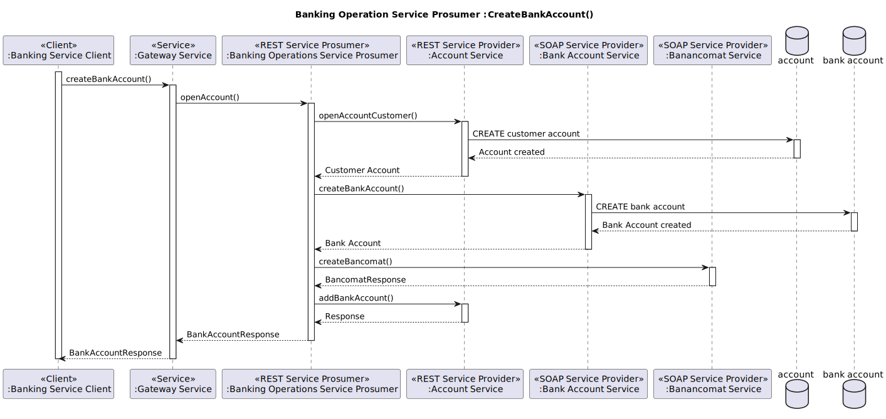
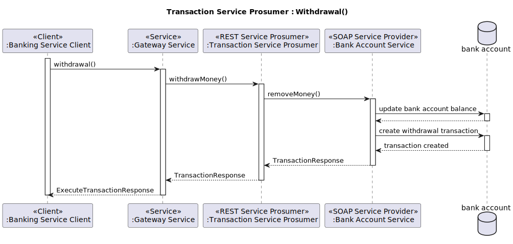

# Banking Micro-SOA System

Il “Sistema micro-SOA bancario” è un moderno sistema bancario che implementa un'architettura orientata ai servizi (SOA)
utilizzando microservizi con tecnologie REST e SOAP.

Questo progetto dimostra come costruire un'applicazione scalabile e modulare in grado di gestire le comuni operazioni
bancarie,
sfruttando le migliori pratiche di ingegneria del software e gli strumenti più avanzati.

Utilizza Apache CXF, Spring Boot, Docker e Maven.

## Requisiti di Esame

Il progetto in questione rispecchia tutti i requisiti richiesti e descritti dal seguente file:
[FINAL_TEST_23-24.pdf](/docs/FINAL_TEST_23-24.pdf)

## Obiettivi del Sistema

Gli obiettivi principali del sistema **Banking Micro SOA System** sono:

- **Gestione Efficiente degli Utenti**: Garantire un processo sicuro e semplice di gestione degli account e
  autenticazione degli utenti.
- **Gestione delle Operazioni sul Conto**: Abilitare l'apertura di conti e bancomat, oltre alla generazione di report
  dettagliati sullo stato dei conti.
- **Gestione Completa dei Conti Correnti**: Permettere operazioni di aggiunta e rimozione di denaro, nonché la
  registrazione di tutte le transazioni.
- **Gestione Avanzata dei Bancomat**: Consentire la creazione di bancomat e la registrazione delle transazioni
  effettuate tramite questi dispositivi.
- **Gestione dei Prestiti**: Consente l'apertura e l'estinzione dei prestiti con tracciamento preciso delle transazioni
  correlate.
- **Esecuzione delle Transazioni**: Supportare varie operazioni come bonifici, prelievi, depositi e pagamenti bancomat.
- **Generazione di Report**: Fornire un report finanziario complessivo di tutte le operazioni, offrendo una visione
  chiara e integrata delle attività finanziarie.

## Funzionamento del Sistema

**Il sistema è strutturato in modo modulare**, suddividendo le principali funzionalità in servizi specifici, ciascuno
responsabile di un particolare aspetto della gestione bancaria:

- Gestione dell'Utenza:

    - Account Management: Creazione, aggiornamento e cancellazione degli account utente.
      Autenticazione: Implementazione di sistemi di autenticazione robusti per garantire la sicurezza degli accessi.

- Gestione del Conto Corrente:

    - Operazioni sul Conto: Aggiunta e rimozione di fondi, registrazione dettagliata di tutte le transazioni.

- Gestione del Bancomat:

    - Creazione Bancomat: Configurazione e gestione dei dispositivi bancomat.
    - Transazioni Bancomat: Salvataggio e tracciamento delle operazioni effettuate tramite bancomat.

- Gestione dei Prestiti:

    - Apertura/Estinzione Prestiti: Procedure dell'intero ciclo di vita dei prestiti, dalla richiesta alla chiusura.

- Esecuzione delle Transazioni:

    - Bonifici, Prelievi, Depositi e Pagamenti Bancomat: Esecuzione e registrazione di tutte le operazioni finanziarie.

- Operazioni sul Conto:

    - Apertura Conto/Bancomat: Processo di apertura di nuovi conti e dispositivi bancomat.
    - Report Conto: Generazione di report dettagliati sullo stato dei conti.

- Gestione dei Report:

    - Report Finanziario Complessivo: Creazione di report integrati che forniscono una visione globale delle attività
      finanziarie.

## Motivazioni legate alll'Approccio SOA e Microservices

L'adozione di un'architettura SOA e microservizi per il Banking Micro SOA System è motivata da diversi vantaggi chiave:

- **Manutenibilità**: La divisione del sistema in microservizi indipendenti rende più semplice la gestione,
  l'aggiornamento e la correzione di errori. Ogni servizio può essere sviluppato, distribuito e mantenuto separatamente,
  riducendo il rischio di impatti negativi sul sistema complessivo.

- **Scalabilità**: La possibilità di istanziare più nodi del sistema permette di scalare facilmente le risorse in base
  alla domanda. In un ambiente bancario con un alto volume di transazioni, questa flessibilità è cruciale per garantire
  prestazioni ottimali e continuità del servizio.

- **Affidabilità**: L'architettura basata su microservizi isola i guasti, impedendo che un problema in un singolo
  componente comprometta l'intero sistema. Questo approccio aumenta significativamente l'affidabilità e la resilienza
  del sistema bancario.

- **Flessibilità**: L'uso di SOA e microservizi facilita l'integrazione con altri sistemi e l'implementazione di nuove
  funzionalità senza dover riscrivere l'intero codice base, accelerando i tempi di sviluppo e distribuzione.

Il sistema **Banking Micro SOA System** rappresenta quindi una soluzione all'avanguardia per la gestione bancaria,
capace di rispondere alle sfide moderne con efficienza e robustezza.

## Use Case Diagram


[Uses_cases_it.svg](/docs/Uses_cases_it.svg)

In questo scenario possiamo vedere tutti gli utenti del sistema che possono eseguire le azioni descritte in precedenza:

1. **Login:** Effettuare l'autenticazione e rilasciare il JWT.
2. **Gestione Account:** Creazione di un account della corretta tipologia utente, visualizzazione dettagli account.
3. **Gestione Conto Corrente:** Creazione conto corrente, aggiunta e rimozione fondi su un conto, gestione delle
   transazioni bancarie e generazione del report del conto corrente.
4. **Gestione Bancomat:** Configurazione di un bancomat, registrazione delle transazioni effettuate con il bancomat,
   generazione report del bancomat.
5. **Gestione Prestiti:** Apertura ed estinzione di un prestito, generazione del report sui prestiti.
6. **Registrazione Account con Conto Corrente e Bancomat:** Include la creazione di un account cliente, l'apertura di un
   conto corrente e la configurazione di un bancomat.
7. **Gestione Operazioni Bancarie:**
    1. **Generazione di un Report Parziale** che include:
        1. Dettagli Account
        2. Report Transazioni sul Conto Corrente
        3. Report Transazioni con Bancomat
    2. **Generazione di un Report Totale** che include:
        1. Dettagli Account
        2. Report Transazioni sul Conto Corrente
        3. Report Transazioni con Bancomat
        4. Report Prestiti

## Component Diagram


### Componenti

1. **Banking Mini SOA System**
    - Rappresenta il sistema principale che include tutti i sottosistemi e i servizi.

2. **Account Service**
    - Tipo: REST Service Provider
    - Responsabilità: Gestire le operazioni relative agli account come l'autenticazione, la creazione e l'aggiunta di
      account. Ha una gestione della persistenza dei dati utilizzando un database per salvare le informazioni relative
      agli account.
    - Operazioni:
        - `OpenAccount (Custometr/Banker/Admin)`
        - `Login`
        - `AddBankAccount`
        - `GetAccount`
        - `CheckTokenResponse`

3. **Bank Account Service**
    - Tipo: SOAP Service Provider
    - Responsabilità: gestione dei conti correnti, aggiunta e rimozione denaro e salvataggio transazioni. Tiene traccia
      di tutte le informazioni dei conti bancari e le relative transazioni. su un database.
    - Operazioni:
        - `CreateBankAccount`
        - `AddMoney`
        - `RemoveMopney`
        - `BancomatPay`
        - `ExecuteTransfer`
        - `CheckBankAccountTranser`
        - `GetBankAccountTransaction`
        - `GetBankAccountDetails`

4. **Bancomat Service**
    - Tipo: SOAP Service Provider
    - Responsabilità: Gestire le operazioni relative alla gestione dei bancomat e delle relative transazioni. Ha una
      gestione della persistenza dei dati utilizzando un database per salvare le informazioni dei bancomat e le relative
      transazioni.
    - Operazioni:
        - `CreateBancomat`
        - `GetBancomatDetails`
        - `GetBancomatDetailsByNumber`
        - `ExecuteTransaction`
        - `GetBancomatTransaction`

5. **Banking Operations Service Prosumer**
    - Tipo: REST Service Prosumer
    - Responsabilità: Gestire le operazioni bancarie di apertura conto
    - Operazioni:
        - `OpenAccount`
        - `GetReportBankAccountFromIdAccount`
        - `RequestAtmCard`
        - `GetAtmCard`

6. **Loan Service Prosumer**
    - Tipo: REST Service Prosumer
    - Responsabilità: Gestire le operazioni relative ai prestiti come la creazione e l'estinzione oltre tenere traccia
      di uno storico dei prestiti dell'utente.
    - Operazioni:
        - `OpenLoan`
        - `CloseLoanByIdLoan`
        - `GetLoanByIdLoan`
        - `GetAllLoanByIdAccount`
        - `GetAllLoanByIdBankAccount`

7. **Transaction Service Prosumer**
    - Tipo: REST Service Prosumer
    - Responsabilità: Gestire le transazioni finanziarie come depositi, prelievi, bonifici e pagamenti con il bancomat.
    - Operazioni:
        - `DepositMoney`
        - `WithdrawMoney`
        - `ExecuteTransfer`
        - `ExecuteAtmPayment`

8. **Financial Report Service Prosumer**
    - Tipo: REST Service Prosumer
    - Responsabilità: Generare e fornire report finanziari completi di tutta la posizione bancaria dell'account.
    - Operazioni:
        - `GetFinancialReportByIdAccount`

9. **Gateway Service**
    - Tipo: Gateway
    - Responsabilità: Fornire un punto di ingresso unificato per i servizi del sistema bancario.
    - Operazioni:
        - `HandleRequests`

10. **Discovery Service**
    - Tipo: Discovery
    - Responsabilità: Gestire la scoperta e l'integrazione dei servizi all'interno del sistema.

11. **Banking Service Client**
    - Tipo: Client Spring Shell
    - Responsabilità: Interfacciarsi con i vari servizi del sistema bancario attraverso il gateway per eseguire
      operazioni richieste dagli utenti.

### Note aggiuntive

- Il **Banking Service Client** comunica con il **Gateway Service** per tutte le operazioni.
- Il **Gateway Service** instrada le richieste ai rispettivi provider/Prosumer.
- I servizi seguono i paradigmi SOA/Microservizi con interfacce REST o SOAP, garantendo interoperabilità e scalabilità.
- Il load balancing è definito secondo una logica di *“Iterazione casuale non ripetitiva”*.
- I servizi sono progettati per essere modulari e possono essere aggiornati o sostituiti indipendentemente senza
  influenzare l'intero sistema.

## Sequence Diagrams

### Open Bank Account



In questa operazione l'utente customer esegue l'apertura del suo conto corrente registrandosi sistema bancario. la prima
richiesta viene fatta al servizio Banking Operation Service Prosumer il quale esegue a sua volta prima la richiesta di
creazione dell'account sul servizio Account Service Provider, poi la creazione del conto sul servizio BankAccount
Service Provider, subito dopo viene aggiornato l'account sul servizio Account Service Provider inserendo l'id del conto
appena creato e infine viene eseguita la creazione del bancomat sul relativo servizio (Bancomat Service Provider). Al
termine delle operazioni viene restituita la risposta di creazione al client.

### Login


Durante questa operazione, l'utente registrato effettua l'autenticazione al sistema.
L'utente invia le proprie credenziali al sistema, che le inoltra al servizio di gestione degli account (Account
Service).
Quest'ultimo verificherà le credenziali e genererà un token JWT.
Al termine del processo, verrà inviata una risposta contenente il token generato.

### Financial Report


Durante questa operazione, l'utente richiede il report finanziario completo al sistema. L'utente invia la richiesta al
sistema, che la inoltra al servizio di gestione dei report finanziari (Financial Report Service Prosumer). Quest'ultimo
invierà quattro richieste parallele:

1. GetBancomatDetails al servizio Bancomat Service (tipo SOAP)
2. GetBancomatTransactions al servizio Bancomat Service (tipo SOAP)
3. GetReportBankAccountFromIdAccount al servizio Banking Operations Service Prosumer (tipo REST)
4. GetAllLoanByIdAccount al servizio Loan Service Prosumer (tipo REST)

(L'operazione GetReportBankAccountFromIdAccount verrà descritta in seguito.)

Al termine del processo, le quattro risposte verranno combinate per generare il report finanziario completo.

### Bank Account Report


Durante questa operazione, l'utente richiede il report cel conto corrente al sistema. L'utente invia la richiesta al
sistema, che la inoltra al servizio di gestione delle operazioni bancarie (Banking Operation Service Prosumer) che a sua
volta esegue due chiamate prima al servizio di gestione dell'account per avere le informazioni dell'Account e poi al
servizio di gestione del conto bancario per avere le informazioni del Bank Account.

Al termine del processo, le informazioni verranno combinate per generare il report del conto bancario.

### Withdraw Money



Operazione di prelievo denaro dal conto corrente viene eseguita dall'utente customer. Attraverso il servizio Transaction
Service Prosumer viene inoltrata una richiesta al servizio Bank Account per verificare se sul conto corrente c'è
sufficiente denaro e viene sottratto al bilancio dello stesso. Immediatamente dopo viene creata una transazione del
prelievo e viene restituita al client.

### Open Loan


L'apertura di un Prestito eseguita dall'utente customer coinvolge il servizio Loan Service Prosumer e il BankAccount
Service Provider. In prima battuta viene creato un loan e poi viene aggiunto il corrispettivo denaro nel conto corrente
dell'utente richiedente sul BankAccount Service Provider. In ultimo, prima di ritornare la risposta, viene anche salvata
la transazione di apertura del loan sul conto dell'utente.

### Close Loan


L'operazione di chiusura di un prestito, eseguita da un utente consumer, prevede l'estinzione del prestito stesso
tramite la sottrazione del corrispettivo valore in denaro dal conto corrente dell'utente sul BankAccount Service
Provider. Viene controllato il bilancio del conto e sottratta la somma. Infine viene aggiornato lo stato del prestito
prima di ritornare la risposta

---

# Implementazione

Per ogni modulo del progetto è stato scelto di utilizzare Spring Boot 3.3.1 e Apache CXF 4.0.4.

Rispettando i requisiti d'esame, non sono state utilizzate tecnologie diverse da quelle spiegate e adottate in classe.

Il progetto si suddivide nei seguenti moduli Maven:

1. **account-service**: Provider. Responsabile delle operazioni di autenticazione e gestione dell'utenza. Questo
   servizio è stato implementato in REST tramite Apache CXF (JAX-RS) e Spring Boot, registrandosi tramite Netflix
   Eureka.

2. **bank-account-services**: Provider. Responsabile delle operazioni inerenti ai conti correnti. Questo servizio è
   stato implementato in SOAP tramite Apache CXF (JAX-WS) e Spring Boot, registrandosi tramite Netflix Eureka.

3. **bancomat-service**: Provider. Responsabile delle operazioni inerenti al bancomat. Questo servizio è stato
   implementato in SOAP tramite Apache CXF (JAX-WS) e Spring Boot, registrandosi tramite Netflix Eureka.

4. **banking-operations-service-prosumer**: Prosumer. Responsabile delle operazioni bancarie di apertura conto. Questo
   servizio è stato implementato in REST tramite Apache CXF (JAX-RS) e Spring Boot, registrandosi tramite Netflix
   Eureka. Tutte le operazioni sono erogate in modalità asincrona. Sono stati sviluppati client REST e SOAP che
   implementano un load balance verso il servizio produttore.

5. **loan-service-prosumer**: Prosumer. Responsabile delle operazioni relative ai prestiti. Questo servizio è stato
   implementato in REST tramite Apache CXF (JAX-RS) e Spring Boot, registrandosi tramite Netflix Eureka. Tutte le
   operazioni sono erogate in modalità asincrona. È stato sviluppato un client REST che implementa un load balance verso
   il servizio produttore.

6. **transaction-service-prosumer**: Prosumer. Responsabile di gestire le transazioni finanziarie come depositi,
   prelievi, bonifici e pagamenti con il bancomat. Questo servizio è stato implementato in REST tramite Apache CXF (
   JAX-RS) e Spring Boot, registrandosi tramite Netflix Eureka. Tutte le operazioni sono erogate in modalità asincrona.
   Sono stati sviluppati client REST e SOAP che implementano un load balance verso il servizio produttore.

7. **financial-report-service-prosumer**: Prosumer. Responsabile di generare e fornire report finanziari completi della
   posizione bancaria dell'account. Questo servizio è stato implementato in REST tramite Apache CXF (JAX-RS) e Spring
   Boot, registrandosi tramite Netflix Eureka. Tutte le operazioni sono erogate in modalità asincrona. Sono stati
   sviluppati client REST e SOAP che implementano un load balance verso il servizio produttore.

8. **gateway-service**: Gateway. Responsabile di fornire un singolo punto di ingresso unificato per i servizi del nostro
   sistema. Questo servizio è stato implementato con Spring Cloud Reactive Gateway e utilizza Netflix Eureka.

9. **discovery-service**: Discovery. Responsabile di gestire la scoperta e l'integrazione dei servizi all'interno del
   sistema. Questo servizio è stato implementato con Spring Cloud Discovery Eureka.

10. **banking-service-client**: Client. È il client di esempio che si interfaccia con il Gateway per effettuare le
    operazioni bancarie. Questo client è stato sviluppato con Spring Shell e Apache CXF (client REST).

## Integrazione Spring Boot e Apache CXF

Per integrare Apache CXF in un'applicazione Spring Boot, è necessario aggiungere una delle seguenti dipendenze
nel `pom.xml`:

```xml

<dependencies>
    <!-- ...  -->
    <dependency>
        <groupId>org.apache.cxf</groupId>
        <artifactId>cxf-spring-boot-starter-jaxws</artifactId>
        <version>4.0.4</version>
    </dependency>

    <dependency>
        <groupId>org.apache.cxf</groupId>
        <artifactId>cxf-spring-boot-starter-jaxrs</artifactId>
        <version>4.0.4</version>
    </dependency>
    <!-- ...  -->
</dependencies>
```

- **cxf-spring-boot-starter-jaxws**: Configura ed esegue Apache CXF in un'applicazione Spring, integrando le dipendenze
  necessarie per l'esecuzione di Apache CXF in modalità SOAP (JAX-WS).

- **cxf-spring-boot-starter-jaxrs**: Configura ed esegue Apache CXF in un'applicazione Spring, integrando le dipendenze
  necessarie per l'esecuzione di Apache CXF in modalità REST (JAX-RS).

**Nota Bene**: Se si desidera implementare un'applicazione Spring Boot che utilizzi Apache CXF sia in modalità SOAP che
REST, è sufficiente includere una delle due dipendenze, insieme alla dipendenza del client Apache CXF per l'altra
modalità. Ad esempio, se si include solo la dipendenza `cxf-spring-boot-starter-jaxws` (per SOAP), basterà aggiungere
al `pom.xml` la dipendenza della libreria mancante `cxf-rt-rs-client` per il client REST.

### Configurazione di Apache CXF per l'esecuzione corretta

Per creare un'applicazione SOAP, è necessario configurare manualmente Apache CXF. Ecco il codice Java necessario:

```java

@Configuration
public class ApacheCXFConfig {

    private final Bus bus;
    private final BankAccountService bankAccountService;
    private final MetricsProvider metricsProvider;

    public ApacheCXFConfig(Bus bus, BankAccountService bankAccountService, MetricsProvider metricsProvider) {
        this.bus = bus;
        this.bankAccountService = bankAccountService;
        this.metricsProvider = metricsProvider;
    }

    @Bean
    public Endpoint endpoint() {
        EndpointImpl endpoint = new EndpointImpl(bus, bankAccountService, null, null, new MetricsFeature[]{
                new MetricsFeature(metricsProvider)
        });
        endpoint.publish("/BankAccountService");
        return endpoint;
    }

}
```

Come si vede nel codice, è necessario creare manualmente un Java Bean che fornisca l'inizializzazione corretta di un
**Endpoint** Apache CXF. Tramite la dependency injection, Spring inietterà: il `Bus` di Apache CXF, `BankAccountService`
che è l'interfaccia che definisce i servizi SOAP, e il `MetricsProvider` che è il provider delle metriche (che vedremo
più avanti).

Per creare un'applicazione REST, si può sfruttare il component-scan di Spring per cercare tutte le classi necessarie ad
Apache CXF e Spring per configurare correttamente il servizio. La configurazione di Apache CXF può essere effettuata
tramite i seguenti comandi YAML:

```yaml
cxf:
  path: /services
  servlet.init:
    service-list-path: /info
  jaxrs:
    component-scan: true
    classes-scan-packages: it.univaq.sose.accountservice.configuration, it.univaq.sose.accountservice.service
```

Come si vede, sotto la chiave `cxf.jaxrs` sono presenti i settaggi per il component-scan. A questa chiave si devono
aggiungere i package che contengono codice Apache CXF (Endpoint e configurazioni varie). In questo modo, Apache CXF
controllerà il package alla ricerca di configurazioni o Endpoint.

Nel YAML sono presenti anche le chiavi `cxf.path` e `cxf.servlet.init.service-list-path`, se vengono settate:

- **cxf.path**: Identifica il percorso della servlet utilizzata da Apache CXF all'interno dell'applicazione.
- **cxf.servlet.init.service-list-path**: Identifica il percorso dove Apache CXF pubblicherà la lista dei servizi
  gestiti.

## Integrazione di Apache CXF Service Description OpenApi in Spring Boot

Per integrare il Service Description OpenApi di Apache CXF in Spring Boot, bisognerà aggiungere le seguenti dipendenze
nel
`pom.xml`:

```xml

<dependencies>
    <!-- ... -->
    <dependency>
        <groupId>org.webjars</groupId>
        <artifactId>swagger-ui</artifactId>
        <version>5.17.14</version>
    </dependency>
    <dependency>
        <groupId>org.apache.cxf</groupId>
        <artifactId>cxf-rt-rs-service-description</artifactId>
        <version>4.0.4</version>
    </dependency>
    <dependency>
        <groupId>org.apache.cxf</groupId>
        <artifactId>cxf-rt-rs-service-description-openapi-v3</artifactId>
        <version>4.0.4</version>
    </dependency>
    <!-- ... -->
</dependencies>
```

Dopo aver aggiunto le dipendenze, bisognerà creare un Java Bean che fornisca un'istanza correttamente configurata
di `OpenApiFeature`:

```java

@Configuration
public class ApacheCXFConfig {
    @Value("${cxf.path}")
    private String cxfPath;

    @Bean
    public OpenApiFeature createOpenApiFeature() {
        final OpenApiFeature openApiFeature = new OpenApiFeature();
        openApiFeature.setPrettyPrint(true);
        openApiFeature.setTitle("Account Service for Banking Micro-SOA System");
        openApiFeature.setContactName("The Banking Micro-SOA System team");
        openApiFeature.setDescription("This is Account Service for Banking Micro-SOA System. Uses Apache CXF and Spring Boot on JAX-RS.");
        openApiFeature.setVersion("0.0.1-SNAPSHOT");
        openApiFeature.setSwaggerUiConfig(
                new SwaggerUiConfig()
                        .url(cxfPath + "/openapi.json").queryConfigEnabled(false));
        return openApiFeature;
    }

    // ...
}
```

Ora puoi utilizzare le annotazioni OpenApi all'interno delle interfacce del tuo servizio REST.

## Integrazione del Logging di Apache CXF in Spring Boot

Per integrare la funzionalità di Logging di Apache CXF in Spring Boot, aggiungi la seguente dipendenza nel
tuo `pom.xml`:

```xml

<dependency>
    <groupId>org.apache.cxf</groupId>
    <artifactId>cxf-rt-features-logging</artifactId>
    <version>4.0.4</version>
</dependency>
```

Dopo aver aggiunto la dipendenza, bisognerà creare un Java Bean che fornisca un'istanza correttamente configurata
di `LoggingFeature`:

```java

@Configuration
public class ApacheCXFConfig {
    // ...

    @Bean
    public LoggingFeature loggingFeature() {
        LoggingFeature loggingFeature = new LoggingFeature();
        loggingFeature.setPrettyLogging(true);
        return loggingFeature;
    }
}
```

## Modifiche al Jackson JSON Provider per Apache CXF in Spring Boot

Per gestire correttamente le date durante la serializzazione e deserializzazione con il provider Jackson, è necessario
aggiungere le seguenti dipendenze:

```xml

<dependencies>
    <!-- ...  -->
    <dependency>
        <groupId>com.fasterxml.jackson.jakarta.rs</groupId>
        <artifactId>jackson-jakarta-rs-json-provider</artifactId>
    </dependency>
    <dependency>
        <groupId>com.fasterxml.jackson.core</groupId>
        <artifactId>jackson-annotations</artifactId>
    </dependency>
    <dependency>
        <groupId>com.fasterxml.jackson.datatype</groupId>
        <artifactId>jackson-datatype-jsr310</artifactId>
    </dependency>
    <!-- ...  -->
</dependencies>
```

Per configurare correttamente il Jackson Provider, includendo il supporto per le nuove classi di data e ora di Java 8 e
impostando la serializzazione delle date in un formato leggibile invece che come timestamp, è necessario creare un Java
Bean configurato come segue:

```java

@Configuration
public class ApacheCXFConfig {
    // ...
    @Bean
    public JacksonJsonProvider jsonProvider() {
        ObjectMapper objectMapper = new ObjectMapper();
        objectMapper.registerModule(new JavaTimeModule());
        objectMapper.disable(SerializationFeature.WRITE_DATES_AS_TIMESTAMPS);
        return new JacksonJsonProvider(objectMapper);
    }
}
```

Questo abiliterà il supporto allo standard ISO-8601.

Viene inoltre fornito un adapter per gestire manualmente le date:

```java
public class LocalDateTimeAdapter extends XmlAdapter<String, LocalDateTime> {
    private static final DateTimeFormatter DATE_FORMATTER = DateTimeFormatter.ISO_LOCAL_DATE_TIME;

    @Override
    public LocalDateTime unmarshal(String v) {
        return LocalDateTime.parse(v, DATE_FORMATTER);
    }

    @Override
    public String marshal(LocalDateTime v) {
        return v != null ? DATE_FORMATTER.format(v) : null;
    }
}
```

Esempio di utilizzo dell'adapter:

```java

@Data
@XmlRootElement(name = "AccountResponse")
@XmlAccessorType(XmlAccessType.FIELD)
public class AccountResponse implements Serializable {
    @Serial
    private static final long serialVersionUID = 4592896323731902686L;

    // ...

    @XmlElement(required = true)
    @XmlJavaTypeAdapter(LocalDateTimeAdapter.class)
    private LocalDateTime updateDate;

    @XmlElement(required = true)
    @XmlJavaTypeAdapter(LocalDateTimeAdapter.class)
    private LocalDateTime createDate;

    // ...
}
```

Questo codice garantisce che le date siano gestite correttamente durante la serializzazione e deserializzazione,
rispettando lo standard ISO-8601.

## Integrazione delle Metriche di Apache CXF con Spring Boot Actuator

In questo progetto, utilizziamo Spring Boot Actuator per generare le metriche dell'applicazione.

Per gestire e creare anche le metriche di Apache CXF, è necessario aggiungere la dipendenza `cxf-rt-features-metrics`.

Inserisci le seguenti dipendenze nel file `pom.xml`:

```xml

<dependencies>
    <!-- ...  -->
    <dependency>
        <groupId>org.springframework.boot</groupId>
        <artifactId>spring-boot-starter-actuator</artifactId>
    </dependency>
    <dependency>
        <groupId>org.apache.cxf</groupId>
        <artifactId>cxf-rt-features-metrics</artifactId>
        <version>4.0.4</version>
    </dependency>
    <dependency>
        <groupId>io.micrometer</groupId>
        <artifactId>micrometer-core</artifactId>
    </dependency>
    <!-- ...  -->
</dependencies>
```

#### Configurazione delle Metriche per un'Applicazione SOAP

Per abilitare le metriche in un'applicazione SOAP, inserisci un'istanza di `MetricsFeature` nel costruttore
dell'`Endpoint`:

```java

@Configuration
public class ApacheCXFConfig {

    private final Bus bus;
    private final BancomatService bancomatService;
    private final MetricsProvider metricsProvider;

    public ApacheCXFConfig(Bus bus, BancomatService bancomatService, MetricsProvider metricsProvider) {
        this.bus = bus;
        this.bancomatService = bancomatService;
        this.metricsProvider = metricsProvider;
    }

    @Bean
    public LoggingFeature loggingFeature() {
        LoggingFeature loggingFeature = new LoggingFeature();
        loggingFeature.setPrettyLogging(true);
        return loggingFeature;
    }

    @Bean
    public Endpoint endpoint() {
        EndpointImpl endpoint = new EndpointImpl(bus, bancomatService, null, null, new MetricsFeature[]{
                new MetricsFeature(metricsProvider)
        });
        endpoint.publish("/BancomatService");
        return endpoint;
    }
}
```

#### Configurazione delle Metriche per un'Applicazione REST

Per un'applicazione REST, bisogna aggiungere il package del provider delle metriche nella lista dei package del
component-scan:

```yaml
cxf:
  path: /services
  servlet.init:
    service-list-path: /info
  jaxrs:
    component-scan: true
    classes-scan-packages: org.apache.cxf.metrics, it.univaq.sose.accountservice.configuration, it.univaq.sose.accountservice.service
```

#### Configurazione di Spring Boot Actuator

Configura Spring Boot Actuator con i seguenti parametri:

```yaml
management:
  endpoints.web.exposure.include: health,info
  info.env.enabled: true

info.application:
  name: account-service
  description: Account Service for Banking Micro-SOA System
  version: 0.0.1-SNAPSHOT
```

Queste configurazioni consentono di integrare le metriche di Apache CXF con Spring Boot Actuator, offrendo una
visibilità completa sulle prestazioni della applicazione.

## Spring Cloud Discovery Eureka

In questo progetto utilizziamo **Spring Cloud Discovery Eureka** come servizio di scoperta per l'intero sistema.

#### Creazione del Server Eureka

Per integrare Spring Cloud Discovery Eureka, è necessario creare un server come applicazione Spring Boot separata.

##### Configurazione del `pom.xml` del Server

Di seguito il file `pom.xml` del server Eureka:

```xml
<?xml version="1.0" encoding="UTF-8"?>
<project xmlns="http://maven.apache.org/POM/4.0.0" xmlns:xsi="http://www.w3.org/2001/XMLSchema-instance"
         xsi:schemaLocation="http://maven.apache.org/POM/4.0.0 https://maven.apache.org/xsd/maven-4.0.0.xsd">
    <modelVersion>4.0.0</modelVersion>
    <parent>
        <groupId>org.springframework.boot</groupId>
        <artifactId>spring-boot-starter-parent</artifactId>
        <version>3.3.1</version>
        <relativePath/> <!-- lookup parent from repository -->
    </parent>
    <groupId>it.univaq.sose</groupId>
    <artifactId>discovery-service</artifactId>
    <version>0.0.1-SNAPSHOT</version>
    <name>discovery-service</name>
    <description>Discovery Service</description>

    <properties>
        <java.version>17</java.version>
        <spring-cloud.version>2023.0.2</spring-cloud.version>
    </properties>

    <dependencies>
        <dependency>
            <groupId>org.springframework.boot</groupId>
            <artifactId>spring-boot-starter-actuator</artifactId>
        </dependency>
        <dependency>
            <groupId>org.springframework.cloud</groupId>
            <artifactId>spring-cloud-starter-netflix-eureka-server</artifactId>
        </dependency>
        <dependency>
            <groupId>org.springframework.boot</groupId>
            <artifactId>spring-boot-starter-test</artifactId>
            <scope>test</scope>
        </dependency>
    </dependencies>

    <dependencyManagement>
        <dependencies>
            <dependency>
                <groupId>org.springframework.cloud</groupId>
                <artifactId>spring-cloud-dependencies</artifactId>
                <version>${spring-cloud.version}</version>
                <type>pom</type>
                <scope>import</scope>
            </dependency>
        </dependencies>
    </dependencyManagement>

    <build>
        <plugins>
            <plugin>
                <groupId>org.springframework.boot</groupId>
                <artifactId>spring-boot-maven-plugin</artifactId>
            </plugin>
        </plugins>
    </build>
</project>
```

#### Configurazione del Server Eureka

La configurazione standard di Eureka prevede più nodi ridondanti per garantire l'affidabilità del servizio di scoperta.
Tuttavia, per adattare Eureka alle esigenze specifiche del nostro sistema, modificheremo alcune impostazioni:

```yaml
eureka:
  instance:
    hostname: ${EUREKA_HOSTNAME:localhost}
  server:
    # Switch off self-preservation. Will turn lease expiration on and evict all instances which no longer sent a heartbeat and whose lease has expired.
    # Self-preservation is desirable for Eureka clusters and where network outages (e.g. between data centers) could be possible.
    # Note: the lease validity / expiration is configured in the Eureka _client_ instances (see eureka.instance.lease-expiration-duration-in-seconds).
    # See: https://github.com/Netflix/eureka/wiki/Server-Self-Preservation-Mode
    # See: https://www.baeldung.com/eureka-self-preservation-renewal
    enable-self-preservation: false
    # Make sure this is set to the same value as the lease renewal interval in Eureka _client_ instances (or slightly higher)
    # This value is relevant for Eureka's calculation of the 'current renewal threshold'.
    # Specifically, the following equation is used: current renewal threshold = (60s / expected-client-renewal-interval-seconds) * renewal-percent-threshold * current number of client instances.
    # In this case:
    # - for one registered client: 60 / 3 * 0.5 * 1 = 10.
    # - for two registered clients: 60 / 3 * 0,5 * 2 = 20.
    expected-client-renewal-interval-seconds: 15 # Default: 30
    # The interval in which the instance eviction task scans for instances with expired leases.
    # Given in milliseconds.
    eviction-interval-timer-in-ms: 2000 # Default 60000
    # The cadence of calculating / adapting a new renewal threshold, i.e. how frequently a new threshold is calculated.
    # The renewal threshold is used to distinguish, when Eureka should go into self-preservation mode
    # (if eureka.server.enable-self-preservation: true). If less heartbeats than the threshold are received, Eureka assumes
    # a network outage and protects itsel from evicting all service instances - assuming that the outage is over soon, and
    # services are still there to continue sending heartbeats.
    renewal-threshold-update-interval-ms: 2000 # Default: 15 * 60 * 1000
    # The minimum renewal threshold, in percent. If less heartbeats than the given percentage are received per minute
    # Eureka will go into self-preservation mode (if eureka.server.enable-self-preservation: true) and stop evicting
    # service instances with expired leases that no longer send heartbeats - assuming there is only a temporal network
    # outage.
    renewal-percent-threshold: 0.5  # Default: 0.85
  client:
    registerWithEureka: false
    fetchRegistry: false
    serviceUrl:
      defaultZone: http://${eureka.instance.hostname}:${server.port}/eureka/
```

#### Integrazione del Client Eureka nei Moduli

Per utilizzare il servizio di scoperta creato, dobbiamo aggiungere la seguente dipendenza nel `pom.xml` dei nostri
moduli:

```xml

<dependencies>
    <dependency>
        <groupId>org.springframework.cloud</groupId>
        <artifactId>spring-cloud-starter-netflix-eureka-client</artifactId>
    </dependency>
</dependencies>

<dependencyManagement>
<dependencies>
    <dependency>
        <groupId>org.springframework.cloud</groupId>
        <artifactId>spring-cloud-dependencies</artifactId>
        <version>2023.0.2</version>
        <type>pom</type>
        <scope>import</scope>
    </dependency>
</dependencies>
</dependencyManagement>
```

#### Configurazione del Client Eureka

Per incrementare la reattività di Eureka, configuriamo il client come segue:

```yaml
eureka:
  client:
    registerWithEureka: true
    serviceUrl:
      defaultZone: http://${EUREKA_HOST:host.docker.internal}:${EUREKA_SERVER_PORT:8761}/eureka/
  instance:
    lease-expiration-duration-in-seconds: 11
    lease-renewal-interval-in-seconds: 5
    prefer-ip-address: true
    statusPageUrlPath: /services/info
    healthCheckUrlPath: /actuator/health
    metadataMap:
      servletPath: ${cxf.path}
```

##### Dettagli della Configurazione del Client

1. **registerWithEureka: true**
    - Indica che il client deve registrarsi con il server Eureka, permettendo al server di instradare le richieste verso
      di esso.
2. **serviceUrl.defaultZone**
    - Specifica l'URL del server Eureka con cui il client deve registrarsi. Utilizza variabili di ambiente per
      determinare l'host e la porta del server Eureka.
3. **lease-expiration-duration-in-seconds: 11**
    - Specifica la durata del lease. Dopo 11 secondi senza rinnovo, il lease scade e il server Eureka può rimuovere
      l'istanza.
4. **lease-renewal-interval-in-seconds: 5**
    - Indica la frequenza con cui il client invia un segnale di "heartbeat" al server Eureka per rinnovare il lease,
      utile per sviluppo o debug.
5. **prefer-ip-address: true**
    - Configura l'istanza per preferire l'indirizzo IP durante la registrazione e la comunicazione con il server Eureka,
      risolvendo problemi di risoluzione dei nomi dei container.
6. **statusPageUrlPath: /services/info**
    - Specifica il percorso URL per la pagina di stato dell'istanza, che contiene la lista dei servizi implementati da
      Apache CXF.
7. **healthCheckUrlPath: /actuator/health**
    - Indica il percorso URL per il controllo della salute dell'istanza.
8. **metadataMap.servletPath: ${cxf.path}**
    - Definisce una mappa di metadati che include il percorso servletPath, il cui valore è la root di Apache CXF.


