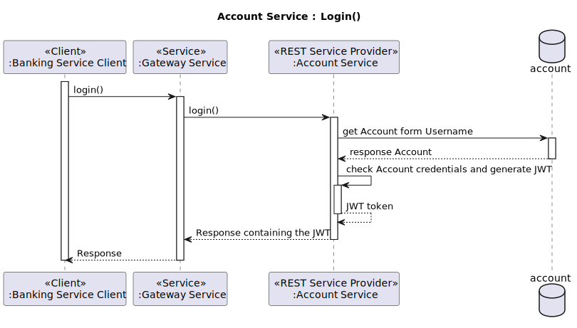
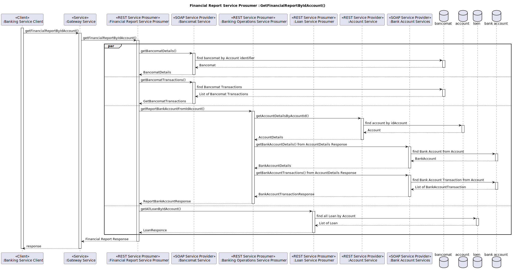
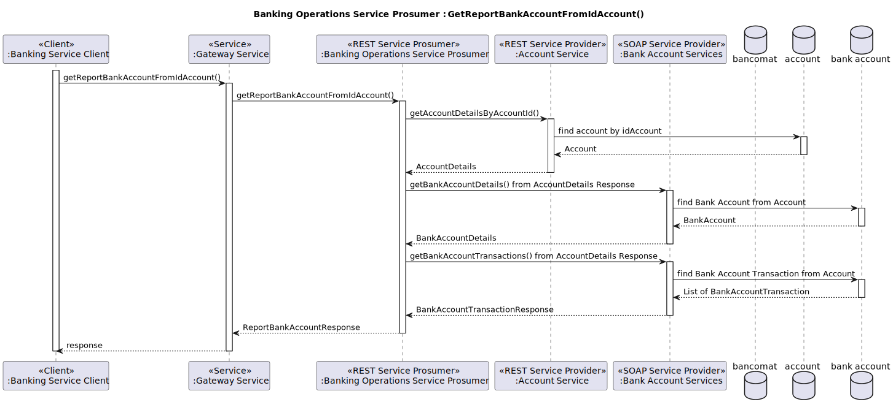
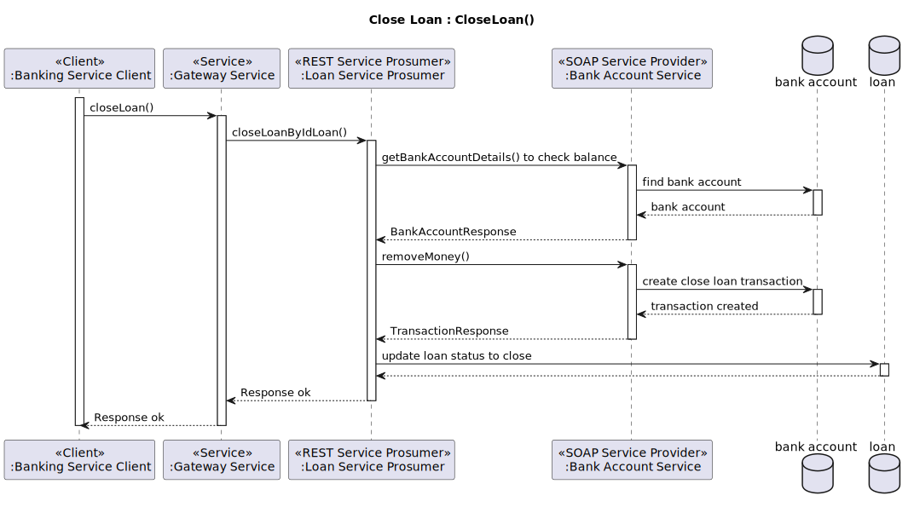

# Banking Micro-SOA System

Il “Sistema micro-SOA bancario” è un moderno sistema bancario che implementa un'architettura orientata ai servizi (SOA)
utilizzando microservizi con tecnologie REST e SOAP.

Questo progetto dimostra come costruire un'applicazione scalabile e modulare in grado di gestire le comuni operazioni
bancarie,
sfruttando le migliori pratiche di ingegneria del software e gli strumenti più avanzati.

Utilizza Apache CXF, Spring Boot, Docker e Maven.

## Requisiti di Esame

Il progetto in questione rispecchia tutti i requisiti richiesti e descritti dal seguente file:
[FINAL_TEST_23-24.pdf](/docs/FINAL_TEST_23-24.pdf)

## Obiettivi del Sistema

Gli obiettivi principali del sistema **Banking Micro SOA System** sono:

- **Gestione Efficiente degli Utenti**: Garantire un processo sicuro e semplice di gestione degli account e
  autenticazione degli utenti.
- **Gestione delle Operazioni sul Conto**: Abilitare l'apertura di conti e bancomat, oltre alla generazione di report
  dettagliati sullo stato dei conti.
- **Gestione Completa dei Conti Correnti**: Permettere operazioni di aggiunta e rimozione di denaro, nonché la
  registrazione di tutte le transazioni.
- **Gestione Avanzata dei Bancomat**: Consentire la creazione di bancomat e la registrazione delle transazioni
  effettuate tramite questi dispositivi.
- **Gestione dei Prestiti**: Consente l'apertura e l'estinzione dei prestiti con tracciamento preciso delle transazioni
  correlate.
- **Esecuzione delle Transazioni**: Supportare varie operazioni come bonifici, prelievi, depositi e pagamenti bancomat.
- **Generazione di Report**: Fornire un report finanziario complessivo di tutte le operazioni, offrendo una visione
  chiara e integrata delle attività finanziarie.

## Funzionamento del Sistema

**Il sistema è strutturato in modo modulare**, suddividendo le principali funzionalità in servizi specifici, ciascuno
responsabile di un particolare aspetto della gestione bancaria:

- Gestione dell'Utenza:

    - Account Management: Creazione, aggiornamento e cancellazione degli account utente.
      Autenticazione: Implementazione di sistemi di autenticazione robusti per garantire la sicurezza degli accessi.

- Gestione del Conto Corrente:

    - Operazioni sul Conto: Aggiunta e rimozione di fondi, registrazione dettagliata di tutte le transazioni.

- Gestione del Bancomat:

    - Creazione Bancomat: Configurazione e gestione dei dispositivi bancomat.
    - Transazioni Bancomat: Salvataggio e tracciamento delle operazioni effettuate tramite bancomat.

- Gestione dei Prestiti:

    - Apertura/Estinzione Prestiti: Procedure dell'intero ciclo di vita dei prestiti, dalla richiesta alla chiusura.

- Esecuzione delle Transazioni:

    - Bonifici, Prelievi, Depositi e Pagamenti Bancomat: Esecuzione e registrazione di tutte le operazioni finanziarie.

- Operazioni sul Conto:

    - Apertura Conto/Bancomat: Processo di apertura di nuovi conti e dispositivi bancomat.
    - Report Conto: Generazione di report dettagliati sullo stato dei conti.

- Gestione dei Report:

    - Report Finanziario Complessivo: Creazione di report integrati che forniscono una visione globale delle attività
      finanziarie.

## Motivazioni legate alll'Approccio SOA e Microservices

L'adozione di un'architettura SOA e microservizi per il Banking Micro SOA System è motivata da diversi vantaggi chiave:

- **Manutenibilità**: La divisione del sistema in microservizi indipendenti rende più semplice la gestione,
  l'aggiornamento e la correzione di errori. Ogni servizio può essere sviluppato, distribuito e mantenuto separatamente,
  riducendo il rischio di impatti negativi sul sistema complessivo.

- **Scalabilità**: La possibilità di istanziare più nodi del sistema permette di scalare facilmente le risorse in base
  alla domanda. In un ambiente bancario con un alto volume di transazioni, questa flessibilità è cruciale per garantire
  prestazioni ottimali e continuità del servizio.

- **Affidabilità**: L'architettura basata su microservizi isola i guasti, impedendo che un problema in un singolo
  componente comprometta l'intero sistema. Questo approccio aumenta significativamente l'affidabilità e la resilienza
  del sistema bancario.

- **Flessibilità**: L'uso di SOA e microservizi facilita l'integrazione con altri sistemi e l'implementazione di nuove
  funzionalità senza dover riscrivere l'intero codice base, accelerando i tempi di sviluppo e distribuzione.

Il sistema **Banking Micro SOA System** rappresenta quindi una soluzione all'avanguardia per la gestione bancaria,
capace di rispondere alle sfide moderne con efficienza e robustezza.

## Use Case Diagram


[Uses_cases_it.svg](/docs/Uses_cases_it.svg)

In questo scenario possiamo vedere tutti gli utenti del sistema che possono eseguire le azioni descritte in precedenza:

1. **Login:** Effettuare l'autenticazione e rilasciare il JWT.
2. **Gestione Account:** Creazione di un account della corretta tipologia utente, visualizzazione dettagli account.
3. **Gestione Conto Corrente:** Creazione conto corrente, aggiunta e rimozione fondi su un conto, gestione delle
   transazioni bancarie e generazione del report del conto corrente.
4. **Gestione Bancomat:** Configurazione di un bancomat, registrazione delle transazioni effettuate con il bancomat,
   generazione report del bancomat.
5. **Gestione Prestiti:** Apertura ed estinzione di un prestito, generazione del report sui prestiti.
6. **Registrazione Account con Conto Corrente e Bancomat:** Include la creazione di un account cliente, l'apertura di un
   conto corrente e la configurazione di un bancomat.
7. **Gestione Operazioni Bancarie:**
    1. **Generazione di un Report Parziale** che include:
        1. Dettagli Account
        2. Report Transazioni sul Conto Corrente
        3. Report Transazioni con Bancomat
    2. **Generazione di un Report Totale** che include:
        1. Dettagli Account
        2. Report Transazioni sul Conto Corrente
        3. Report Transazioni con Bancomat
        4. Report Prestiti

## Component Diagram


### Componenti

1. **Banking Mini SOA System**
    - Rappresenta il sistema principale che include tutti i sottosistemi e i servizi.

2. **Account Service**
    - Tipo: REST Service Provider
    - Responsabilità: Gestire le operazioni relative agli account come l'autenticazione, la creazione e l'aggiunta di
      account. Ha una gestione della persistenza dei dati utilizzando un database per salvare le informazioni relative
      agli account.
    - Operazioni:
        - `OpenAccount (Custometr/Banker/Admin)`
        - `Login`
        - `AddBankAccount`
        - `GetAccount`
        - `CheckTokenResponse`

3. **Bank Account Service**
    - Tipo: SOAP Service Provider
    - Responsabilità: gestione dei conti correnti, aggiunta e rimozione denaro e salvataggio transazioni. Tiene traccia
      di tutte le informazioni dei conti bancari e le relative transazioni. su un database.
    - Operazioni:
        - `CreateBankAccount`
        - `AddMoney`
        - `RemoveMopney`
        - `BancomatPay`
        - `ExecuteTransfer`
        - `CheckBankAccountTranser`
        - `GetBankAccountTransaction`
        - `GetBankAccountDetails`

4. **Bancomat Service**
    - Tipo: SOAP Service Provider
    - Responsabilità: Gestire le operazioni relative alla gestione dei bancomat e delle relative transazioni. Ha una
      gestione della persistenza dei dati utilizzando un database per salvare le informazioni dei bancomat e le relative
      transazioni.
    - Operazioni:
        - `CreateBancomat`
        - `GetBancomatDetails`
        - `GetBancomatDetailsByNumber`
        - `ExecuteTransaction`
        - `GetBancomatTransaction`

5. **Banking Operations Service Prosumer**
    - Tipo: REST Service Prosumer
    - Responsabilità: Gestire le operazioni bancarie di apertura conto
    - Operazioni:
        - `OpenAccount`
        - `GetReportBankAccountFromIdAccount`
        - `RequestAtmCard`
        - `GetAtmCard`

6. **Loan Service Prosumer**
    - Tipo: REST Service Prosumer
    - Responsabilità: Gestire le operazioni relative ai prestiti come la creazione e l'estinzione oltre tenere traccia
      di uno storico dei prestiti dell'utente.
    - Operazioni:
        - `OpenLoan`
        - `CloseLoanByIdLoan`
        - `GetLoanByIdLoan`
        - `GetAllLoanByIdAccount`
        - `GetAllLoanByIdBankAccount`

7. **Transaction Service Prosumer**
    - Tipo: REST Service Prosumer
    - Responsabilità: Gestire le transazioni finanziarie come depositi, prelievi, bonifici e pagamenti con il bancomat.
    - Operazioni:
        - `DepositMoney`
        - `WithdrawMoney`
        - `ExecuteTransfer`
        - `ExecuteAtmPayment`

8. **Financial Report Service Prosumer**
    - Tipo: REST Service Prosumer
    - Responsabilità: Generare e fornire report finanziari completi di tutta la posizione bancaria dell'account.
    - Operazioni:
        - `GetFinancialReportByIdAccount`

9. **Gateway Service**
    - Tipo: Gateway
    - Responsabilità: Fornire un punto di ingresso unificato per i servizi del sistema bancario.
    - Operazioni:
        - `HandleRequests`

10. **Discovery Service**
    - Tipo: Discovery
    - Responsabilità: Gestire la scoperta e l'integrazione dei servizi all'interno del sistema.

11. **Banking Service Client**
    - Tipo: Client Spring Shell
    - Responsabilità: Interfacciarsi con i vari servizi del sistema bancario attraverso il gateway per eseguire
      operazioni richieste dagli utenti.

### Note aggiuntive

- Il **Banking Service Client** comunica con il **Gateway Service** per tutte le operazioni.
- Il **Gateway Service** instrada le richieste ai rispettivi provider/Prosumer.
- I servizi seguono i paradigmi SOA/Microservizi con interfacce REST o SOAP, garantendo interoperabilità e scalabilità.
- Il load balancing è definito secondo una logica di *“Iterazione casuale non ripetitiva”*.
- I servizi sono progettati per essere modulari e possono essere aggiornati o sostituiti indipendentemente senza
  influenzare l'intero sistema.

## Sequence Diagrams

### Open Bank Account


In questa operazione l'utente customer esegue l'apertura del suo conto corrente registrandosi sistema bancario. la prima
richiesta viene fatta al servizio Banking Operation Service Prosumer il quale esegue a sua volta prima la richiesta di
creazione dell'account sul servizio Account Service Provider, poi la creazione del conto sul servizio BankAccount
Service Provider, subito dopo viene aggiornato l'account sul servizio Account Service Provider inserendo l'id del conto
appena creato e infine viene eseguita la creazione del bancomat sul relativo servizio (Bancomat Service Provider). Al
termine delle operazioni viene restituita la risposta di creazione al client.

### Login



Durante questa operazione, l'utente registrato effettua l'autenticazione al sistema.
L'utente invia le proprie credenziali al sistema, che le inoltra al servizio di gestione degli account (Account
Service).
Quest'ultimo verificherà le credenziali e genererà un token JWT.
Al termine del processo, verrà inviata una risposta contenente il token generato.

### Financial Report



Durante questa operazione, l'utente richiede il report finanziario completo al sistema. L'utente invia la richiesta al
sistema, che la inoltra al servizio di gestione dei report finanziari (Financial Report Service Prosumer). Quest'ultimo
invierà quattro richieste parallele:

1. GetBancomatDetails al servizio Bancomat Service (tipo SOAP)
2. GetBancomatTransactions al servizio Bancomat Service (tipo SOAP)
3. GetReportBankAccountFromIdAccount al servizio Banking Operations Service Prosumer (tipo REST)
4. GetAllLoanByIdAccount al servizio Loan Service Prosumer (tipo REST)

(L'operazione GetReportBankAccountFromIdAccount verrà descritta in seguito.)

Al termine del processo, le quattro risposte verranno combinate per generare il report finanziario completo.

### Bank Account Report



Durante questa operazione, l'utente richiede il report cel conto corrente al sistema. L'utente invia la richiesta al
sistema, che la inoltra al servizio di gestione delle operazioni bancarie (Banking Operation Service Prosumer) che a sua
volta esegue due chiamate prima al servizio di gestione dell'account per avere le informazioni dell'Account e poi al
servizio di gestione del conto bancario per avere le informazioni del Bank Account.

Al termine del processo, le informazioni verranno combinate per generare il report del conto bancario.

### Withdraw Money


Operazione di prelievo denaro dal conto corrente viene eseguita dall'utente customer. Attraverso il servizio Transaction
Service Prosumer viene inoltrata una richiesta al servizio Bank Account per verificare se sul conto corrente c'è
sufficiente denaro e viene sottratto al bilancio dello stesso. Immediatamente dopo viene creata una transazione del
prelievo e viene restituita al client.

### Open Loan


L'apertura di un Prestito eseguita dall'utente customer coinvolge il servizio Loan Service Prosumer e il BankAccount
Service Provider. In prima battuta viene creato un loan e poi viene aggiunto il corrispettivo denaro nel conto corrente
dell'utente richiedente sul BankAccount Service Provider. In ultimo, prima di ritornare la risposta, viene anche salvata
la transazione di apertura del loan sul conto dell'utente.

### Close Loan



L'operazione di chiusura di un prestito, eseguita da un utente consumer, prevede l'estinzione del prestito stesso
tramite la sottrazione del corrispettivo valore in denaro dal conto corrente dell'utente sul BankAccount Service
Provider. Viene controllato il bilancio del conto e sottratta la somma. Infine viene aggiornato lo stato del prestito
prima di ritornare la risposta

---

# Implementazione

Per ogni modulo del progetto è stato scelto di utilizzare Spring Boot 3.3.1 e Apache CXF 4.0.4.

Rispettando i requisiti d'esame, non sono state utilizzate tecnologie diverse da quelle spiegate e adottate in classe.

Il progetto si suddivide nei seguenti moduli Maven:

1. **account-service**: Provider. Responsabile delle operazioni di autenticazione e gestione dell'utenza. Questo
   servizio è stato implementato in REST tramite Apache CXF (JAX-RS) e Spring Boot, registrandosi tramite Netflix
   Eureka.

2. **bank-account-services**: Provider. Responsabile delle operazioni inerenti ai conti correnti. Questo servizio è
   stato implementato in SOAP tramite Apache CXF (JAX-WS) e Spring Boot, registrandosi tramite Netflix Eureka.

3. **bancomat-service**: Provider. Responsabile delle operazioni inerenti al bancomat. Questo servizio è stato
   implementato in SOAP tramite Apache CXF (JAX-WS) e Spring Boot, registrandosi tramite Netflix Eureka.

4. **banking-operations-service-prosumer**: Prosumer. Responsabile delle operazioni bancarie di apertura conto. Questo
   servizio è stato implementato in REST tramite Apache CXF (JAX-RS) e Spring Boot, registrandosi tramite Netflix
   Eureka. Tutte le operazioni sono erogate in modalità asincrona. Sono stati sviluppati client REST e SOAP che
   implementano un load balance verso il servizio produttore.

5. **loan-service-prosumer**: Prosumer. Responsabile delle operazioni relative ai prestiti. Questo servizio è stato
   implementato in REST tramite Apache CXF (JAX-RS) e Spring Boot, registrandosi tramite Netflix Eureka. Tutte le
   operazioni sono erogate in modalità asincrona. È stato sviluppato un client REST che implementa un load balance verso
   il servizio produttore.

6. **transaction-service-prosumer**: Prosumer. Responsabile di gestire le transazioni finanziarie come depositi,
   prelievi, bonifici e pagamenti con il bancomat. Questo servizio è stato implementato in REST tramite Apache CXF (
   JAX-RS) e Spring Boot, registrandosi tramite Netflix Eureka. Tutte le operazioni sono erogate in modalità asincrona.
   Sono stati sviluppati client REST e SOAP che implementano un load balance verso il servizio produttore.

7. **financial-report-service-prosumer**: Prosumer. Responsabile di generare e fornire report finanziari completi della
   posizione bancaria dell'account. Questo servizio è stato implementato in REST tramite Apache CXF (JAX-RS) e Spring
   Boot, registrandosi tramite Netflix Eureka. Tutte le operazioni sono erogate in modalità asincrona. Sono stati
   sviluppati client REST e SOAP che implementano un load balance verso il servizio produttore.

8. **gateway-service**: Gateway. Responsabile di fornire un singolo punto di ingresso unificato per i servizi del nostro
   sistema. Questo servizio è stato implementato con Spring Cloud Reactive Gateway e utilizza Netflix Eureka.

9. **discovery-service**: Discovery. Responsabile di gestire la scoperta e l'integrazione dei servizi all'interno del
   sistema. Questo servizio è stato implementato con Spring Cloud Discovery Eureka.

10. **banking-service-client**: Client. È il client di esempio che si interfaccia con il Gateway per effettuare le
    operazioni bancarie. Questo client è stato sviluppato con Spring Shell e Apache CXF (client REST).

Le implementazioni di tutti i Prosumer sono di tipo asincrono, poiché devono interagire con uno o più Provider, il che
comporta ritardi nelle loro risposte.

Per quanto riguarda i Provider, essi sono stati ottimizzati per supportare un
elevato numero di operazioni al secondo, permettendo l'implementazione della maggior parte delle loro operazioni in modo
sincrono.

## Integrazione Spring Boot e Apache CXF

Per integrare Apache CXF in un'applicazione Spring Boot, è necessario aggiungere una delle seguenti dipendenze
nel `pom.xml`:

```xml

<dependencies>
    <!-- ...  -->
    <dependency>
        <groupId>org.apache.cxf</groupId>
        <artifactId>cxf-spring-boot-starter-jaxws</artifactId>
        <version>4.0.4</version>
    </dependency>

    <dependency>
        <groupId>org.apache.cxf</groupId>
        <artifactId>cxf-spring-boot-starter-jaxrs</artifactId>
        <version>4.0.4</version>
    </dependency>
    <!-- ...  -->
</dependencies>
```

- **cxf-spring-boot-starter-jaxws**: Configura ed esegue Apache CXF in un'applicazione Spring, integrando le dipendenze
  necessarie per l'esecuzione di Apache CXF in modalità SOAP (JAX-WS).

- **cxf-spring-boot-starter-jaxrs**: Configura ed esegue Apache CXF in un'applicazione Spring, integrando le dipendenze
  necessarie per l'esecuzione di Apache CXF in modalità REST (JAX-RS).

**Nota Bene**: Se si desidera implementare un'applicazione Spring Boot che utilizzi Apache CXF sia in modalità SOAP che
REST, è sufficiente includere una delle due dipendenze, insieme alla dipendenza del client Apache CXF per l'altra
modalità. Ad esempio, se si include solo la dipendenza `cxf-spring-boot-starter-jaxws` (per SOAP), basterà aggiungere
al `pom.xml` la dipendenza della libreria mancante `cxf-rt-rs-client` per il client REST.

### Configurazione di Apache CXF per l'esecuzione corretta

Per creare un'applicazione SOAP, è necessario configurare manualmente Apache CXF. Ecco il codice Java necessario:

```java

@Configuration
public class ApacheCXFConfig {

    private final Bus bus;
    private final BankAccountService bankAccountService;
    private final MetricsProvider metricsProvider;

    public ApacheCXFConfig(Bus bus, BankAccountService bankAccountService, MetricsProvider metricsProvider) {
        this.bus = bus;
        this.bankAccountService = bankAccountService;
        this.metricsProvider = metricsProvider;
    }

    @Bean
    public Endpoint endpoint() {
        EndpointImpl endpoint = new EndpointImpl(bus, bankAccountService, null, null, new MetricsFeature[]{
                new MetricsFeature(metricsProvider)
        });
        endpoint.publish("/BankAccountService");
        return endpoint;
    }

}
```

Come si vede nel codice, è necessario creare manualmente un Java Bean che fornisca l'inizializzazione corretta di un
**Endpoint** Apache CXF. Tramite la dependency injection, Spring inietterà: il `Bus` di Apache CXF, `BankAccountService`
che è l'interfaccia che definisce i servizi SOAP, e il `MetricsProvider` che è il provider delle metriche (che vedremo
più avanti).

Per creare un'applicazione REST, si può sfruttare il component-scan di Spring per cercare tutte le classi necessarie ad
Apache CXF e Spring per configurare correttamente il servizio. La configurazione di Apache CXF può essere effettuata
tramite i seguenti comandi YAML:

```yaml
cxf:
  path: /services
  servlet.init:
    service-list-path: /info
  jaxrs:
    component-scan: true
    classes-scan-packages: it.univaq.sose.accountservice.configuration, it.univaq.sose.accountservice.service
```

Come si vede, sotto la chiave `cxf.jaxrs` sono presenti i settaggi per il component-scan. A questa chiave si devono
aggiungere i package che contengono codice Apache CXF (Endpoint e configurazioni varie). In questo modo, Apache CXF
controllerà il package alla ricerca di configurazioni o Endpoint.

Nel YAML sono presenti anche le chiavi `cxf.path` e `cxf.servlet.init.service-list-path`, se vengono settate:

- **cxf.path**: Identifica il percorso della servlet utilizzata da Apache CXF all'interno dell'applicazione.
- **cxf.servlet.init.service-list-path**: Identifica il percorso dove Apache CXF pubblicherà la lista dei servizi
  gestiti.

## Integrazione di Apache CXF Service Description OpenApi in Spring Boot

Per integrare il Service Description OpenApi di Apache CXF in Spring Boot, bisognerà aggiungere le seguenti dipendenze
nel
`pom.xml`:

```xml

<dependencies>
    <!-- ... -->
    <dependency>
        <groupId>org.webjars</groupId>
        <artifactId>swagger-ui</artifactId>
        <version>5.17.14</version>
    </dependency>
    <dependency>
        <groupId>org.apache.cxf</groupId>
        <artifactId>cxf-rt-rs-service-description</artifactId>
        <version>4.0.4</version>
    </dependency>
    <dependency>
        <groupId>org.apache.cxf</groupId>
        <artifactId>cxf-rt-rs-service-description-openapi-v3</artifactId>
        <version>4.0.4</version>
    </dependency>
    <!-- ... -->
</dependencies>
```

Dopo aver aggiunto le dipendenze, bisognerà creare un Java Bean che fornisca un'istanza correttamente configurata
di `OpenApiFeature`:

```java

@Configuration
public class ApacheCXFConfig {
    @Value("${cxf.path}")
    private String cxfPath;

    @Bean
    public OpenApiFeature createOpenApiFeature() {
        final OpenApiFeature openApiFeature = new OpenApiFeature();
        openApiFeature.setPrettyPrint(true);
        openApiFeature.setTitle("Account Service for Banking Micro-SOA System");
        openApiFeature.setContactName("The Banking Micro-SOA System team");
        openApiFeature.setDescription("This is Account Service for Banking Micro-SOA System. Uses Apache CXF and Spring Boot on JAX-RS.");
        openApiFeature.setVersion("0.0.1-SNAPSHOT");
        openApiFeature.setSwaggerUiConfig(
                new SwaggerUiConfig()
                        .url(cxfPath + "/openapi.json").queryConfigEnabled(false));
        return openApiFeature;
    }

    // ...
}
```

Ora puoi utilizzare le annotazioni OpenApi all'interno delle interfacce del tuo servizio REST.

## Ottimizzazioni effettuate nei Servizi

Essendo un sistema bancario, sono state effettuate ottimizzazioni per aumentare il volume di richieste gestibili entro
l'intervallo del Time-to-Live di una richiesta (60 secondi).

All'interno dei servizi, utilizziamo Spring Data JPA con PostgreSQL. Abbiamo quindi ottimizzato il comportamento di
Hibernate e Hikari per massimizzare le operazioni eseguite sul database.

```yaml
spring:
  datasource:
    driver-class-name: org.postgresql.Driver
    url: jdbc:postgresql://host.docker.internal:5432/account?reWriteBatchedInserts=true
    username: postgres
    password: 123456
    name: Account_DS
    hikari:
      auto-commit: false
      minimum-idle: 0
      maximum-pool-size: 10
      max-lifetime: 600000
      transaction-isolation: TRANSACTION_READ_COMMITTED
      data-source-properties:
        prepStmtCacheSqlLimit: 1024
        useServerPrepStmts: false
        prepStmtCacheSize: 500
        cachePrepStmts: true
  batch:
    jdbc:
      initialize-schema: always
  jpa:
    open-in-view: false
    hibernate:
      ddl-auto: update
    properties:
      hibernate:
        jdbc:
          time_zone: UTC
          batch_size: 10
        order_inserts: true
        order_updates: true
        query:
          fail_on_pagination_over_collection_fetch: true
          plan_cache_max_size: 4096
          in_clause_parameter_padding: true
        format_sql: false
        connection:
          provider_disables_autocommit: true
    show-sql: false
```

##### Dettagli della Configurazione di Hibernate e Hikari

1. `spring.datasource`: Configura il datasource per la connessione al database.
    - `driver-class-name`: Specifica il driver JDBC da utilizzare, in questo caso il driver PostgreSQL.
    - `url`: L'URL di connessione al database PostgreSQL. L'opzione `reWriteBatchedInserts=true` permette di ottimizzare
      le operazioni batch riscrivendole in un'unica operazione.
    - `username`: Il nome utente per la connessione al database.
    - `password`: La password per la connessione al database.
    - `name`: Un nome identificativo per il datasource.
    - `hikari`: Configurazione specifica per HikariCP, il connection pool utilizzato.
        - `auto-commit`: Impostato a false per non eseguire il commit automatico delle transazioni.
        - `minimum-idle`: Numero minimo di connessioni inattive mantenute nel pool.
        - `maximum-pool-size`: Numero massimo di connessioni nel pool.
        - `max-lifetime`: Tempo massimo di vita di una connessione in millisecondi.
        - `transaction-isolation`: Livello di isolamento delle transazioni, in questo caso TRANSACTION_READ_COMMITTED.
        - `data-source-properties`: Proprietà aggiuntive per il datasource.
            - `prepStmtCacheSqlLimit`: Limite di dimensione per la cache delle istruzioni preparate.
            - `useServerPrepStmts`: Specifica se utilizzare le istruzioni preparate sul server.
            - `prepStmtCacheSize`: Dimensione della cache per le istruzioni preparate.
            - `cachePrepStmts`: Abilita la cache delle istruzioni preparate.
2. `spring.batch.jdbc`: Specifiche per operazioni Batch.
    - `initialize-schema`: Impostato a `always`, inizializza lo schema del database per Spring Batch ad ogni avvio.
3. `spring.jpa`: Specifiche per JPA (Java Persistence API).
    - `open-in-view`: Impostato a false, chiude automaticamente la sessione Hibernate dopo la vista.
    - `hibernate.ddl-auto`: Impostato a update, Hibernate aggiorna lo schema del database all'avvio dell'applicazione.
    - `properties`: Configurazioni aggiuntive.
        - `hibernate`: Specifiche per Hibernate.
            - `jdbc`: Specifiche per jdbc.
                - `time_zone`: Imposta il fuso orario a UTC.
                - `batch_size`: Dimensione del batch per le operazioni di inserimento/aggiornamento.
        - `order_inserts`: Abilita l'ordinamento degli inserimenti per ottimizzare le operazioni batch.
        - `order_updates`: Abilita l'ordinamento degli aggiornamenti per ottimizzare le operazioni batch.
        - `query`: Specifiche per le Query da eseguire sul DB.
            - `fail_on_pagination_over_collection_fetch`: Imposta se fallire in caso di paginazione su fetch di
              collezioni.
            - `plan_cache_max_size`: Dimensione massima della cache dei piani di query.
            - `in_clause_parameter_padding`: Abilita il padding dei parametri nelle clausole IN.
        - `format_sql`: Impostato a false, non formatta l'SQL generato da Hibernate.
        - `connection.provider_disables_autocommit`: Impostato a true, disabilita l'autocommit per il provider di
          connessione.
    - `show-sql`: Impostato a false, non mostra l'SQL generato da Hibernate nella console.

Grazie a queste modifiche, siamo in grado di raggiungere oltre 5.000 operazioni di scrittura al secondo e più di 80.000
operazioni di lettura al secondo sul database.

Un'ulteriore ottimizzazione riguarda l'uso delle **SEQUENCE** come indici delle tabelle. In questo modo, Hibernate
richiede
al suo avvio degli ID che utilizzerà per il salvataggio di nuove entità, riducendo così il numero di query al database.

```java

@Getter
@Setter
@MappedSuperclass
@EntityListeners(AuditingEntityListener.class)
public class BaseEntity implements Serializable {
    @Serial
    private static final long serialVersionUID = -6204225224072578741L;

    @Id
    @GeneratedValue(strategy = GenerationType.SEQUENCE)
    @Column(name = "id", nullable = false)
    private Long id;

    @CreatedDate
    private LocalDateTime createDate;

    @LastModifiedDate
    private LocalDateTime updateDate;
}

@Getter
@Setter
@Entity
@Table(name = "account")
@SequenceGenerator(name = "account_seq", sequenceName = "account_sequence", allocationSize = 10) //Pre-Alloca solo 10 id
public class Account extends BaseEntity {
    @Serial
    private static final long serialVersionUID = 2741904033865180248L;

    @Column(name = "name", nullable = false)
    private String name;

    @Column(name = "surname", nullable = false)
    private String surname;

    @Column(name = "username", nullable = false)
    private String username;

    @Column(name = "password", nullable = false, length = 500)
    private String password;

    @Column(name = "email", nullable = false)
    private String email;

    @Column(name = "phone", nullable = false)
    private String phone;

    @Enumerated
    @Column(name = "role", nullable = false)
    private Role role;

    @Column(name = "id_bank_account")
    private Long idBankAccount;

    @Override
    public final boolean equals(Object object) {
        if (this == object) return true;
        if (object == null) return false;
        Class<?> oEffectiveClass = object instanceof HibernateProxy hibernateProxy ? hibernateProxy.getHibernateLazyInitializer().getPersistentClass() : object.getClass();
        Class<?> thisEffectiveClass = this instanceof HibernateProxy hibernateProxy ? hibernateProxy.getHibernateLazyInitializer().getPersistentClass() : this.getClass();
        if (thisEffectiveClass != oEffectiveClass) return false;
        Account account = (Account) object;
        return getId() != null && Objects.equals(getId(), account.getId());
    }

    @Override
    public final int hashCode() {
        return this instanceof HibernateProxy hibernateProxy ? hibernateProxy.getHibernateLazyInitializer().getPersistentClass().hashCode() : getClass().hashCode();
    }
}
```

## Integrazione del Logging di Apache CXF in Spring Boot

Per integrare la funzionalità di Logging di Apache CXF in Spring Boot, aggiungi la seguente dipendenza nel
tuo `pom.xml`:

```xml

<dependency>
    <groupId>org.apache.cxf</groupId>
    <artifactId>cxf-rt-features-logging</artifactId>
    <version>4.0.4</version>
</dependency>
```

Dopo aver aggiunto la dipendenza, bisognerà creare un Java Bean che fornisca un'istanza correttamente configurata
di `LoggingFeature`:

```java

@Configuration
public class ApacheCXFConfig {
    // ...

    @Bean
    public LoggingFeature loggingFeature() {
        LoggingFeature loggingFeature = new LoggingFeature();
        loggingFeature.setPrettyLogging(true);
        return loggingFeature;
    }
}
```

## Modifiche al Jackson JSON Provider per Apache CXF in Spring Boot

Per gestire correttamente le date durante la serializzazione e deserializzazione con il provider Jackson, è necessario
aggiungere le seguenti dipendenze:

```xml

<dependencies>
    <!-- ...  -->
    <dependency>
        <groupId>com.fasterxml.jackson.jakarta.rs</groupId>
        <artifactId>jackson-jakarta-rs-json-provider</artifactId>
    </dependency>
    <dependency>
        <groupId>com.fasterxml.jackson.core</groupId>
        <artifactId>jackson-annotations</artifactId>
    </dependency>
    <dependency>
        <groupId>com.fasterxml.jackson.datatype</groupId>
        <artifactId>jackson-datatype-jsr310</artifactId>
    </dependency>
    <!-- ...  -->
</dependencies>
```

Per configurare correttamente il Jackson Provider, includendo il supporto per le nuove classi di data e ora di Java 8 e
impostando la serializzazione delle date in un formato leggibile invece che come timestamp, è necessario creare un Java
Bean configurato come segue:

```java

@Configuration
public class ApacheCXFConfig {
    // ...
    @Bean
    public JacksonJsonProvider jsonProvider() {
        ObjectMapper objectMapper = new ObjectMapper();
        objectMapper.registerModule(new JavaTimeModule());
        objectMapper.disable(SerializationFeature.WRITE_DATES_AS_TIMESTAMPS);
        return new JacksonJsonProvider(objectMapper);
    }
}
```

Questo abiliterà il supporto allo standard ISO-8601.

Viene inoltre fornito un adapter per gestire manualmente le date:

```java
public class LocalDateTimeAdapter extends XmlAdapter<String, LocalDateTime> {
    private static final DateTimeFormatter DATE_FORMATTER = DateTimeFormatter.ISO_LOCAL_DATE_TIME;

    @Override
    public LocalDateTime unmarshal(String v) {
        return LocalDateTime.parse(v, DATE_FORMATTER);
    }

    @Override
    public String marshal(LocalDateTime v) {
        return v != null ? DATE_FORMATTER.format(v) : null;
    }
}
```

Esempio di utilizzo dell'adapter:

```java

@Data
@XmlRootElement(name = "AccountResponse")
@XmlAccessorType(XmlAccessType.FIELD)
public class AccountResponse implements Serializable {
    @Serial
    private static final long serialVersionUID = 4592896323731902686L;

    // ...

    @XmlElement(required = true)
    @XmlJavaTypeAdapter(LocalDateTimeAdapter.class)
    private LocalDateTime updateDate;

    @XmlElement(required = true)
    @XmlJavaTypeAdapter(LocalDateTimeAdapter.class)
    private LocalDateTime createDate;

    // ...
}
```

Questo codice garantisce che le date siano gestite correttamente durante la serializzazione e deserializzazione,
rispettando lo standard ISO-8601.

## Integrazione delle Metriche di Apache CXF con Spring Boot Actuator

In questo progetto, utilizziamo Spring Boot Actuator per generare le metriche dell'applicazione.

Per gestire e creare anche le metriche di Apache CXF, è necessario aggiungere la dipendenza `cxf-rt-features-metrics`.

Inserisci le seguenti dipendenze nel file `pom.xml`:

```xml

<dependencies>
    <!-- ...  -->
    <dependency>
        <groupId>org.springframework.boot</groupId>
        <artifactId>spring-boot-starter-actuator</artifactId>
    </dependency>
    <dependency>
        <groupId>org.apache.cxf</groupId>
        <artifactId>cxf-rt-features-metrics</artifactId>
        <version>4.0.4</version>
    </dependency>
    <dependency>
        <groupId>io.micrometer</groupId>
        <artifactId>micrometer-core</artifactId>
    </dependency>
    <!-- ...  -->
</dependencies>
```

#### Configurazione delle Metriche per un'Applicazione SOAP

Per abilitare le metriche in un'applicazione SOAP, inserisci un'istanza di `MetricsFeature` nel costruttore
dell'`Endpoint`:

```java

@Configuration
public class ApacheCXFConfig {

    private final Bus bus;
    private final BancomatService bancomatService;
    private final MetricsProvider metricsProvider;

    public ApacheCXFConfig(Bus bus, BancomatService bancomatService, MetricsProvider metricsProvider) {
        this.bus = bus;
        this.bancomatService = bancomatService;
        this.metricsProvider = metricsProvider;
    }

    @Bean
    public LoggingFeature loggingFeature() {
        LoggingFeature loggingFeature = new LoggingFeature();
        loggingFeature.setPrettyLogging(true);
        return loggingFeature;
    }

    @Bean
    public Endpoint endpoint() {
        EndpointImpl endpoint = new EndpointImpl(bus, bancomatService, null, null, new MetricsFeature[]{
                new MetricsFeature(metricsProvider)
        });
        endpoint.publish("/BancomatService");
        return endpoint;
    }
}
```

#### Configurazione delle Metriche per un'Applicazione REST

Per un'applicazione REST, bisogna aggiungere il package del provider delle metriche nella lista dei package del
component-scan:

```yaml
cxf:
  path: /services
  servlet.init:
    service-list-path: /info
  jaxrs:
    component-scan: true
    classes-scan-packages: org.apache.cxf.metrics, it.univaq.sose.accountservice.configuration, it.univaq.sose.accountservice.service
```

#### Configurazione di Spring Boot Actuator

Configura Spring Boot Actuator con i seguenti parametri:

```yaml
management:
  endpoints.web.exposure.include: health,info
  info.env.enabled: true

info.application:
  name: account-service
  description: Account Service for Banking Micro-SOA System
  version: 0.0.1-SNAPSHOT
```

Queste configurazioni consentono di integrare le metriche di Apache CXF con Spring Boot Actuator, offrendo una
visibilità completa sulle prestazioni della applicazione.

## Spring Cloud Discovery Eureka

In questo progetto utilizziamo **Spring Cloud Discovery Eureka** come servizio di scoperta per l'intero sistema.

#### Creazione del Server Eureka

Per integrare Spring Cloud Discovery Eureka, è necessario creare un server come applicazione Spring Boot separata.

##### Configurazione del `pom.xml` del Server

Di seguito il file `pom.xml` del server Eureka:

```xml
<?xml version="1.0" encoding="UTF-8"?>
<project xmlns="http://maven.apache.org/POM/4.0.0" xmlns:xsi="http://www.w3.org/2001/XMLSchema-instance"
         xsi:schemaLocation="http://maven.apache.org/POM/4.0.0 https://maven.apache.org/xsd/maven-4.0.0.xsd">
    <modelVersion>4.0.0</modelVersion>
    <parent>
        <groupId>org.springframework.boot</groupId>
        <artifactId>spring-boot-starter-parent</artifactId>
        <version>3.3.1</version>
        <relativePath/> <!-- lookup parent from repository -->
    </parent>
    <groupId>it.univaq.sose</groupId>
    <artifactId>discovery-service</artifactId>
    <version>0.0.1-SNAPSHOT</version>
    <name>discovery-service</name>
    <description>Discovery Service</description>

    <properties>
        <java.version>17</java.version>
        <spring-cloud.version>2023.0.2</spring-cloud.version>
    </properties>

    <dependencies>
        <dependency>
            <groupId>org.springframework.boot</groupId>
            <artifactId>spring-boot-starter-actuator</artifactId>
        </dependency>
        <dependency>
            <groupId>org.springframework.cloud</groupId>
            <artifactId>spring-cloud-starter-netflix-eureka-server</artifactId>
        </dependency>
        <dependency>
            <groupId>org.springframework.boot</groupId>
            <artifactId>spring-boot-starter-test</artifactId>
            <scope>test</scope>
        </dependency>
    </dependencies>

    <dependencyManagement>
        <dependencies>
            <dependency>
                <groupId>org.springframework.cloud</groupId>
                <artifactId>spring-cloud-dependencies</artifactId>
                <version>${spring-cloud.version}</version>
                <type>pom</type>
                <scope>import</scope>
            </dependency>
        </dependencies>
    </dependencyManagement>

    <build>
        <plugins>
            <plugin>
                <groupId>org.springframework.boot</groupId>
                <artifactId>spring-boot-maven-plugin</artifactId>
            </plugin>
        </plugins>
    </build>
</project>
```

#### Configurazione del Server Eureka

La configurazione standard di Eureka prevede più nodi ridondanti per garantire l'affidabilità del servizio di scoperta.
Tuttavia, per adattare Eureka alle esigenze specifiche del nostro sistema, modificheremo alcune impostazioni:

```yaml
eureka:
  instance:
    hostname: ${EUREKA_HOSTNAME:localhost}
  server:
    # Switch off self-preservation. Will turn lease expiration on and evict all instances which no longer sent a heartbeat and whose lease has expired.
    # Self-preservation is desirable for Eureka clusters and where network outages (e.g. between data centers) could be possible.
    # Note: the lease validity / expiration is configured in the Eureka _client_ instances (see eureka.instance.lease-expiration-duration-in-seconds).
    # See: https://github.com/Netflix/eureka/wiki/Server-Self-Preservation-Mode
    # See: https://www.baeldung.com/eureka-self-preservation-renewal
    enable-self-preservation: false
    # Make sure this is set to the same value as the lease renewal interval in Eureka _client_ instances (or slightly higher)
    # This value is relevant for Eureka's calculation of the 'current renewal threshold'.
    # Specifically, the following equation is used: current renewal threshold = (60s / expected-client-renewal-interval-seconds) * renewal-percent-threshold * current number of client instances.
    # In this case:
    # - for one registered client: 60 / 3 * 0.5 * 1 = 10.
    # - for two registered clients: 60 / 3 * 0,5 * 2 = 20.
    expected-client-renewal-interval-seconds: 15 # Default: 30
    # The interval in which the instance eviction task scans for instances with expired leases.
    # Given in milliseconds.
    eviction-interval-timer-in-ms: 2000 # Default 60000
    # The cadence of calculating / adapting a new renewal threshold, i.e. how frequently a new threshold is calculated.
    # The renewal threshold is used to distinguish, when Eureka should go into self-preservation mode
    # (if eureka.server.enable-self-preservation: true). If less heartbeats than the threshold are received, Eureka assumes
    # a network outage and protects itsel from evicting all service instances - assuming that the outage is over soon, and
    # services are still there to continue sending heartbeats.
    renewal-threshold-update-interval-ms: 2000 # Default: 15 * 60 * 1000
    # The minimum renewal threshold, in percent. If less heartbeats than the given percentage are received per minute
    # Eureka will go into self-preservation mode (if eureka.server.enable-self-preservation: true) and stop evicting
    # service instances with expired leases that no longer send heartbeats - assuming there is only a temporal network
    # outage.
    renewal-percent-threshold: 0.5  # Default: 0.85
  client:
    registerWithEureka: false
    fetchRegistry: false
    serviceUrl:
      defaultZone: http://${eureka.instance.hostname}:${server.port}/eureka/
```

#### Integrazione del Client Eureka nei Moduli

Per utilizzare il servizio di scoperta creato, dobbiamo aggiungere la seguente dipendenza nel `pom.xml` dei nostri
moduli:

```xml

<dependencies>
    <dependency>
        <groupId>org.springframework.cloud</groupId>
        <artifactId>spring-cloud-starter-netflix-eureka-client</artifactId>
    </dependency>
</dependencies>

<dependencyManagement>
<dependencies>
    <dependency>
        <groupId>org.springframework.cloud</groupId>
        <artifactId>spring-cloud-dependencies</artifactId>
        <version>2023.0.2</version>
        <type>pom</type>
        <scope>import</scope>
    </dependency>
</dependencies>
</dependencyManagement>
```

#### Configurazione del Client Eureka

Per incrementare la reattività di Eureka, configuriamo il client come segue:

```yaml
eureka:
  client:
    registerWithEureka: true
    serviceUrl:
      defaultZone: http://${EUREKA_HOST:host.docker.internal}:${EUREKA_SERVER_PORT:8761}/eureka/
  instance:
    lease-expiration-duration-in-seconds: 11
    lease-renewal-interval-in-seconds: 5
    prefer-ip-address: true
    statusPageUrlPath: /services/info
    healthCheckUrlPath: /actuator/health
    metadataMap:
      servletPath: ${cxf.path}
```

##### Dettagli della Configurazione del Client

1. **registerWithEureka: true**
    - Indica che il client deve registrarsi con il server Eureka, permettendo al server di instradare le richieste verso
      di esso.
2. **serviceUrl.defaultZone**
    - Specifica l'URL del server Eureka con cui il client deve registrarsi. Utilizza variabili di ambiente per
      determinare l'host e la porta del server Eureka.
3. **lease-expiration-duration-in-seconds: 11**
    - Specifica la durata del lease. Dopo 11 secondi senza rinnovo, il lease scade e il server Eureka può rimuovere
      l'istanza.
4. **lease-renewal-interval-in-seconds: 5**
    - Indica la frequenza con cui il client invia un segnale di "heartbeat" al server Eureka per rinnovare il lease,
      utile per sviluppo o debug.
5. **prefer-ip-address: true**
    - Configura l'istanza per preferire l'indirizzo IP durante la registrazione e la comunicazione con il server Eureka,
      risolvendo problemi di risoluzione dei nomi dei container.
6. **statusPageUrlPath: /services/info**
    - Specifica il percorso URL per la pagina di stato dell'istanza, che contiene la lista dei servizi implementati da
      Apache CXF.
7. **healthCheckUrlPath: /actuator/health**
    - Indica il percorso URL per il controllo della salute dell'istanza.
8. **metadataMap.servletPath: ${cxf.path}**
    - Definisce una mappa di metadati che include il percorso servletPath, il cui valore è la root di Apache CXF.

## Implementazione dei Load-Balance nei client Apache CXF

Rispettando i requisiti d'esame, non sono state utilizzate tecnologie diverse da quelle spiegate e adottate in classe.
Durante il corso è stato introdotto il progetto Spring Cloud OpenFeign che consente la comunicazione tra servizi senza
passare il gateway, abbiamo quindi iniziato a studiare se tale utilizzo era possibile nel nostro progetto.
Durante la fase iniziale di studio abbiamo notato che Spring Cloud OpenFeign non implementa da solo una logica di
Load-Balance ma
per poter applicare questa tecnologia necessita di un altro progetto Spring: Spring Cloud LoadBalancer.

[Declarative REST Client: Feign](https://docs.spring.io/spring-cloud-openfeign/docs/current/reference/html/#spring-cloud-feign)

> Feign is a declarative web service client. It makes writing web service clients easier. To use Feign create an
> interface and annotate it. It has pluggable annotation support including Feign annotations and JAX-RS annotations.
> Feign
> also supports pluggable encoders and decoders. Spring Cloud adds support for Spring MVC annotations and for using the
> same HttpMessageConverters used by default in Spring Web. Spring Cloud integrates Eureka, Spring Cloud CircuitBreaker,
> as well as **Spring Cloud LoadBalancer to provide a load-balanced http client when using Feign**.

[Overriding Feign Defaults](https://docs.spring.io/spring-cloud-openfeign/docs/current/reference/html/#spring-cloud-feign-overriding-defaults)
> Note:   
> `spring-cloud-starter-openfeign` supports `spring-cloud-starter-loadbalancer`. However, as is an optional dependency,
> you need to make sure it has been added to your project if you want to use it.

Rispettando i requisiti d'esame e non avendo visto durante le lezioni `Spring Cloud LoadBalancer` non potevamo
introdurlo
nel nostro progetto.

Dopo aver notato che era obbligatorio introdurre Spring Cloud LoadBalancer ci siamo soffermati sull'effettivo utilizzo
di OpenFeign rispetto al client di Apache CXF e abbiamo concluso lo studio decidendo implementare un piccolo
Load-Balance basato sul concetto di *“Iterazione casuale non ripetitiva”* nel Client di Apache CXF.

Di seguito l'implementazione del Load-Balance per il Client Apache CXF per operazioni SOAP:

```java

@Slf4j
@Service
public class BancomatServiceClient {
    private final EurekaClient eurekaClient;
    private volatile BancomatService_Service bancomatService;
    private final AtomicReference<URL> lastUrl = new AtomicReference<>();
    private final List<InstanceInfo> lastInstancesCache = Collections.synchronizedList(new ArrayList<>());

    public BancomatServiceClient(EurekaClient eurekaClient) {
        this.eurekaClient = eurekaClient;
        this.bancomatService = null;
    }

    public BancomatService getBancomatService() throws ServiceUnavailableException {
        try {
            List<InstanceInfo> instances = Optional.ofNullable(eurekaClient.getInstancesByVipAddress("BANCOMAT-SERVICE", false))
                    .filter(list -> !list.isEmpty())
                    .orElseGet(() -> {
                        log.warn("Using cached instances for BANCOMAT-SERVICE");
                        log.warn("lastInstancesCache {}", lastInstancesCache);
                        synchronized (lastInstancesCache) {
                            return new ArrayList<>(lastInstancesCache);  // Ritorna una copia delle istanze della cache
                        }
                    });

            if (instances == null || instances.isEmpty()) {
                log.error("No instances available for BANCOMAT-SERVICE");
                throw new ServiceUnavailableException("No instances available for BANCOMAT-SERVICE");
            }

            // Aggiorna la cache delle istanze in modo sincronizzato
            synchronized (lastInstancesCache) {
                lastInstancesCache.clear();
                lastInstancesCache.addAll(deepCopyInstanceInfoList(instances));
            }

            // Rimuove l'ultima istanza utilizzata dalla lista
            URL lastUrlValue = lastUrl.get();
            if (lastUrlValue != null) {
                instances.removeIf(instance -> {
                    try {
                        return Objects.equals(new URL(instance.getHomePageUrl() + "services/BancomatService?wsdl"), lastUrlValue);
                    } catch (MalformedURLException e) {
                        log.error("Malformed URL while filtering instances: {}", e.getMessage(), e);
                        return false;
                    }
                });
            }

            // Se non ci sono istanze alternative disponibili, utilizza l'ultima istanza utilizzata
            if (instances.isEmpty()) {
                log.warn("No alternative instances available for BANCOMAT-SERVICE, using the last used instance");
                if (bancomatService != null) {
                    return bancomatService.getBancomatPort();
                } else {
                    throw new ServiceUnavailableException("BANCOMAT-SERVICE: No alternative instances available and no previously used instance available");
                }
            }

            // Mescola la lista per selezionare un'istanza casuale
            Collections.shuffle(instances);
            InstanceInfo instance = instances.get(0);
            String eurekaUrl = instance.getHomePageUrl() + "services/BancomatService?wsdl";
            URL url = new URL(eurekaUrl);
            bancomatService = new BancomatService_Service(url);
            log.info("New Retrieved BancomatService URL: {}", url);
            lastUrl.set(url);

            return bancomatService.getBancomatPort();
        } catch (MalformedURLException e) {
            log.error("Malformed URL: {}", e.getMessage(), e);
            throw new ServiceUnavailableException("Malformed URL: " + e.getMessage());
        } catch (Exception e) {
            log.error("Failed to retrieve BancomatService URL: {}", e.getMessage(), e);
            throw new ServiceUnavailableException("Failed to retrieve BancomatService URL: " + e.getMessage());
        }
    }

    private List<InstanceInfo> deepCopyInstanceInfoList(List<InstanceInfo> instances) {
        return instances.stream()
                .map(InstanceInfo::new) // Usa il costruttore di copia
                .collect(Collectors.toList());
    }
}
```

Di seguito l'implementazione del Load-Balance per il Client Apache CXF per operazioni REST:

```java

@Slf4j
@Service
public class AccountServiceClient {
    private final EurekaClient eurekaClient;
    private final JacksonJsonProvider jacksonProvider;
    private final AtomicReference<String> lastUrlService = new AtomicReference<>();
    private final List<InstanceInfo> lastInstancesCache = Collections.synchronizedList(new ArrayList<>());

    public AccountServiceClient(EurekaClient eurekaClient, JacksonJsonProvider jacksonProvider) {
        this.eurekaClient = eurekaClient;
        this.jacksonProvider = jacksonProvider;
    }

    private String getUrlServiceFromEureka() throws ServiceUnavailableException {
        try {
            List<InstanceInfo> instances = Optional.ofNullable(eurekaClient.getInstancesByVipAddress("ACCOUNT-SERVICE", false))
                    .filter(list -> !list.isEmpty())
                    .orElseGet(() -> {
                        log.warn("Using cached instances for ACCOUNT-SERVICE");
                        log.warn("lastInstancesCache {}", lastInstancesCache);
                        synchronized (lastInstancesCache) {
                            return new ArrayList<>(lastInstancesCache);  // Return a copy of the cached instances
                        }
                    });

            if (instances == null || instances.isEmpty()) {
                log.error("No instances available for ACCOUNT-SERVICE");
                throw new ServiceUnavailableException("No instances available for ACCOUNT-SERVICE");
            }

            // Aggiorna la cache delle istanze in modo sincronizzato
            synchronized (lastInstancesCache) {
                lastInstancesCache.clear();
                lastInstancesCache.addAll(deepCopyInstanceInfoList(instances));
            }

            // Rimuove l'ultima istanza utilizzata dalla lista
            String lastUrl = lastUrlService.get();
            if (lastUrl != null) {
                instances.removeIf(instance -> {
                    try {
                        return Objects.equals(new URL(instance.getHomePageUrl() + "services"), new URL(lastUrl));
                    } catch (MalformedURLException e) {
                        log.error("Malformed URL while filtering instances: {}", e.getMessage(), e);
                        return false;
                    }
                });
            }

            // Se non ci sono istanze alternative disponibili, utilizza l'ultima istanza utilizzata
            if (instances.isEmpty()) {
                log.warn("No alternative instances available for ACCOUNT-SERVICE, using the last used instance");
                if (lastUrl != null) {
                    return lastUrl;
                } else {
                    throw new ServiceUnavailableException("ACCOUNT-SERVICE: No alternative instances available and no previously used instance available");
                }
            }

            // Mescola la lista per selezionare un'istanza casuale
            Collections.shuffle(instances);
            InstanceInfo instance = instances.get(0);
            String eurekaUrl = instance.getHomePageUrl() + "services";
            log.info("New Retrieved Banking Operations Service URL: {}", eurekaUrl);
            lastUrlService.set(eurekaUrl);

            return eurekaUrl;
        } catch (Exception e) {
            log.error("Failed to retrieve Banking Operations Service URL: {}", e.getMessage(), e);
            throw new ServiceUnavailableException("Failed to retrieve Banking Operations Service URL: " + e.getMessage());
        }
    }

    private List<InstanceInfo> deepCopyInstanceInfoList(List<InstanceInfo> instances) {
        return instances.stream()
                .map(InstanceInfo::new) // Usa il costruttore di copia
                .collect(Collectors.toList());
    }

    public AccountServiceDefaultClient getAccountService() throws ServiceUnavailableException {
        return JAXRSClientFactory.create(getUrlServiceFromEureka(), AccountServiceDefaultClient.class, List.of(jacksonProvider));
    }

    public Client getClientAccountService() throws ServiceUnavailableException {
        AccountServiceDefaultClient api = JAXRSClientFactory.create(getUrlServiceFromEureka(), AccountServiceDefaultClient.class, List.of(jacksonProvider));
        return WebClient.client(api);
    }

    public WebClient getWebClientAccountService() throws ServiceUnavailableException {
        AccountServiceDefaultClient api = JAXRSClientFactory.create(getUrlServiceFromEureka(), AccountServiceDefaultClient.class, List.of(jacksonProvider));
        Client client = WebClient.client(api);
        WebClient webClient = WebClient.fromClient(client);
        webClient.type(MediaType.APPLICATION_JSON);
        return webClient;
    }

    public ClientConfiguration getClientConfigurationAccountService() throws ServiceUnavailableException {
        AccountServiceDefaultClient api = JAXRSClientFactory.create(getUrlServiceFromEureka(), AccountServiceDefaultClient.class, List.of(jacksonProvider));
        Client client = WebClient.client(api);
        return WebClient.getConfig(client);
    }

    public String getEndpoint() throws ServiceUnavailableException {
        return getUrlServiceFromEureka();
    }

}
```

Come si può vedere dai codici sopra, è stata adottata una strategia di cache per le istanze restituite da Eureka. Questo
è necessario perché effettuare numerose richieste al client di Eureka può far sì che Eureka entri in modalità di
protezione e restituisca una lista vuota come risposta.

Infatti, tutte le librerie che utilizzano Eureka Client implementano operazioni di cache proprio per evitare continue
chiamate al server Eureka.

Queste strategie di cache possono essere piuttosto complesse.

Per semplificare al massimo il
codice e renderlo più leggibile, abbiamo implementato una strategia più elementare:

- Effettuiamo una richiesta al server Eureka per ottenere tutte le istanze di un determinato servizio.
- Se Eureka restituisce una risposta non vuota, aggiorniamo la nostra cache con la lista delle istanze fornite.
- Se Eureka non fornisce una lista di istanze, utilizziamo quella salvata in precedenza.
- Se la lista risultante dalle operazioni precedenti è vuota o nulla, solleviamo un'eccezione.
- Se la lista è presente, verifichiamo se contiene l'URL utilizzato in precedenza per effettuare una richiesta a quel
  servizio. Se presente, lo eliminiamo dalla lista.
- Se la lista risultante dopo la rimozione è vuota, riutilizziamo l'URL precedentemente utilizzato per effettuare una
  richiesta a quel servizio.

## Implementazione di un servizio JAX-WS con Apache CXF e Spring Boot

Dopo aver aggiunto le dipendenze e le configurazioni necessarie descritte in precedenza, vediamo come è stato
implementato un servizio JAX-WS.

Per implementare un servizio, è sufficiente dichiarare un'interfaccia che utilizzi le annotazioni JAX-WS e una classe
che implementi l'effettiva logica.

Interfaccia:

```java

@WebService(name = "BancomatService")
public interface BancomatService {

    @WebResult(name = "GetBancomatDetailsResponse",
            targetNamespace = "http://webservice.bancomatservice.sose.univaq.it/")
    @WebMethod(action = "urn:GetBancomatDetails")
    @ResponseWrapper(localName = "getBancomatDetailsResponse",
            className = "it.univaq.sose.bancomatservice.domain.dto.GetBancomatDetailsResponse")
    public BancomatResponse getBancomatDetails(@XmlElement(required = true) @WebParam(name = "accountId",
            targetNamespace = "http://webservice.bancomatservice.sose.univaq.it/") Long accountId) throws NotFoundException, BancomatException;

    @WebResult(name = "GetBancomatDetailsAsync",
            targetNamespace = "http://webservice.bancomatservice.sose.univaq.it/")
    @WebMethod(action = "urn:GetBancomatDetailsAsync")
    @ResponseWrapper(localName = "getBancomatDetailsResponse",
            className = "it.univaq.sose.bancomatservice.domain.dto.GetBancomatDetailsResponse")
    public Future<?> getBancomatDetailsAsync(@XmlElement(required = true) @WebParam(name = "accountId",
            targetNamespace = "http://webservice.bancomatservice.sose.univaq.it/") Long accountId, AsyncHandler<GetBancomatDetailsResponse> asyncHandler) throws NotFoundException, BancomatException;
    // ...
}
```

Implementazione dell'interfaccia:

```java

@Service
@Features(features = "org.apache.cxf.ext.logging.LoggingFeature")
@WebService(serviceName = "BancomatService", portName = "BancomatPort",
        targetNamespace = "http://webservice.bancomatservice.sose.univaq.it/",
        endpointInterface = "it.univaq.sose.bancomatservice.webservice.BancomatService")
public class BancomatServiceImpl implements BancomatService {

    private final BancomatManager bancomatManager;

    public BancomatServiceImpl(BancomatManager bancomatManager) {
        this.bancomatManager = bancomatManager;
    }

    @Override
    @UseAsyncMethod
    public BancomatResponse getBancomatDetails(Long accountId) throws NotFoundException, BancomatException {
        return bancomatManager.getBancomatDetails(accountId);
    }

    @Override
    public Future<?> getBancomatDetailsAsync(Long accountId, AsyncHandler<GetBancomatDetailsResponse> asyncHandler) throws NotFoundException, BancomatException {
        final ServerAsyncResponse<GetBancomatDetailsResponse> r
                = new ServerAsyncResponse<>();
        new Thread(() -> {
            try {
                Thread.sleep(1000);
                BancomatResponse bancomatResponse = bancomatManager.getBancomatDetails(accountId);
                GetBancomatDetailsResponse response = new GetBancomatDetailsResponse();
                response.setGetBancomatDetailsResponse(bancomatResponse);
                r.set(response);
                asyncHandler.handleResponse(r);
            } catch (InterruptedException e) {
                r.exception(new BancomatException(e.getMessage()));
                asyncHandler.handleResponse(r);
                /* Clean up whatever needs to be handled before interrupting  */
                Thread.currentThread().interrupt();
            } catch (NotFoundException e) {
                r.exception(e);
                asyncHandler.handleResponse(r);
                /* Clean up whatever needs to be handled before interrupting  */
                Thread.currentThread().interrupt();
            }
        }).start();
        return r;
    }
    // ...
}
```

Si notino i seguenti punti:

- L'utilizzo di un metodo asincrono.
- La presenza di `Thread.sleep(1000);` nell'implementazione asincrona del metodo web `getBancomatDetailsAsync`, che
  simula
  un ritardo di 1 secondo nella risposta effettiva.
- `r.exception(e);` e `r.exception(new BancomatException(e.getMessage()));` vengono utilizzati quando si verifica
  un'eccezione, creando una risposta di tipo FAULT.
- La presenza dell'annotazione `@Features(features = "org.apache.cxf.ext.logging.LoggingFeature")`, che abilita il
  logging
  di Apache su questo endpoint.

Un esempio di oggetto risposta `BancomatResponse` e di ResponseWrapper `GetBancomatDetailsResponse`:

```java

@Getter
@Setter
@ToString
@XmlAccessorType(XmlAccessType.FIELD)
@XmlType(name = "BancomatResponse", propOrder = {"id", "number", "cvv", "expiryDate", "accountId"})
public class BancomatResponse {

    @XmlElement(required = true)
    private Long id;

    @XmlElement(required = true)
    private String number;

    @XmlElement(required = true)
    private String cvv;

    @XmlElement(required = true)
    private String expiryDate;

    @XmlElement(required = true)
    private Long accountId;

    public BancomatResponse() {
    }

    public BancomatResponse(Long id, String number, String cvv, String expiryDate, Long accountId) {
        this.id = id;
        this.number = number;
        this.cvv = cvv;
        this.expiryDate = expiryDate;
        this.accountId = accountId;
    }
}

@XmlAccessorType(XmlAccessType.FIELD)
@XmlType(name = "getBancomatDetailsResponse", propOrder = {
        "getBancomatDetailsResponse"
})
public class GetBancomatDetailsResponse {

    @XmlElement(name = "GetBancomatDetailsResponse", namespace = "http://webservice.bancomatservice.sose.univaq.it/")
    protected BancomatResponse getBancomatDetailsResponse;

    public BancomatResponse getGetBancomatDetailsResponse() {
        return getBancomatDetailsResponse;
    }

    public void setGetBancomatDetailsResponse(BancomatResponse value) {
        this.getBancomatDetailsResponse = value;
    }

}
```

## Implementazione di un servizio JAX-RS con Apache CXF e Spring Boot

Dopo aver aggiunto le dipendenze e le configurazioni necessarie descritte in precedenza, vediamo come è stato
implementato un servizio JAX-RS.

Per implementare un servizio, è sufficiente dichiarare un'interfaccia che utilizzi le annotazioni JAX-RS e le
annotazioni OpenApi e una classe
che implementi l'effettiva logica.

Interfacce:

```java

@Path("/api/account")
public interface AccountService {

    @Operation(operationId = "login", description = "Authenticate user and return JWT", responses = {
            @ApiResponse(responseCode = "200", description = "Authentication successful", content = {
                    @Content(mediaType = MediaType.APPLICATION_JSON, schema = @Schema(implementation = TokenResponse.class)),
                    @Content(mediaType = MediaType.APPLICATION_XML, schema = @Schema(implementation = TokenResponse.class))}),
            @ApiResponse(responseCode = "401", description = "Authentication failed", content = {
                    @Content(mediaType = MediaType.APPLICATION_JSON, schema = @Schema(implementation = ErrorResponse.class)),
                    @Content(mediaType = MediaType.APPLICATION_XML, schema = @Schema(implementation = ErrorResponse.class))})
    })
    @POST
    @Path("/login")
    @Consumes({MediaType.APPLICATION_JSON, MediaType.APPLICATION_XML})
    @Produces({MediaType.APPLICATION_JSON, MediaType.APPLICATION_XML})
    Response login(@RequestBody(description = "Login",
            required = true,
            content = {@Content(mediaType = MediaType.APPLICATION_JSON, schema = @Schema(implementation = UserCredentials.class)),
                    @Content(mediaType = MediaType.APPLICATION_XML, schema = @Schema(implementation = UserCredentials.class)),
            }
    ) UserCredentials credentials);
}

@Path("/api/bank")
public interface BankingOperationsService {
    @Operation(
            operationId = "OpenAccount",
            description = "This endpoint allows users to create their personal profile and open a new bank account in a single operation.",
            responses = {
                    @ApiResponse(
                            responseCode = "201",
                            description = "Open Account Successful",
                            content = {
                                    @Content(mediaType = MediaType.APPLICATION_JSON, schema = @Schema(implementation = OpenAccountResponse.class)),
                                    @Content(mediaType = MediaType.APPLICATION_XML, schema = @Schema(implementation = OpenAccountResponse.class))
                            }),
                    @ApiResponse(
                            responseCode = "400",
                            description = "Bad Request",
                            content = {
                                    @Content(mediaType = MediaType.APPLICATION_JSON, schema = @Schema(implementation = ErrorResponse.class)),
                                    @Content(mediaType = MediaType.APPLICATION_XML, schema = @Schema(implementation = ErrorResponse.class))
                            }
                    ),
                    @ApiResponse(
                            responseCode = "503",
                            description = "Service Unavailable",
                            content = {
                                    @Content(mediaType = MediaType.APPLICATION_JSON, schema = @Schema(implementation = ErrorResponse.class)),
                                    @Content(mediaType = MediaType.APPLICATION_JSON, schema = @Schema(implementation = ErrorResponse.class))
                            }
                    ),
                    @ApiResponse(
                            responseCode = "500",
                            description = "Internal Server Error",
                            content = {
                                    @Content(mediaType = MediaType.APPLICATION_JSON, schema = @Schema(implementation = ErrorResponse.class)),
                                    @Content(mediaType = MediaType.APPLICATION_XML, schema = @Schema(implementation = ErrorResponse.class))
                            }
                    )
            })
    @POST
    @Path("/open-account")
    @Consumes({MediaType.APPLICATION_JSON, MediaType.APPLICATION_XML})
    @Produces({MediaType.APPLICATION_JSON, MediaType.APPLICATION_XML})
    void openAccount(@RequestBody(description = "OpenAccount",
            required = true,
            content = {@Content(mediaType = MediaType.APPLICATION_JSON, schema = @Schema(implementation = OpenAccountRequest.class)),
                    @Content(mediaType = MediaType.APPLICATION_XML, schema = @Schema(implementation = OpenAccountRequest.class)),
            }
    ) OpenAccountRequest openAccountRequest, @Suspended AsyncResponse asyncResponse);
}
```

Implementazione delle interfacce:

```java

@Service
@Features(features = "org.apache.cxf.ext.logging.LoggingFeature")
public class AccountServiceImpl implements AccountService {
    private final AccountManager accountManager;

    public AccountServiceImpl(AccountManager accountManager) {
        this.accountManager = accountManager;
    }

    @Override
    public Response login(UserCredentials credentials) {
        try {
            String token = accountManager.getJwtToken(credentials);
            return Response.ok(new TokenResponse(token)).build();
        } catch (AuthenticationException e) {
            return Response.status(Response.Status.UNAUTHORIZED).entity(new ErrorResponse(e.getMessage())).build();
        }
    }
}

@Slf4j
@Service
public class BankingOperationsServiceImpl implements BankingOperationsService {
    private final AccountServiceClient accountServiceClient;
    private final BankAccountServiceClient bankAccountService;
    private final BancomatServiceClient bancomatServiceClient;

    public BankingOperationsServiceImpl(AccountServiceClient accountServiceClient, BankAccountServiceClient bankAccountService, BancomatServiceClient bancomatServiceClient) {
        this.accountServiceClient = accountServiceClient;
        this.bankAccountService = bankAccountService;
        this.bancomatServiceClient = bancomatServiceClient;
    }

    @Override
    public void openAccount(OpenAccountRequest openAccountRequest, AsyncResponse asyncResponse) {
        new Thread(() -> {

            try {
                Thread.sleep(1000);
                WebClient accountClient = accountServiceClient.getWebClientAccountService();
                String locationHeader = null;
                try (Response accountResponse = accountClient.path("/api/account/customer-account").post(
                        new OpenBankAccountRequest()
                                .name(openAccountRequest.getName())
                                .surname(openAccountRequest.getSurname())
                                .username(openAccountRequest.getUsername())
                                .password(openAccountRequest.getPassword())
                                .email(openAccountRequest.getEmail())
                                .phone(openAccountRequest.getPhone())
                )) {
                    log.info("Account-Service Response for Create Account Customer: {}", accountResponse);
                    log.info("Headers from Create Account Customer Response: {}", accountResponse.getHeaders());
                    if (!accountResponse.getStatusInfo().getFamily().equals(Response.Status.Family.SUCCESSFUL))
                        throw new AccountServiceException("Error for Account Service (Create Customer Account)");
                    locationHeader = accountResponse.getHeaderString("Location");
                }

                if (locationHeader == null) throw new UrlLocationMalformedException("The URL Location is empty.");
                long idAccount = BankingOperationsUtils.getIdFromUrlLocator(locationHeader);

                OpenAccountResponse openAccountResponse = getOpenAccountResponse(openAccountRequest, idAccount);

                Response response = Response.status(Response.Status.CREATED).entity(openAccountResponse).build();
                asyncResponse.resume(response);
            } catch (InterruptedException | UrlLocationMalformedException | BankAccountAlradyExistException_Exception |
                     AccountServiceException e) {
                Response response = Response.serverError().entity(new ErrorResponse(e.getMessage())).build();
                asyncResponse.resume(response);
                /* Clean up whatever needs to be handled before interrupting  */
                Thread.currentThread().interrupt();
            } catch (ServiceUnavailableException e) {
                /* Trigger ExceptionMapper */
                asyncResponse.resume(e);
                Thread.currentThread().interrupt();
            } catch (it.univaq.sose.bancomatservice.webservice.NotFoundException_Exception e) {
                Response response = Response.status(Response.Status.NOT_FOUND).entity(new ErrorResponse(e.getMessage())).build();
                asyncResponse.resume(response);
                Thread.currentThread().interrupt();
            } catch (BancomatAlreadyExistingException_Exception e) {
                Response response = Response.status(Response.Status.BAD_REQUEST).entity(new ErrorResponse(e.getMessage())).build();
                asyncResponse.resume(response);
                Thread.currentThread().interrupt();
            }
        }).start();
    }

    private OpenAccountResponse getOpenAccountResponse(OpenAccountRequest openAccountRequest, long idAccount) throws BankAccountAlradyExistException_Exception, AccountServiceException, ServiceUnavailableException, it.univaq.sose.bancomatservice.webservice.NotFoundException_Exception, BancomatAlreadyExistingException_Exception {
        BankAccountRequest bankAccountRequest = new BankAccountRequest();
        bankAccountRequest.setAccountId(idAccount);
        bankAccountRequest.setBalance(openAccountRequest.getBalance());
        BankAccountService bankAccountClient = bankAccountService.getBankAccountService();
        BancomatService bancomatService = bancomatServiceClient.getBancomatService();

        BankAccountResponse bankAccountResponse = bankAccountClient.createBankAccount(bankAccountRequest);
        log.info("Bank-Account-Service Response for Create Bank Account: {}", bankAccountResponse);

        BancomatRequest bancomatRequest = new BancomatRequest();
        bancomatRequest.setAccountId(bankAccountResponse.getAccountId());
        bancomatRequest.setBankAccountId(bankAccountResponse.getId());

        BancomatResponse bancomatResponse = bancomatService.createBancomat(bancomatRequest);

        AccountServiceDefaultClient client = accountServiceClient.getAccountService();
        try {
            client.addBankAccount1(idAccount, new AddIdBankAccountRequest().idBankAccount(bankAccountResponse.getId()));
        } catch (Exception e) {
            throw new AccountServiceException("Error for Account Service (Add Bank Account)");
        }
        return getOpenAccountResponse(idAccount, bankAccountResponse, bancomatResponse);
    }
}

@Provider
public class ServiceUnavailableExceptionMapper implements ExceptionMapper<ServiceUnavailableException> {
    @Context
    private HttpHeaders headers;

    @Override
    public Response toResponse(ServiceUnavailableException exception) {
        MediaType responseType = determineResponseType();
        return Response.status(Response.Status.SERVICE_UNAVAILABLE)
                .entity(new ErrorResponse(exception.getMessage()))
                .type(responseType)
                .build();
    }

    private MediaType determineResponseType() {
        List<MediaType> acceptableMediaTypes = headers.getAcceptableMediaTypes();
        if (acceptableMediaTypes.contains(MediaType.APPLICATION_JSON_TYPE)) {
            return MediaType.APPLICATION_JSON_TYPE;
        } else if (acceptableMediaTypes.contains(MediaType.APPLICATION_XML_TYPE)) {
            return MediaType.APPLICATION_XML_TYPE;
        } else {
            return MediaType.TEXT_PLAIN_TYPE; // Default response type
        }
    }
}
```

Si notino i seguenti punti:

- L'utilizzo del Client/LoadBalancer `AccountServiceClient` per eseguire in modo sincrono la query al
  servizio `Account-Service`, che crea un nuovo account Customer.
- La presenza di `Thread.sleep(1000);` nell'implementazione asincrona del metodo `openAccount`, che simula un ritardo di
  1 secondo nella risposta effettiva.
- L'uso di `asyncResponse.resume(e);` in caso di eccezione di tipo `ServiceUnavailableException`, creando una risposta
  automatizzata tramite il `ServiceUnavailableExceptionMapper`.
- L'annotazione `@Features(features = "org.apache.cxf.ext.logging.LoggingFeature")`, che abilita il logging di Apache su
  questo endpoint.

Un esempio di oggetto risposta `OpenAccountResponse`:

```java

@Data
@XmlRootElement(name = "OpenAccountResponse")
@XmlAccessorType(XmlAccessType.FIELD)
public class OpenAccountResponse {
    @XmlElement(required = true)
    private long id;
    @XmlElement(required = true)
    private String name;
    @XmlElement(required = true)
    private String surname;
    @XmlElement(required = true)
    private String username;
    @XmlElement(required = true)
    private String email;
    @XmlElement(required = true)
    private String phone;
    @XmlElement(required = true)
    private long bankAccountId;
    @XmlElement(required = true)
    private String iban;
    @XmlElement(required = true)
    private BigDecimal balance;
    @XmlElement(required = true)
    private long bancomatId;
    @XmlElement(required = true)
    private String bancomatNumber;
    @XmlElement(required = true)
    private String bancomatCvv;
    @XmlElement(required = true)
    private String bancomatExpiryDate;
}
```

## Implementazione client asincrono con Apache CXF

Per implementare una richiesta asincrona verso un client che espone servizi in modo asincrono, possiamo utilizzare le
seguenti strategie:

- Async Blocking Polling
- Async Non-Blocking Polling
- Async Callback

Per questo progetto, è stata scelta la strategia Async Callback per le chiamate REST e Async Non-Blocking Polling per le
chiamate SOAP.

Implementazione di una Callback per un servizio REST:

```java

@Getter
@Slf4j
public class ReportBankAccountCallBack implements InvocationCallback<Response> {
    private ReportBankAccountResponse reportBankAccountResponse;
    private boolean hasError = false;
    private Throwable throwable;

    @Override
    public void completed(Response response) {
        if (response.getStatusInfo().getFamily().equals(Response.Status.Family.SUCCESSFUL)) {
            try {
                String messageFromTheServer = response.readEntity(String.class);
                ObjectMapper objectMapper = new ObjectMapper();
                reportBankAccountResponse = objectMapper.readValue(messageFromTheServer, ReportBankAccountResponse.class);
            } catch (ProcessingException | IllegalStateException e) {
                log.error("ReportBankAccount: Response content of the message cannot be Report Bank Account Type");
                handleException(new FinancialServiceException("Response content of the message cannot be Report Bank Account Type"));
            } catch (JsonMappingException e) {
                log.error("ReportBankAccount: JsonMappingException");
                handleException(new FinancialServiceException("JsonMappingException"));
            } catch (JsonProcessingException e) {
                log.error("ReportBankAccount: JsonProcessingException");
                handleException(new FinancialServiceException("JsonProcessingException"));
            }
        } else {
            log.error("ReportBankAccountResponse returned with status: {}", response.getStatus());
            handleException(new FinancialServiceException("ReportBankAccountResponse returned with status: " + response.getStatus()));
        }
    }

    @Override
    public void failed(Throwable throwable) {
        log.error("ReportBankAccount Error on Callback", throwable);
        handleException(new FinancialServiceException("ReportBankAccount Error on Callback", throwable));
    }

    private void handleException(FinancialServiceException e) {
        this.hasError = true;
        this.throwable = e;
        throw e; // Rilancia l'eccezione
    }

}
```

Implementazione del Servizio:

```java

@Slf4j
@Service
public class FinancialReportServiceImpl implements FinancialReportService {
    private final BancomatServiceClient bancomatServiceClient;
    private final BankingOperationsServiceClient bankingServiceClient;
    private final LoanServiceClient loanServiceClient;

    public FinancialReportServiceImpl(BancomatServiceClient bancomatServiceClient, BankingOperationsServiceClient bankingServiceClient, LoanServiceClient loanServiceClient) {
        this.bancomatServiceClient = bancomatServiceClient;
        this.bankingServiceClient = bankingServiceClient;
        this.loanServiceClient = loanServiceClient;
    }

    @Override
    public void getFinancialReportByIdAccount(long idAccount, AsyncResponse asyncResponse) {
        new Thread(() -> {
            try {
                ReportBankAccountCallBack bankingServiceCallBack = new ReportBankAccountCallBack();
                AllLoanCallBack loanServiceCallBack = new AllLoanCallBack();

                BancomatService bancomatService = bancomatServiceClient.getBancomatService();

                GetBancomatDetails requestBancomat = new GetBancomatDetails();
                requestBancomat.setAccountId(idAccount);

                GetBancomatTransactions requestBancomatTransactions = new GetBancomatTransactions();
                requestBancomatTransactions.setAccountId(idAccount);

                Response<GetBancomatDetailsResponse> bancomatResponse = bancomatService.getBancomatDetailsAsync(requestBancomat);
                Response<GetBancomatTransactionsResponse> bancomatTransactionsResponse = bancomatService.getBancomatTransactionsAsync(requestBancomatTransactions);

                try (Client client = ClientBuilder.newClient(); Client client1 = ClientBuilder.newClient()) {
                    Future<jakarta.ws.rs.core.Response> bankingResponse = client.target(bankingServiceClient.getEndpoint() + "/api/bank/report-bank-account-by-account/" + idAccount).request().async().get(bankingServiceCallBack);
                    Future<jakarta.ws.rs.core.Response> loanResponse = client1.target(loanServiceClient.getEndpoint() + "/api/loan/account/" + idAccount).request().async().get(loanServiceCallBack);

                    log.info("Response form: BANCOMAT: {}, BANCOMAT1: {}, BANKING-OPERATION: {}, LOAN: {}", bancomatResponse.isDone(), bancomatTransactionsResponse.isDone(), bankingResponse.isDone(), loanResponse.isDone());
                    Thread.sleep(600);

                    while (!bancomatResponse.isDone() || !bancomatTransactionsResponse.isDone() || !bankingResponse.isDone() || !loanResponse.isDone()) {
                        Thread.sleep(100);
                        log.info("Response form: BANCOMAT: {}, BANCOMAT1: {}, BANKING-OPERATION: {}, LOAN: {}", bancomatResponse.isDone(), bancomatTransactionsResponse.isDone(), bankingResponse.isDone(), loanResponse.isDone());

                        if (bankingServiceCallBack.isHasError()) {
                            throw (FinancialServiceException) bankingServiceCallBack.getThrowable();
                        }
                        if (loanServiceCallBack.isHasError()) {
                            throw (FinancialServiceException) loanServiceCallBack.getThrowable();
                        }
                    }

                    BancomatResponse bancomatReply = bancomatResponse.get().getGetBancomatDetailsResponse();
                    List<BancomatTransactionResponse> bancomatTransactionsReply = bancomatTransactionsResponse.get().getGetBancomatTransactionsResponse();
                    ReportBankAccountResponse reportBankAccountReplay = bankingServiceCallBack.getReportBankAccountResponse();
                    List<LoanDto> allLoanReplay = loanServiceCallBack.getLoanListResponses();

                    log.info("RESULT BancomatResponse IS {}", bancomatReply);
                    log.info("RESULT BancomatTransactionsResponse IS {}", bancomatTransactionsReply);
                    log.info("RESULT ReportBankAccountResponse IS {}", reportBankAccountReplay);
                    log.info("RESULT AllLoan IS {}", allLoanReplay);

                    FinancialReportResponse financialReportResponse = new FinancialReportResponse(reportBankAccountReplay.getAccount(), reportBankAccountReplay.getBankAccount(), reportBankAccountReplay.getTransactions(), bancomatReply, bancomatTransactionsReply, allLoanReplay);
                    jakarta.ws.rs.core.Response response = jakarta.ws.rs.core.Response.ok(financialReportResponse).build();
                    asyncResponse.resume(response);
                } catch (Exception e) {
                    jakarta.ws.rs.core.Response response = jakarta.ws.rs.core.Response.serverError().entity(new ErrorResponse(e.getMessage())).build();
                    asyncResponse.resume(response);
                    /* Clean up whatever needs to be handled before interrupting  */
                    Thread.currentThread().interrupt();
                }
            } catch (ServiceUnavailableException e) {
                /* Trigger ExceptionMapper */
                asyncResponse.resume(e);
            }
        }).start();
    }
}
```

Si notino i seguenti punti:

- Tutte le 4 richieste vengono lanciate in modo **asincrono**, seguito da una pausa di 600 ms
  tramite `Thread.sleep(600);`.
- Ogni 100 ms viene stampato lo stato delle 4 chiamate, indicando se sono state concluse o se sono ancora in corso.
- Viene controllato lo stato delle risposte delle chiamate sotto callback e vengono gestite eventuali eccezioni.
- Al termine di tutte le 4 richieste, le risposte vengono elaborate per creare una risposta finale.

## Implementazione di un Semplice Client per il Banking Micro-SOA System

Per questo sistema, abbiamo deciso di implementare un'applicazione client di tipo Shell utilizzando **Spring Shell**.

Questa applicazione si interfaccia con i vari servizi del sistema bancario attraverso il gateway per eseguire le
operazioni richieste dagli utenti.

Le operazioni implementate sono:

1. login: Accesso al sistema bancario (interagisce con Account-Service)
2. logout: Disconnessione dal sistema bancario
3. open-bank-account: Apertura di un conto bancario (interagisce con banking-operations-service-prosumer)
4. withdrawal: Operazione di prelievo (interagisce con transaction-service-prosumer)
5. open-loan: Apertura di un prestito (interagisce con loan-service-prosumer)
6. close-loan: Chiusura di un prestito (interagisce con loan-service-prosumer)
7. bank-account-report: Visualizzazione del rapporto sul conto bancario (interagisce con
   banking-operations-service-prosumer)
8. financial-report: Visualizzazione del rapporto finanziario completo (interagisce con
   financial-report-service-prosumer)

Per implementare un comando Spring Shell, è sufficiente utilizzare l'annotazione `@ShellComponent` sulla classe che
contiene i comandi shell e `@ShellMethod` sui singoli metodi.

Ecco un esempio:

```java

@Slf4j
@ShellComponent
public class BankingCommands extends AbstractShellComponent {

    private final JwtTokenProvider jwtTokenProvider;
    private final AccountSession accountSession;
    private final GatewayUtil gatewayUtil;

    public BankingCommands(JwtTokenProvider jwtTokenProvider, AccountSession accountSession, GatewayUtil gatewayUtil) {
        this.jwtTokenProvider = jwtTokenProvider;
        this.accountSession = accountSession;
        this.gatewayUtil = gatewayUtil;
    }

    @ShellMethodAvailability("isNotAuthenticated")
    @ShellMethod(key = "login", value = "Login to the banking system", group = "AUTHENTICATION OPERATIONS")
    public String login() {
        String username = InputReader.singleReadInput(getTerminal(), "Enter your username: ");
        String password = InputReader.singleReadInput(getTerminal(), "Enter your password: ");

        try {
            executeLogin(username, password);
        } catch (BankingClientException e) {
            return gatewayUtil.formatErrorMessage(e.getMessage());
        }
        AccountDetails accountDetails = accountSession.getAccountDetails();
        try {
            executeFinancialReport(accountDetails);
        } catch (BankingClientException e) {
            return gatewayUtil.formatErrorMessage(e.getMessage());
        }

        accountDetails = accountSession.getAccountDetails();
        TerminalUtil.printlnOnTerminal(getTerminal(), gatewayUtil.formatSuccessMessage("Login successful. Welcome " + accountDetails.getUsername() + "!"));
        return TableFormatter.formatObjectDetails(getTerminal(), accountDetails, "Account");
    }

    @ShellMethodAvailability("isAuthenticated")
    @ShellMethod(key = "logout", value = "Logout from the banking system", group = "AUTHENTICATION OPERATIONS")
    public String logout() {
        String key = InputReader.singleReadInputCustom(getTerminal(), "Are you sure you want to logout? (Y/n)");

        while (true) {
            if (Objects.equals(key, "n")) {
                return "\n****************************\nGood decision, stay with us!\n****************************\n";
            } else if (Objects.equals(key, "Y")) {
                accountSession.resetAccountSession();
                jwtTokenProvider.clearToken();
                return "\n**********************\nGoodbye, see you soon!\n**********************\n";
            } else {
                key = InputReader.singleReadInputCustom(getTerminal(), "Command not recognised, try again: (Y/n)");
            }
        }
    }

    private Availability isNotAuthenticated() {
        return !accountSession.isLoggedIn()
                ? Availability.available()
                : Availability.unavailable("You are logged in");
    }

    private Availability isAuthenticated() {
        return accountSession.isLoggedIn()
                ? Availability.available()
                : Availability.unavailable("You are not logged in");
    }

    // ...
}
```

L'annotazione `@ShellMethodAvailability` viene utilizzata per abilitare o disabilitare un comando in base a una
determinata condizione.

Nell'esempio precedente, sia il comando `login` che il comando `logout` sono annotati con questa
annotazione.

Il comando `login` utilizza la condizione `isNotAuthenticated`, risultando disponibile solo se l'utente non
è già autenticato, mentre il comando `logout` utilizza la condizione `isAuthenticated`, risultando disponibile solo se
l'utente è autenticato.

Per maggiori dettagli sull'implementazione, consultare il modulo `banking-service-client`.

## Utilizzo del Plug-in Maven openapi-generator-maven-plugin

Per incrementare la velocità di sviluppo e mantenere la coerenza degli oggetti tra i vari servizi, è stato deciso di
utilizzare il plug-in Maven per la generazione del codice `openapi-generator-maven-plugin`. Questo plug-in consente di
generare automaticamente tutti i modelli e le interfacce per i vari client REST.

È stata creata una cartella chiamata `openapi`, situata nella root del progetto, che contiene le specifiche OpenAPI
generate automaticamente da Apache CXF per ogni servizio JAX-RS. Questa cartella verrà utilizzata dal plug-in per
generare il codice necessario.

Esempio di utilizzo del plug-in per generare sia i modelli che l'interfaccia del servizio REST:

```xml

<plugin>
    <groupId>org.openapitools</groupId>
    <artifactId>openapi-generator-maven-plugin</artifactId>
    <version>7.7.0</version>
    <executions>
        <execution>
            <id>banking-operations-service-generate-sources</id>
            <phase>generate-sources</phase>
            <configuration>
                <inputSpec>${basedir}/../openapi/BankingOperationsService_openapi.yaml</inputSpec>
                <generatorName>jaxrs-cxf</generatorName>
                <output>${project.build.directory}/generated-sources/openapi/banking-operations-service
                </output>
                <packageName>it.univaq.sose.bankingoperationsserviceprosumer</packageName>
                <apiPackage>it.univaq.sose.bankingoperationsserviceprosumer.api</apiPackage>
                <modelPackage>it.univaq.sose.bankingoperationsserviceprosumer.model</modelPackage>
                <invokerPackage>it.univaq.sose.bankingoperationsserviceprosumer.invoker</invokerPackage>
                <generateApiTests>false</generateApiTests>
                <generateModelTests>false</generateModelTests>
                <configOptions>
                    <useJakartaEe>true</useJakartaEe>
                </configOptions>
                <additionalProperties>
                    <additionalProperty>apiNameSuffix=Client</additionalProperty>
                    <additionalProperty>apiNamePrefix=BankingOperationsService</additionalProperty>
                </additionalProperties>
            </configuration>
            <goals>
                <goal>generate</goal>
            </goals>
        </execution>
        <execution>
            <id>generate-sources</id>
            <phase>generate-sources</phase>
            <configuration>
                <inputSpec>${basedir}/../openapi/LoanService_openapi.yaml</inputSpec>
                <generatorName>jaxrs-cxf</generatorName>
                <output>${project.build.directory}/generated-sources/openapi/loan-service</output>
                <packageName>it.univaq.sose.loanserviceprosumer</packageName>
                <apiPackage>it.univaq.sose.loanserviceprosumer.api</apiPackage>
                <modelPackage>it.univaq.sose.loanserviceprosumer.model</modelPackage>
                <invokerPackage>it.univaq.sose.loanserviceprosumer.invoker</invokerPackage>
                <generateApiTests>false</generateApiTests>
                <generateModelTests>false</generateModelTests>
                <configOptions>
                    <useJakartaEe>true</useJakartaEe>
                </configOptions>
                <additionalProperties>
                    <additionalProperty>apiNameSuffix=Client</additionalProperty>
                    <additionalProperty>apiNamePrefix=LoanService</additionalProperty>
                </additionalProperties>
            </configuration>
            <goals>
                <goal>generate</goal>
            </goals>
        </execution>
    </executions>
</plugin>
```

Esempio di utilizzo del plug-in per generare solo i modelli del servizio REST:

```xml

<plugin>
    <groupId>org.openapitools</groupId>
    <artifactId>openapi-generator-maven-plugin</artifactId>
    <version>7.7.0</version>
    <executions>
        <execution>
            <id>account-service-generate-sources</id>
            <phase>generate-sources</phase>
            <configuration>
                <inputSpec>${basedir}/../openapi/AccountService_openapi.yaml</inputSpec>
                <generatorName>jaxrs-cxf</generatorName>
                <output>${project.build.directory}/generated-sources/openapi</output>
                <packageName>it.univaq.sose.accountservice</packageName>
                <modelPackage>it.univaq.sose.accountservice.model</modelPackage>
                <generateApis>false</generateApis>
                <generateApiTests>false</generateApiTests>
                <generateModelTests>false</generateModelTests>
                <configOptions>
                    <useJakartaEe>true</useJakartaEe>
                </configOptions>
            </configuration>
            <goals>
                <goal>generate</goal>
            </goals>
        </execution>
    </executions>
</plugin>
```

Per ulteriori informazioni su come configurare questo plugin, è possibile inserire nella
configurazione `<configHelp>true</configHelp>`. Questo fornirà una lista delle possibili opzioni di configurazione.

## Utilizzo del Plug-in Maven cxf-codegen-plugin

Per incrementare la velocità di sviluppo e mantenere la coerenza degli oggetti tra i vari servizi, è stato deciso di
utilizzare il plug-in Maven per la generazione del codice `cxf-codegen-plugin`. Questo plug-in consente di
generare automaticamente tutti gli oggetti necessari alla creazione di un client SOAP.

È stata creata una cartella chiamata `wsdl`, situata nella root del progetto, che contiene le specifiche WSDL
generate automaticamente da Apache CXF per ogni servizio JAX-WS. Questa cartella verrà utilizzata dal plug-in per
generare il codice necessario.

Esempio di utilizzo del plug-in:

```xml

<plugin>
    <groupId>org.apache.cxf</groupId>
    <artifactId>cxf-codegen-plugin</artifactId>
    <version>${cxf.version}</version>
    <executions>
        <execution>
            <id>generate-sources</id>
            <phase>generate-sources</phase>
            <configuration>
                <sourceRoot>${project.build.directory}/generated-sources/cxf</sourceRoot>
                <wsdlOptions>
                    <wsdlOption>
                        <wsdl>${basedir}/../wsdl/BankAccountService.wsdl</wsdl>
                    </wsdlOption>
                    <wsdlOption>
                        <wsdl>${basedir}/../wsdl/BancomatService.wsdl</wsdl>
                    </wsdlOption>
                </wsdlOptions>
            </configuration>
            <goals>
                <goal>wsdl2java</goal>
            </goals>
        </execution>
    </executions>
</plugin>
```

## Utilizzo del Plug-in Maven build-helper-maven-plugin

Per facilitare la fase di build e includere automaticamente tutte le classi e i package autogenerati tramite i plugin
descritti sopra, abbiamo scelto di utilizzare il plug-in Maven `build-helper-maven-plugin`.

Esempio di utilizzo del plug-in:

```xml

<plugin>
    <groupId>org.codehaus.mojo</groupId>
    <artifactId>build-helper-maven-plugin</artifactId>
    <version>3.2.0</version>
    <executions>
        <execution>
            <id>add-source</id>
            <phase>generate-sources</phase>
            <goals>
                <goal>add-source</goal>
            </goals>
            <configuration>
                <sources>
                    <source>${project.build.directory}/generated-sources/cxf</source>
                    <source>${project.build.directory}/generated-sources/openapi/src/gen/java</source>
                </sources>
            </configuration>
        </execution>
    </executions>
</plugin>
```

## Implementazione dei Dockerfile

Per distribuire il nostro progetto, abbiamo scelto una distribuzione basata su container Docker. Per generare delle
immagini eseguibili da Docker, è indispensabile creare un Dockerfile appropriato per ogni modulo da containerizzare.

Ecco un esempio di Dockerfile per quei servizi che non utilizzano un plugin di generazione del codice:

```dockerfile
# Fase 1: Build
FROM maven:3.9.7-amazoncorretto-17 AS build

# Set the working directory
WORKDIR /app

# Copy file pom.xml and download dependencies
COPY pom.xml .
RUN mvn dependency:go-offline -B

# Copy the code and compile the project
COPY src ./src
RUN mvn package -DskipTests

# Fase 2: Run
FROM amazoncorretto:17.0.12-alpine3.19

# Set the working directory
WORKDIR /app

# Copy the jar from build stage
COPY --from=build /app/target/*.jar app.jar

# Expose ports
EXPOSE 9080

LABEL name="Banking Micro-SOA System - Account Banking" \
      description="Account Service for Banking Micro-SOA System" \
      version="0.0.1" \
      authors="University of L'Aquila"

# Command to run the application
ENTRYPOINT ["sh", "-c", "java $JAVA_OPTS -Djava.security.egd=file:/dev/./urandom -jar /app/app.jar"]
```

Ecco un esempio di Dockerfile per quei servizi che utilizzano un plugin di generazione del codice:

```dockerfile
# Stage 1: Build
FROM maven:3.9.7-amazoncorretto-17 AS build

# Set the working directory
WORKDIR /app

# Copy the pom.xml file and download dependencies
COPY banking-operations-service-prosumer/pom.xml .

# Copy the WSDL and OpenAPI files into the build directory
COPY wsdl /app/../wsdl
COPY openapi /app/../openapi

# Copy the source code into the working directory
COPY banking-operations-service-prosumer/src /app/src

# Run code generation and Maven build command, skipping tests
RUN mvn clean generate-sources package -DskipTests

# Stage 2: Run
FROM amazoncorretto:17.0.12-alpine3.19

# Set the working directory
WORKDIR /app

# Copy the jar from the build stage
COPY --from=build /app/target/*.jar app.jar

# Expose port 9083
EXPOSE 9083

# Add labels to the image
LABEL name="Banking Micro-SOA System - Banking Operations Service Prosumer" \
      description="Banking Operations Service Prosumer for Banking Micro-SOA System" \
      version="0.0.1" \
      authors="University of L'Aquila"

# Command to run the application
ENTRYPOINT ["sh", "-c", "java $JAVA_OPTS -Djava.security.egd=file:/dev/./urandom -jar /app/app.jar"]
```

Nota bene:

Per eseguire il build delle immagini dei moduli che utilizzano un generatore di codice, è necessario avviare il processo
di build al di fuori della directory del modulo. Questo perché il processo ha bisogno delle cartelle `wsdl`
e/o `openapi`
che si trovano all'esterno.

È quindi necessario impostare il contesto di Docker al di fuori della cartella del modulo e forzare la lettura del
Dockerfile interno. Questo comportamento è necessario per motivi di sicurezza quando si utilizzano i comandi `COPY wsdl
/app/../wsdl` e `COPY openapi /app/../openapi`.

Il comando da eseguire nella root del progetto sarà quindi:

```shell
docker build -t banking-operations-service-prosumer -f banking-operations-service-prosumer/Dockerfile .
```

## Implementazione del docker-compose

Per semplificare la distribuzione del nostro progetto, abbiamo creato un file `docker-compose`.

Da notare l'utilizzo dell'host virtuale `host.docker.internal` di Docker.

Se questo host non è disponibile nel file host del sistema operativo, è necessario aggiungerlo manualmente con l'IP
`127.0.0.1` o, preferibilmente, con l'IP locale della macchina che ospita Docker.

````yaml
version: '3.8'
services:
  postgresql:
    image: postgres
    container_name: postgresql-container
    environment:
      POSTGRES_PASSWORD: 123456
    volumes:
      - postgres_data:/var/lib/postgresql/data
      - ./init-db.sql:/docker-entrypoint-initdb.d/init-db.sql
    ports:
      - "5432:5432"
    networks:
      - banking-micro-soa-system

  pgadmin:
    image: dpage/pgadmin4
    container_name: pgadmin-container
    environment:
      PGADMIN_DEFAULT_EMAIL: admin@admin.admin
      PGADMIN_DEFAULT_PASSWORD: 123456
    ports:
      - "9090:80"
    volumes:
      - pgadmin_data:/var/lib/pgadmin
    depends_on:
      - postgresql
    networks:
      - banking-micro-soa-system

  discovery-service:
    build: ./discovery-service
    image: discovery-service
    container_name: discovery-service-container
    ports:
      - "8761:8761"
    environment:
      EUREKA_SERVER_PORT: "8761"
    depends_on:
      - postgresql
    networks:
      - banking-micro-soa-system
    tty: true

  account-service:
    build: ./account-service
    image: account-service
    container_name: account-service-container
    ports:
      - "9080:9080"
    environment:
      EUREKA_HOST: "host.docker.internal"
      EUREKA_SERVER_PORT: "8761"
    depends_on:
      - postgresql
      - discovery-service
    networks:
      - banking-micro-soa-system
    tty: true

  bank-account-service:
    build: ./bank-account-service
    image: bank-account-service
    container_name: bank-account-service-container
    ports:
      - "9081:9081"
    environment:
      EUREKA_HOST: "host.docker.internal"
      EUREKA_SERVER_PORT: "8761"
    depends_on:
      - postgresql
      - discovery-service
    networks:
      - banking-micro-soa-system
    tty: true

  bancomat-service:
    build: ./bancomat-service
    image: bancomat-service
    container_name: bancomat-service-container
    ports:
      - "9082:9082"
    environment:
      EUREKA_HOST: "host.docker.internal"
      EUREKA_SERVER_PORT: "8761"
    depends_on:
      - postgresql
      - discovery-service
    networks:
      - banking-micro-soa-system
    tty: true

  banking-operations-service-prosumer:
    build:
      context: .
      dockerfile: banking-operations-service-prosumer/Dockerfile
    image: banking-operations-service-prosumer
    container_name: banking-operations-service-prosumer-container
    ports:
      - "9083:9083"
    environment:
      EUREKA_HOST: "host.docker.internal"
      EUREKA_SERVER_PORT: "8761"
    depends_on:
      - postgresql
      - discovery-service
      - account-service
      - bank-account-service
      - bancomat-service
    networks:
      - banking-micro-soa-system
    tty: true

  transaction-service-prosumer:
    build:
      context: .
      dockerfile: transaction-service-prosumer/Dockerfile
    image: transaction-service-prosumer
    container_name: transaction-service-prosumer-container
    ports:
      - "9084:9084"
    environment:
      EUREKA_HOST: "host.docker.internal"
      EUREKA_SERVER_PORT: "8761"
    depends_on:
      - postgresql
      - discovery-service
      - account-service
      - bank-account-service
      - bancomat-service
    networks:
      - banking-micro-soa-system
    tty: true

  loan-service-prosumer:
    build:
      context: .
      dockerfile: loan-service-prosumer/Dockerfile
    image: loan-service-prosumer
    container_name: loan-service-prosumer-container
    ports:
      - "9085:9085"
    environment:
      EUREKA_HOST: "host.docker.internal"
      EUREKA_SERVER_PORT: "8761"
    depends_on:
      - postgresql
      - discovery-service
      - account-service
      - bank-account-service
      - bancomat-service
    networks:
      - banking-micro-soa-system
    tty: true

  financial-report-service-prosumer:
    build:
      context: .
      dockerfile: financial-report-service-prosumer/Dockerfile
    image: financial-report-service-prosumer
    container_name: financial-report-service-prosumer-container
    ports:
      - "9086:9086"
    environment:
      EUREKA_HOST: "host.docker.internal"
      EUREKA_SERVER_PORT: "8761"
    depends_on:
      - postgresql
      - discovery-service
      - account-service
      - bank-account-service
      - bancomat-service
      - banking-operations-service-prosumer
      - loan-service-prosumer
    networks:
      - banking-micro-soa-system
    tty: true

  gateway-service:
    build: ./gateway-service
    image: gateway-service
    container_name: gateway-service-container
    ports:
      - "9087:9087"
    environment:
      EUREKA_HOST: "host.docker.internal"
      EUREKA_SERVER_PORT: "8761"
    depends_on:
      - postgresql
      - discovery-service
      - account-service
      - bancomat-service
      - bank-account-service
      - banking-operations-service-prosumer
      - financial-report-service-prosumer
      - loan-service-prosumer
      - transaction-service-prosumer
    networks:
      - banking-micro-soa-system
    tty: true

volumes:
  postgres_data:
  pgadmin_data:

networks:
  banking-micro-soa-system:
    driver: bridge
````
